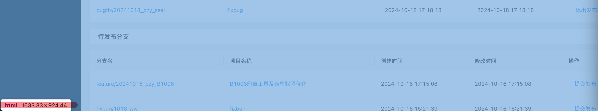

# 第一章 HTML 学习笔记

前端命名规范：https://developer.aliyun.com/article/951001

1. 组件文件命名规范：大驼峰命名，公司用的是横杠命名
2. 变量命名规范：无论是普通变量、对象、数组还是对象的键，都是小驼峰命名
3. 常量命名规范：通过 const 定义一个常量，命名方式为 VAR_TYPE，字母全部大写
4. 枚举命名规范：枚举名称为大驼峰，枚举的键为常量命名规范


## 1.1 HTML 备忘清单

HTML 备忘清单

https://wangchujiang.com/reference/docs/html.html

Emmet （HTML、CSS 内置的快捷指令）备忘清单

https://wangchujiang.com/reference/docs/emmet.html

特殊字符及转义参考

https://blog.csdn.net/jack_rose_me/article/details/124603494

> 如果一个元素拥有 ID 属性,那么 ID 属性的属性值就会成为 window 对象的属性名
>
> link 标签是同时加载的，而 script 标签才会加载完一个再加载另一个


## 1.2 IMG 标签知识点

**图片适配方案一：使用盒子加 img 标签**

```less
// 先规范外层盒子的宽高
.img-box {
  width: 300px;
  height: 300px;
  
  // 再适配内部图片
  .img {
    width: 100%;
    height: 100%;
    object-fit: contain;    
  }
}
```

```less
fill		// 默认，不保证保持原有的比例，内容拉伸填充整个内容容器
contain	// 保持原有尺寸比例。内容被缩放(可能和指定宽度对应不上)
cover		// 保持原有尺寸比例。但部分内容可能被剪切
none		// 保留原有元素内容的长度和宽度，也就是说内容不会被重置
```


**图片适配方案二：直接使用 img 标签**

```less
img {
  width: 35px;
  height: 35px;
  cursor: pointer;
  object-fit: contain;
}
```


**图片适配方案三：使用盒子加背景图片**

```less
.cover-thumb {
  width: 230px;
  height: 230px;
  vertical-align: top;
  background-size: cover; // 一般指定宽度为盒子宽度230px或者cover、contain
  background-position: center;
  background-repeat: no-repeat;
  background-image: url('...')
}
```


**src 或 backgroundImage 引入图片变量**

```tsx
import questionnaireSurveyImg from '@/assets/images/questionnaireSurveyImg.png'

(
  
  
  <div style={{ backgroundImage: `url(${questionnaireSurveyImg})` }} />
)
```


**src 为空时，img 标签不显示裂图**

```js
img[src=""], img:not([src]) {
    opacity:0;
}
```


**访问网络图片必须添加如下属性**

```html
index.html
<meta name="referrer" content="no-referrer">
```

> https://blog.csdn.net/u011127019/article/details/125169827


## 1.3 静态资源路径

React 脚手架中使用 `%PUBLIC_URL%` 则固定从服务器根路径 `http://localhost:3000` 的文件夹下获取资源

```html
<link rel="apple-touch-icon" href="%PUBLIC_URL%/logo192.png" />
```

> 和 `href="/logo192.png"` 效果是一样


使用 `./` 则从当前服务器路径 `http://localhost:3000/home` 的文件夹下获取资源

```html
<link rel="apple-touch-icon" href="./logo192.png" />
```


## 1.4 HTML 标签介绍

**块元素**

1. 常见的块元素有 `<h1> ~ <h6>`、`<p>`、`<div>`、`<ul>`、`<ol>`、`<li>`、`<dl>`、`<dt>`、`<dd>`、`<table>`、`<tr>`、`<form>` 等
2. 一行只能放一个块级元素


**行内元素**

1. 常见的行内元素有 `<a>`、`<span>`、`<em>`、`i`、`<strong>` 等
2. 一行可以放多个行内元素，设置宽高无效


**行内块元素**

1. 常见的行内块元素有：``、`<input>`、`button`、`<th>`、`<td>` 等，也是行内元素

2. 和相邻行内元素（行内块）在一行上，但是他们之间会有空白缝隙

3. 高度，行高、外边距以及内边距都可以控制（块级元素特点）


## 1.5 HTML 自定义属性

当我们操作 DOM 时，可以通过传入 HTML 标签的自定义属性来实现跨层级传输数据，自定义属性规范上使用 `data-*` 来命名

```html
<div data-custom-id="12345" roleId="admin">
  This div has custom attributes.
</div>
```

```js
const divElement = document.querySelector('div');
const customId = divElement.getAttribute('data-custom-id');
const roleId = divElement.attributes.attributes.blocId?.value
```


# 第二章 CSS 学习笔记

## 2.1 CSS 速记链接

CSS 备忘清单：https://wangchujiang.com/reference/docs/css.html

> CSS 样式包含三种类型：行内样式（内联样式）、内部样式（style 标签）、外部样式（link 标签）
>
> 加载页面时，link 标签引入的 CSS 被同时加载；@import 引入的 CSS 将在页面加载完毕后被加载
>
> a 标签不能嵌套 a 标签，p 标签不能嵌套块级元素


## 2.2 CSS 选择器详解

CSS 选择器速记：[https://wangchujiang.com/reference/docs/css.html#css-选择器](https://wangchujiang.com/reference/docs/css.html#css-选择器)

CSS 选择器介绍：https://vue3js.cn/interview/css/selector.html


**常见的选择器**

```css
/* 选择子类 */
.box .child {}

/* 选择.box并且带有.red的元素 */
.box.red {}
```


**带 type 的匹配选择器**

`first-of-type`、`last-of-type`、`nth-of-type(n、even、odd)`：选择第一个、最后一个、第 n 个

`nth-last-of-type(n)`：从末尾开始计数，第 n 个

- 先筛选该父元素下的所有 `p` 标签（仅限直接子元素），再匹配第 n 个 `p` 标签
- 由于是选择所有后代 p 标签，所以还会逐层把直接子元素作为父元素，再进行上面的匹配流程

```css
#father p:nth-of-type(2) {
	color: red
}
```

```html
<div id='father'>
  <div>
      <p>1</p>
      <p>2</p> // red
  </div>
  <h1>3</h1>
  <p>4</p>
  <p>5</p> // red
</div>
```

> 如果是 `#father > p:nth-of-type(2)`，只选择直接子元素，那么就不会再逐层匹配


**带 child 的匹配选择器**

`first-child`、`last-child`、`nth-child(n、even、odd)`：选择第一个、最后一个、第 n 个

- 先选择该父元素下的第 n 个元素（直接子元素），再看下该元素是不是 `p` 标签，如果是则匹配
- 由于是选择所有后代 p 标签，所以还会逐层把直接子元素作为父元素，再进行上面的匹配流程

```css
#father p:nth-child(2) {
	color: red
}
```

```html
<div id='father'>
  <div>
      <p>1</p>
      <p>2</p> // red
  </div>
  <h1>3</h1>
  <p>4</p>
  <p>5</p>
</div>
```

> 只有 2 会亮，因为 5 被认为是第 4 个元素


**其他伪类选择器**

```css
:link 未被访问的链接样式
:visited 已被访问的链接样式
:active 鼠标点击时链接的样式
:hover 鼠标指针浮动在上面的元素
:focus 选择具有焦点的
:root 设置HTML文档
:empty 指定空的元素
:enabled 选择可用元素
:disabled 选择被禁用元素
:checked 选择选中的元素
```


**属性选择器**

```css
[attribute*=value]：选择attribute属性值等于value的所有元素
[attribute*=value]：选择attribute属性值包含value的所有元素
[attribute^=value]：选择attribute属性开头为value的所有元素
[attribute$=value]：选择attribute属性结尾为value的所有元素
```

```css
[data-animate=move] {}

/* 选择p标签中id为包含div的所有元素 */
p[id*=div] {
    color: red;
}
```


**:not(selector)**

选择与 `<selector>` 选择器不匹配的所有元素，下面是例子

```css
/* 选择当包含 .flipped 的所有元素中不包含 .matched 的元素 */
.flipped:not(.matched) {};

/* 当 .board-container 中包含了 .flipped，然后对其子元素 .board 作用 */
.board-container.flipped .board {};
```

```scss
// scss文件在内部写伪类时可以不用加&，默认绑定&
// 下面是匹配.box除了最后一项的所有子类
.box {
  :not(:last-child) {
  	margin-bottom: 12px;
  }
}
```


## 2.3 CSS 滚动条配置

`::-webkit-scrollbar` 作为一个伪类选择器，设置全局滚动条

参考文档：https://blog.csdn.net/coder_jxd/article/details/124213962

MDN：https://developer.mozilla.org/zh-CN/docs/Web/CSS/::-webkit-scrollbar


**全局滚动条模板参考**

```css
/* 整个滚动条 */
::-webkit-scrollbar {
    width: 10px;
    height: 10px;
}

/* 垂直滚动条和水平滚动条时交汇的部分 */
::-webkit-scrollbar-corner {
    display: block;
    /* background-color: rgba(0, 0, 0, 0.1); */
    background-color: transparent;
}

/* 滚动条上的滚动滑块 */
::-webkit-scrollbar-thumb {
    border-radius: 10px;
    border-right-color: transparent;
    border-left-color: transparent;
    background-color: rgba(0, 0, 0, 0.3);
}

/* 滚动条轨道 */
::-webkit-scrollbar-track {
    border-right-color: transparent;
    border-left-color: transparent;
    background-color: rgba(0, 0, 0, 0.1);
}
```


**单个盒子生效，不需要添加 `:global`**

```scss
// 滚动条隐藏
&::-webkit-scrollbar {
    width: 0px;
}
```


**纵向滚动条出现契机**

当一个盒子设置了高度（非响应式高度），另外还设置了 `overflow: auto`，那么当内容高度超出设置的高度时即可出现纵向滚动条。

**当盒子设置了响应式高度，那么需要将其所有设置了响应式高度的父盒子都设置为 `overflow-y: auto`，**不然的话不会出现滚动条而是会持续撑高。


**横向滚动出现契机**

如果这个盒子是固定宽度则直接使用 `overflow-x: auto` 即可。如果是继承父盒子宽度 `width: 100%` 则需要向上找父盒子，直到某个父盒子的宽度不是 `width: 100%` ，然后一路向下开启 `overflow-x: auto` 即可


## 2.5 Flex/Grid 布局

**flex 布局**

Flex 介绍：https://vue3js.cn/interview/css/flexbox.html
Flex 备忘清单：https://wangchujiang.com/reference/docs/css.html#css-flexbox

个人笔记：https://github.com/cocoonnu/web-projects/blob/main/Markdown/HTML%20CSS/13%E3%80%81flex%E5%B8%83%E5%B1%80/flex%E5%B8%83%E5%B1%80.md


**grid 布局**

Grid 介绍：https://vue3js.cn/interview/css/grid.html

Grid 备忘清单：[https://wangchujiang.com/reference/docs/css.html#css-grid-网格布局](https://wangchujiang.com/reference/docs/css.html#css-grid-网格布局)

个人笔记：https://github.com/cocoonnu/web-projects/blob/main/Markdown/HTML%20CSS/17%E3%80%81grid%E5%B8%83%E5%B1%80/grid%E5%B8%83%E5%B1%80.md


**flex 布局技巧**

响应式盒子布局：当父元素设置 flex 布局之后，子元素可设置一个最小宽度，然后实际宽度可为 flex: 1 按比列分配。当宽度不够时，后面的子元素换行展示。

```scss
.boxWrapper {
  width: 100%;
  display: flex;
  align-items: center;
  justify-content: space-between;
  row-gap: 24px;
  column-gap: 8%;
  flex-wrap: wrap;  
  .box1 {
    flex: 1 0 200px; // 最小宽度200px，实际宽度自适应
	}
  .box2 {
    flex: 1 0 220px;
    max-width: 350px;
  }
}
```


**grid 布局技巧**

响应式盒子布局：通过属性 `grid-template-columns: repeat(auto-fill, minmax(230px, 1fr))` 设置容器子元素宽度最小 230px，最大为容器宽度分配完 230px 后再将剩下的宽度均匀的分配给每个 230px

```scss
// 定义每个网格宽度（150px-先分配个数多余宽度自动填充）、高度（150px）
.gridContainer {
  display: grid;
  grid-template-columns: repeat(auto-fill, minmax(150px, 1fr));
  grid-auto-rows: 150px;
}

// 自定义渲染网络内部，先占满整个网格，再合理分配
.gridCard {
  width: 100%;
  height: 100%;
  ......
}
```


## 2.6 CSS 技巧总结

**父级元素清除浮动的方式**

1. 在父级元素创建 BFC，https://vue3js.cn/interview/css/BFC.html
2. 在最后的浮动元素末尾添加一个空标签，设置 `clear: both` 样式
3. 给父元素添加一个伪元素 `::after`，设置 `clear: both` 样式

 

**HTML 字符串换行方式**

https://blog.csdn.net/TwelveSpring/article/details/123253679


**text-align 属性可控制当前盒子的内容横向显示位置**

```less
.edit-header-right {
  flex: 1;
  text-align: right; // 将两个按钮靠右排列
}
```

```tsx
<div className={styles['edit-header-right']}>
  <Space>
    <Button>保存</Button>
    <Button type="primary">发布</Button>
  </Space>
</div>
```


**省略号样式**

```less
.text {
  max-width: 200px; // 必须设置宽度或者最大宽度
  white-space: nowrap;
  overflow: hidden;
  text-overflow: ellipsis;
}
```

```jsx
// 搭配title实现鼠标移入把文字显示全
<div title='titletitle'>titletitle</div>
```


**块状和文字溢出处理**

https://juejin.cn/post/7027845262190051335


**盒子宽度随着内容（字数）宽度动态变化**

```less
.total-wrapper {
  width: fit-content;
  height: 32px;
  text-align: center;
  padding: 5px 16px;
  font-size: 14px;
  white-space: nowrap;
  line-height: 22px;
  background-color: #f3f3f3;
}
```

```tsx
<div className={styles['total-wrapper']}>答卷数量: 1000000</div>
```


**inherit,initial,unset,revert 是什么**

https://juejin.cn/post/7035445933152141342


## 2.7 Less 常用技巧

Less 官网：https://less.bootcss.com/

1. 变量
2. 混合
3. @规则嵌套和冒泡
4. 算术运算符
5. calc()
6. 内置函数：https://less.bootcss.com/functions/


## 2.8 Tailwind CSS

推荐直接通过中文官网学习，从入门文档开始看：https://tailwind.nodejs.cn/docs/utility-first

安装的话普通项目最好通过 PostCSS 进行安装：https://tailwind.nodejs.cn/docs/installation/using-postcss


## 2.9 响应式交互方案

首先我们来了解浏览器视口大小是什么，当浏览器最大化时为最大值。它由三个值决定：显示器尺寸、显示器分辨率和浏览器缩放比。

1. 显示器尺寸越大，最大化浏览器视口就越大；显示器分辨率越大，最大化浏览器视口就越大。
1. 当我们调整浏览器缩放比的时候，缩放百分比越小，浏览器视口越大（因此可模拟大屏观看效果）
1. 下面是如何查看当前浏览器视口大小：



清楚浏览器视口大小之后，我们就可以开始了解 px 像素值了。在浏览器视口大小确定（不用再管窗口大小、显示器尺寸、分辨率大小了）之后，px 变成了一个绝对单位！！那么在 UI 给的设计稿中通常 Web 的视口大小定义为 1920 * 1080，如果你的浏览器视口大小也为这个的话，你看到的页面效果就和设计稿的显示效果一模一样了。**那么响应式设计要解决的矛盾就是你的浏览器视口大小比设计稿视口大小小很多时，应该如何布局会比较舒服。**下面是几个响应式布局的方案：

1. 设计稿根据不同大小比例设定：就是 1920 * 1080、1470 * 881、1200 * 440 分段设计不同的布局效果，前端再对应开发。
2. 设计稿直接用 rem 响应式分辨率为单位，前端也用 rem 进行开发。实现自动通过设置缩放比达到一致的显示效果（H5 常用）。
3. 设计稿内容像素大小固定，并且一直居中显示，浏览器视口大小很大时两边内容会空（论坛、推特之内的网站常用）。
4. 使用 Flex、Grid和百分比布局，实现宽度自适应，高度实现给定高度或展示滚动条。


**媒体查询方案**

概念：通过视口宽度实现不同适配方案，作用：手动设置 `html-font-size `  、  手动修改不同视口宽度的样式

- 先把常规布局写完（视口宽度为1024px）
- 然后从大到下 设置媒体查询   **下面的会继承上面的样式**
- 通过不同视口宽度下 修改某些元素的布局或样式

``` css
/* 视口宽度：320 - 750 */
@media screen and (max-width: 750px) {...}

/* 视口宽度：0 - 320 */
@media screen and (max-width: 30px) {...}
```


# 第三章 JavaScript 笔记

MDN 官方：https://developer.mozilla.org/zh-CN/docs/Web/JavaScript

JavaScript Guidebook：https://tsejx.github.io/javascript-guidebook/


## 3.1 ECMAScript 6

**展开运算符**

使用展开运算符进行对数组和对象的复制或者合并，**返回一个新的对象或数组，新地址和原地址不相等**

```js
// 数组
const arr = [1,2,3]
console.log([...arr] === arr);	// false
// 对象
const apple = {
  color: '红色',
  shape: '球形',
  taste: '甜'
};
console.log({...apple});  // { color: '红色', shape: '球形', taste: '甜' }
console.log({...apple} === apple);	// false
```


**更多复杂类型**

Set（引用类型无法去重）：https://juejin.cn/post/7107449385264349191

Map：https://juejin.cn/post/7106898275290054692

遍历 Map：https://blog.csdn.net/qq_41767116/article/details/131161193

WeakMap：https://juejin.cn/post/7107261631859523615

Symbol 内置符号：https://juejin.cn/post/7074608058369835015

Symbol 类型：https://juejin.cn/post/7073852491695128583

RegExp：https://juejin.cn/post/7275550152974221346

Error：https://juejin.cn/post/7169017392016654372

Date：https://juejin.cn/post/6996926386405376037

迭代器/生成器：https://juejin.cn/post/7141685685940912136


**对象与原型的概念**

- 文档参考：https://juejin.cn/post/6844903989088092174

- 构造函数和对象实例都是**对象**，只有构造函数有 `prototype`，任何对象都有 `__proto__`
- **对象的 `__proto__` 指向其构造函数的 `prototype`**，构造函数的构造函数是 `Function`，`prototype` 的构造函数是 `Object`
- 对象里面有一个属性 `constructor`，它直接指向其构造函数

```js
function Foo() {} // 构造函数Foo
const foo = new Foo() // 对象实例foo

// 可以得到以下关系
foo.__proto__ == Foo.prototype
Foo.__proto__ == Function.prototype
Function.__proto__ == Function.prototype

Foo.prototype.__proto__ == Object.prototype // 原型对象也是一个对象，构造函数为Object
Function.prototype.__proto__ == Object.prototype

Object.__proto__ == Function.prototype // Object的构造函数为Function
Object.prototype.__proto__ == null // 原型链的终点
```

```js
Foo.prototype.constructor == Foo
Function.prototype.constructor == Function
Object.prototype.constructor == Object
```

> null 和 undefined 没有原型对象


**原型链的概念**

- `__proto__` 为实例对象的隐式原型，指向其构造函数的 `prototype`
- `prototype` 为构造函数的原型对象，包含该构造函数实例化后对象可以共享的属性和方法
- 原型链就是多个对象通过 `__proto__` 属性形成的一条查找路径，当访问某个对象的属性或方法时，如果当前对象没有，就会沿着原型链向上查找，直到 `null` 为止


**原型和原型链例题**

```js
Object.prototype.foo = 'Object';
Function.prototype.foo = 'Function';
function Animal () {};
var cat = new Animal();
console.log(cat.foo); // Object
console.log(Animal.foo); // Function
```

> cat -> Animal.prototype -> Object.prototype，原型链查找路径
>
> Animal -> Function.prototype，原型链查找路径


**判断类型的方式**

- `typeof`：基础类型和 function 可以识别，其他引用类型一律返回 object（包括 null）
- `instanceof` 只能判断当前对象的原型链上，是否存在指定类型，返回 true 或 false
- `Object.prototype.toString.call(new Set())`：全能型判断方法，得到字符串 `[object Set]`
- https://juejin.cn/post/7197990402720235576


**普通函数和箭头函数的 this 指向问题**

- 首先看普通函数的 this 指向，有全局函数（默认绑定）、对象函数（隐式绑定）、构造函数（new 绑定、prototype）
- 另外注意：`setTimeout`、`Promise` 里的内置函数作为全局函数（默认绑定）看待
- 如果一个普通函数被调用 `apply`、`call`、`bind`（显示绑定），那等于是明确指定了 this 指向了
- 然后箭头函数，就看两点：该箭头没有外层函数则 this 指向 window，有外层函数 this 就为外层函数的 this
- 注：浏览器的全局对象为 `window`，node 环境的全局对象为 `globalThis`，如果实在无法对应函数，则一般就是匿名函数
- **注：this 绑定的优先级：new 绑定 > 显式绑定 > 隐式绑定 > 默认绑定**
- https://juejin.cn/post/7310415386405765159

```js
// 经典例题
var a = 1;
function printA(){
  console.log(this.a);
}
var obj={
  a:2,
  foo:printA,
  bar:function(){
    printA();
  }
}

obj.foo(); // 2
obj.bar(); // 1
var foo = obj.foo;
foo(); // 1
```


**关于可迭代对象和可迭代器的理解**

- 常见的可迭代对象有：`Map`、`Set`、`Array`、`String`、`arguments`、`arguments`
- 每个可迭代对象都内置有一个 `Symbol.iterator`，表示它可以被 `for of` 进行迭代
- 迭代器是可迭代对象的一个拓展，它实现了迭代协议，具有 `next` 函数指向不断指向下一个值
- 所以可迭代对象不一定是迭代器,但是迭代器一定是可迭代对象
- 常见的迭代器有：Map 迭代器：keys、values、entries，Set 迭代器：values、keys、entries
- https://juejin.cn/post/6844903749610127373


**对象引用问题详解**

如果两个变量都是引用地址，那么不能直接将这两个对象划上等号。一但划上等号之后那么这两个变量会指向**同一块内存地址**，会导致两块地址的数据同步修改，产生严重的数据污染问题。下面是一个实际案例：

```jsx
const handelEffectiveCol = () => {
  const formDataList = form.getFieldValue('formDataList') || [];
  // 这是一个引用地址
  const titleData = formDataList?.[formDataList.length - 1];
  const handleIds = formDataList
    ?.slice((pagination.current - 1) * pagination.pageSize, pagination.current * pagination.pageSize)
    .map(({ _id }) => _id);
  const newFormDataList = formDataList.map((item) => {
    if (!handleIds.includes(item._id)) return item;
    // 这只是浅拷贝，依然是一个引用地址
    const newItem = { ...item };
    Object.keys(newItem).forEach((key) => {
      if (key === '_id') return;
      const tagObj = newItem[key];
      const titleTagObj = titleData[key];
      // 因此这里就典型的将两个引用地址划上等号了！虽然层级比较深。
      tagObj.tagValues = titleTagObj.tagValues;
    });
    return newItem;
  });
  form.setFieldValue('formDataList', newFormDataList);
};
```

> 解决方案有三个：1. 在第一个 titleData 定义的地方用一个深拷贝生成 2. 在 newItem 那里不能用浅拷贝，而是改用将 item 深拷贝 3. 在最后等于的地方将右边的地址进行的深拷贝


## 3.2 对象常见函数

这里记录 Object 原型对象所暴露的 API，通常在每个对象下都可以使用

**Object.assign**

用来合并对象。如果存在同名属性则o1被o2覆盖，**返回o1对象**  浅拷贝

```js
const target = { a: 1, b: 2 };
const source = { b: 4, c: 5 };

const returnedTarget = Object.assign(target, source);

console.log(target);
// Expected output: Object { a: 1, b: 4, c: 5 }

console.log(returnedTarget === target);
// Expected output: true
```

> 还可以用来给某个原型对象添加属性：`Object.assign(obj.prototype,{ name, callFn })`


**Object.keys、Object.values 、Object.entries**

传入一个对象或者枚举类型，可返回它的键、值、键值对数组（不包含可继承的属性）

```js
const person = {
    name: 'Alex',
    age: 18
};
// 返回键数组
console.log(Object.keys(person));		// [ 'name', 'age' ]
// 返回值数组
console.log(Object.values(person));		// [ 'Alex', 18 ]
// 返回键值二维数组
console.log(Object.entries(person));
```


**for in 循环**

for...in 遍历一个对象的可枚举属性，并且还可以遍历数组、字符串，依次遍历获得 key（数组获得 index ）

**注：key 可以得到该对象所有的属性，包括原型链上的属性，不按顺序遍历**

```js
for (let key in obj) {}
for (let index in arr) {}
```

```js
for (const key in target) {
  if (target.hasOwnProperty(key)) {}
}
```


**Object.defineProperty**

`Object.defineProperty(obj, prop, descriptor)`

用于定义一个对象的新属性或修改对象已有属性的特性（如可写性、可枚举性等）,

obj 是要定义属性的对象，prop 是要定义的属性名，descriptor 是一个包含属性特性的对象。

descriptor 对象可以包含以下属性：

- `value`：属性的值
- `writable`：属性是否可写，默认为 `false`
- `enumerable`：属性是否可枚举，默认为 `false`
- `configurable`：属性是否可配置（delete），默认为 `false`
- `get`：获取属性值的函数
- `set`：设置属性值的函数


**对象实例常用 API**

- `delete obj.name`：删除对象属性
- `obj.hasOwnProperty`：判断一个对象自身是否有某个属性，而不是原型链上的属性

- 判断是否是空对象：`JSON.stringify(obj) === "{}"`


**toString()**

返回一个表示该对象的字符串，类似于 `String()` 的使用

https://blog.csdn.net/u011140116/article/details/121845262


## 3.3 数组常见函数

**数组使用经验总结**

数组常见函数：https://vue3js.cn/interview/JavaScript/array_api.html

Array 原型方法大全：https://juejin.cn/post/7028018256266919973

> **会直接改变原数组的方法：push、pop、splice、unshift、shift、sort、reverse**
>
> `arr.length`：数组长度会自动延长到最后一个被赋值的位置，中间没有被赋值的都为 undefined

数组变量如果是要赋值，那么直接等于即可。如果需要拷贝，那么需要使用以下两个方法实现浅拷贝：`concat`、`[...]`


**普通方法总结**

```js
1、arr.shift：删除数组的第一个元素   

2、arr.unshift：插入数组第一个元素

3、arr.concat：直接将多个数组、多个数字拼接成一个数组 
let a= [].concat(1,2,3,[4,5],[6,7])

4、let newArr = arr.slice(a, b) 截取下标为 a ，到下标为 b（不包括 b）的区间

5、arr.reverse()：用来将一个数组中的全部项顺序置反

6、arr.indexOf(value)：数组存在value则返回其下标 不存在返回-1

7、arr.includes(value)：数组存在value则返回true,否则返回false

8、arr.join(',')：数组转字符串

9、arr.push(1, 2, 3)：只会push最后一项
```


**数组常用内置函数**

- **arr.push**

向数组末尾添加元素的方法，支持添加单个或多个元素，并返回数组的新长度，**直接改变原数组**

```js
const arr = [1, 2, 3];
arr.push(4, 5, 6); // 添加元素 4, 5, 6
console.log(arr); // 输出: [1, 2, 3, 4, 5, 6]

const arr1 = [1, 2, 3];
const arr2 = [4, 5];
arr1.push(...arr2); // 将 arr2 的元素逐个添加到 arr1
console.log(arr1); // 输出: [1, 2, 3, 4, 5]
```


- **arr.concat**

首先会创建一个当前数组的副本，然后再把它的参数添加到副本末尾，最后返回一个新数组，**不会影响原始数组**

```js
let colors = ["red", "green", "blue"];
let colors2 = colors.concat("yellow", ["black", "brown"]);
console.log(colors); // ["red", "green","blue"]
console.log(colors2); // ["red", "green", "blue", "yellow", "black", "brown"]
```


- **arr.splice**

arr.splice(下标，个数，替换的值)：数组值替换（可替换、添加、删除值），**该方法会改变原始数组**

返回被删除的值组成一个数组

```js
// 删除下标为index的项
arr.splice(index, 1)
```


- **arr.slice**

截取数组某个区间并返回，**该方法不会改变原始数组**

```ts
const newArr = arr.slice(a,b) // 截取a-b区间，返回改变之后的数组（不包含b！！）
const newArr = arr.slice() // 经典的浅拷贝！！
```


- **arr.split**

`arr.split('str')`：将数组转化为字符串，以 str 间隔


- **arr.reduce**

不改变原数组，使用方法：https://blog.csdn.net/hannah2233/article/details/128367223

```js
// 不传入initialValue时，默认从index=1开始遍历，初始时prev=1，cur=2
// 每次遍历，prev为上一个遍历的返回值，cur为当前数组的遍历值
var arr = [1, 2, 3, 4];
var sum = arr.reduce(function(prev, cur, index, arr) {
    console.log(prev, cur, index);
    return prev + cur;
})
console.log(arr, sum);
// 结果：
// 1 2 1
// 3 3 2
// 6 4 3
// [1, 2, 3, 4] 10
```

```js
// 这个例子index是从0开始的，第一次的prev的值是我们设置的初始值0，数组长度是4，reduce函数循环4次。
var  arr = [1, 2, 3, 4];
var sum = arr.reduce(function(prev, cur, index, arr) {
    console.log(prev, cur, index);
    return prev + cur;
}，0) //注意这里设置了初始值
console.log(arr, sum);
//打印结果：
//0 1 0
//1 2 1
//3 3 2
//6 4 3
//[1, 2, 3, 4] 10
```


- **arr.some**

some() 方法会依次遍历数组的每个元素：

如果有一个元素满足条件，则表达式返回 true , 剩余的元素不会再执行检测

如果没有满足条件的元素，则返回false

```js
var arr = [3,6,9,12];
 
if(arr.some(function checknumber(number){return number == 12;})) {
    console.log(true)
}

// 简写：arr.some(item => item == 12)
 
//因为arr数组中有12的值，所以代码块会执行，而函数checknumber中传的参数number是从数组arr中读取
```


- **arr.find**

遍历查找数组，返回找到的值（只返回一个值），未找到返回 undefined

```js
let num = arr.find(item => item == 12)
```


- **arr.forEach**

遍历操作数组，**没有返回值**，**该方法没有办法终止循环，除非抛出异常或者直接改变原数组**

当数组为简单类型时，不会该变原数组，当为引用类型时，则会改变原数组！！

```js
arr.fonEach((item,index,arr) => {})
```


- **arr.map**

遍历操作数组，将每次返回的结果作为一个新数组返回

```js
let newArr = arr.map((item,index,arr) => item + 1)
```

map 使用方法：https://blog.csdn.net/Anna0115/article/details/103696124


- **arr.filter**

遍历筛选数组，回调函数返回布尔类型，返回一个满足条件的新数组

```js
var newArr = arr.filter(function(item,index,arr) {
    if (item > 4) return true;
})
```


- **arr.flat**

对多维数组进行扁平化处理

```js
// 按照一个可指定的深度递归遍历数组，并将所有元素与遍历到的子数组中的元素合并为一个新数组返回
let newArr = arr.flat(Infinity)
```


- **for of 循环**（效率更高、使用 break 可终止循环）

for...of 可以遍历一个**可迭代对象**，常见的可迭代对象有：`Map`、`Set`、`Array`、`String`、`arguments`、`arguments`

```js
for (let v of arr) {}
```


- **arr.sort(compareFn(a,b))**

自定义规则排序数组：[MDN Array.prototype.sort()](https://developer.mozilla.org/zh-CN/docs/Web/JavaScript/Reference/Global_Objects/Array/sort)

如果没有指定比较函数，那么数组按照转换后的字符串的各字符的[Unicode](https://so.csdn.net/so/search?q=Unicode&spm=1001.2101.3001.7020)位点进行排序。

如果指明了比较函数，那么数组按照调用**该函数的返回值**进行排序。规则如下：

- 函数遍历数组，a 和 b 为前一项和后一项

- 如果 `compareFunction(a,b)` 小于0，那么`a`排`b`前面
- 如果 `compareFunction(a,b)` 大于0，那么`a`排`b`后面
- 如果 `compareFunction(a,b)` 等于0，那么`a,b`的相对位置不变

```js
// 默认排序从小到大
arr.sort()

// 自定义排序
var items = [
  { name: 'Edward', value: 21 },
  { name: 'Sharpe', value: 37 },
  { name: 'And', value: 45 },
  { name: 'The', value: -12 },
  { name: 'Magnetic' },
  { name: 'Zeros', value: 37 }
];

items.sort((a, b) => {
	const nameA = a.name.toUpperCase()[0]
	const nameB = b.name.toUpperCase()[0]
	if(nameA < nameB)	return -1
	if(nameA > nameB)	return 1
	return 0
})
```

> 该方法会改变原数组


- **arr.every**

判断数组中是否所有元素都满足条件，所有都满足则返回 true，否则返回 false

```ts
const isOld = columns?.every((item, index) => {
  const oldItem = oldPropsColumnsCurrent?.[index]
  return item.key === oldItem?.key || item?.dataIndex === oldItem?.dataIndex
})
```


- **二维数组去重**（数组为number类型）

利用的是对象添加 `key - values` 时的特性，把数组作为对象的 `key` 值，达到去重的目的

```ts
const TwoDimArrayUnique = (arr) => {
  const obj = {}
  arr.forEach(item => obj[item] = item)
  return Object.values(obj)
}
```


- **Array.form**

将类数组或者 Set 实例转化为数组，https://blog.csdn.net/qq_27674439/article/details/108793223


## 3.4 JavaScript 常用函数

**lodash 常用函数**

1. isEmpty：如果一个值为 null、undefined、[]、{}、''，那么返回 true
2. omit：从一个对象中剔除出某几个属性并创建一个新对象：https://www.lodashjs.com/docs/lodash.omit
3. pick：从一个对象中剔取出某几个属性并创建一个新对象：https://www.lodashjs.com/docs/lodash.pick
4. groupBy：将一个数组根据某种规则返回一个组成聚合的对象：https://www.lodashjs.com/docs/lodash.groupBy

```js
// 根据rowNum进行分组
const ruleDatasMapByRowNum = groupBy(ruleDatas, 'rowNum')
// 根据指定规则进行分组
const arr = groupBy([6.1, 4.2, 6.3], Math.floor); // { '4': [4.2], '6': [6.1, 6.3] }
```


**30 个常用函数**

https://juejin.cn/post/7145036326373425159


**JSON.stringify**

1. 将一个 JavaScript 对象或值转换为 JSON 字符串，详细转化规则参考文章
2. **JSON.parse** 再将 JSON 字符串转化为对象

2. https://juejin.cn/post/7191712569394987065


**valueOf()**

返回指定对象的**原始值**，若对象没有原始值，则将返回对象本身

https://blog.csdn.net/weixin_45242865/article/details/119798783


**Math 和 Number 的 API**

```js
Math.ceil() // 数字向上取整

Math.round() // 整数四舍五入

Math.abs() // 绝对值

Math.floor() // 向下取整

isNaN(value) // value会先被Number()隐式类型转换，转化后不是一个数字则返回true

num.toFixed(n) // 保留n位小数，四舍五入

Math.floor(Math.random() * num)：// 返回0到num-1的整数
```


**`parseInt()` 、 `parseFloat()` 、`Number()` 的区别**

1. 前两个是将字符串根据一定的规则转换为整数或者浮点数，后者是将其他类型隐式转换成 Number
2. `parseInt('111', 16)` 等效于 `parseInt('0x111')`
3. https://blog.csdn.net/qq_41131745/article/details/114663291


**两个浮点数直接相减后不能直接用来判断结果**

```js
0.3 - 0.2 !== 0.1 // 会考虑到精度丢失的问题，部分浮点数计算也是如此 
```


**字符串**

增删改查基础方法：https://vue3js.cn/interview/JavaScript/string_api.html

`str.split`：https://blog.csdn.net/weixin_52844244/article/details/122836185

`String.fromCharCode(ASCII)`：通过 ASCII 码返回字符（A = 65）

`str.charCodeAt(index)`：返回 `str[index]` 的 ASCII 码

`[...new Set(string)].join('')`：字符串去重

`replace(reg, str)`：指定字符替换，https://blog.csdn.net/qq_46658751/article/details


**其他函数**

```js
navigator.clipboard.writeText(123); // 实现用户复制内容为123

// 禁止打开右键
document.oncontextmenu=new Function("event.returnValue=false");

// 禁止滑动选中
document.onselectstart=new Function("event.returnValue=false");

document.onkeydown = function(event){    
    if (event.ctrlKey && window.event.keyCode==67){	//禁用ctrl + c 功能
        return false;
    }
    if (event.ctrlKey && window.event.keyCode==86){	//禁用ctrl + v 功能
        return false;
    }
}

((year % 4 === 0) && (year % 100 !== 0)) || (year % 400 === 0)
```


**获取随机值**

使用 `Mock.Random`：https://github.com/nuysoft/Mock/wiki/Mock.Random

```js
import Mock from 'mockjs'
const Random = Mock.Random
console.log(Random.date())
```


## 3.5 DOM BOM 使用记录

**DOM**

1. 常用操作：https://vue3js.cn/interview/JavaScript/Dom.html
2. 详细解析：https://juejin.cn/post/6875674323042959368

**BOM**  

1. 常用操作：https://vue3js.cn/interview/JavaScript/BOM.html


### 3.5.1 Event 对象属性

MouseEvent MDN：https://developer.mozilla.org/zh-CN/docs/Web/API/MouseEvent

Event MDN：https://developer.mozilla.org/zh-CN/docs/Web/API/Event


`e` 就是鼠标对象 `MouseEvent`，它继承了 `Event` 事件对象，下面是它的常见属性

- `e.target`：触发绑定事件的对象，可以为本体，也可以为子盒子

- `e.clientX`：鼠标在**页面上可视区域的位置**，从浏览器可视区域左上角开始，即是以浏览器滑动条此刻的滑动到的位置为参考点，随滑动条移而变化

- `e.pageX`：鼠标在**页面上的位置**，从页面左上角开始，即是以页面为参考点，不随滑动条移动而变化

- `e.offsetX`：鼠标在 `e.target` **盒子里的位置**，如果该盒子有边框，则可能出现负值

- `e.stopPropagation`：阻止事件冒泡

- `e.preventDefault`：组件事件默认行为


### 3.5.2 DOM 高宽度属性

主要考察盒子模型，一个 DOM 对象包含如下的高宽度属性：

- offsetHeight、offsetWidth：包括盒子的 border + padding + content
- offsetTop、offsetLeft：该元素的上（左）外边框到其父元素的上（左）内边框之间的距离
- clientHeight、clientWidth：包括盒子的 padding + content
- scrollHeight、scrollWidth：包括盒子的 padding + 实际内容的尺寸
- scrollTop、scrollLeft：该盒子相对于其父盒子滚动的距离

> 实际内容是指该盒子可能含有子盒子，子盒子内容尺寸大于该盒子内容尺寸


如何判断一个元素是否在**浏览器窗口**（也可换成其他父元素）的可视区域中

- https://vue3js.cn/interview/JavaScript/visible.html

```js
function isInViewPortOfOne (el) {
    const viewPortHeight = window.innerHeight || document.documentElement.clientHeight || document.body.clientHeight 
    const offsetTop = el.offsetTop
    const scrollTop = document.documentElement.scrollTop
    const top = offsetTop - scrollTop
    return top <= viewPortHeight
}
```


还有一个 API 可以获取当前盒子相对于**视口**（浏览器页面边缘）的位置属性：getBoundingClientRect

- 还可用于判断当前元素是否在可视区：https://vue3js.cn/interview/JavaScript/visible.html#getboundingclientrect

- MDN 官方文档：https://developer.mozilla.org/zh-CN/docs/Web/API/Element/getBoundingClientRect


### 3.5.3 DOM API 使用记录

**document**

推荐文章：https://juejin.cn/post/7029691847060488228

| 方法                                | 功能                       | 兼容性                       |
| ----------------------------------- | -------------------------- | ---------------------------- |
| `document.getElementById()`         | 通过 id 得到**元素**       | IE 6                         |
| `document.getElementsByTagName()`   | 通过标签名得到**元素数组** | IE 6                         |
| `document.getElementsByClassName()` | 通过类名得到**元素数组**   | IE 9                         |
| `document.querySelector()`          | 通过选择器得到**元素**     | IE 8 部分兼容、IE 9 完全兼容 |
| `document.querySelectorAll()`       | 通过选择器得到**元素数组** | IE 8 部分兼容、IE 9 完全兼容 |


**滚动属性与样式**

1. **先确定一个父盒子的宽和高**，然后将其样式设置为 `over-flow: auto`，即可开启滚动属性
2. 要控制父盒子的滚动位置直接使用：`ele.scrollTo({ top: 0, behavior: 'smooth' })`
3. 要指定滚动到某个子盒子的位置直接使用：`children.scrollIntoView()`
4. 详细属性可自行查看 MDN：https://developer.mozilla.org/zh-CN/docs/Web/API/Element/scrollIntoView

```tsx
const ele = document.getElementById('ele')
const children = document.getElementById('children')

// block：垂直方向对齐方式    inline：水平方向对齐方式
if (children) children.scrollIntoView({ behavior: "smooth", block: "end", inline: "nearest" })
ele.scrollTo({ top: 0, behavior: 'smooth' })
```


### 3.5.4 事件捕获和事件冒泡

**事件流：有三个阶段**

- 事件捕获阶段：一种从上往下的传播方式，由DOM中最高层的父节点然后逐渐向下传播到触发节点

- 处于目标阶段

- 事件冒泡阶段：一种从下往上的传播方式，由触发节点然后逐渐向上传播到DOM中最高层的父节点


**事件模型可以分为三种**

- 原始事件模型：同一个类型的事件只能绑定一次。只支持冒泡，不支持捕获。直接绑定 `btn.onclick = fun`
- 标准事件模型：1、使用 `addEventListener` 进行监听事件，并支持监听多个事件，默认事件冒泡
- 标准事件模型：2、第三个参数决定该元素的事件在捕获还是冒泡中执行，可绑定多个事件
- 标准事件模型：3、根据事件流顺序：先事件捕获，再目标元素事件，最后事件冒泡
- IE 事件模型：通过 `attachEvent`、`detachEvent` 绑定和移除监听函数，只支持冒泡，不支持捕获
- https://vue3js.cn/interview/JavaScript/event_Model.html

> 原始事件模型、标准事件模型、IE事件模型


**addEventListener 使用方法**

https://developer.mozilla.org/zh-CN/docs/Web/API/EventTarget/addEventListener

> 如果设置第三个参数为useCapture，则默认为false，事件冒泡执行。为true，事件捕获执


**DOM 事件类型大全**

https://www.runoob.com/jsref/dom-obj-event.html

> 不支持冒泡：妈（mouseenter）妈( mouseleave )不( blur )放( focus )心你( load、unload、resize )


**Vue 里面的事件监听**

- 默认为事件冒泡执行：`@click="doThis"`
- 设置为事件捕获执行：`@click.capture="doThis"`
- 阻止该元素触发事件冒泡：`@click.stop="doThis"`

https://cn.vuejs.org/guide/essentials/event-handling.html#event-modifiers


## 3.6 正则表达式介绍

菜鸟教程：https://www.runoob.com/regexp/regexp-tutorial.html

正则表达式实用大全：https://wangchujiang.com/regexp-example/


**常见的特殊字符匹配**

```
\d     匹配一个数字字符。等价于 [0-9]。
\D     匹配一个非数字字符。等价于 [^0-9]。
\f     匹配一个换页符。等价于 \x0c 和 \cL。
\n     匹配一个换行符。等价于 \x0a 和 \cJ。
\r     匹配一个回车符。等价于 \x0d 和 \cM。
\s     匹配任何空白字符，包括空格、制表符、换页符等等。等价于 [\f\n\r\t\v]。
\S     匹配任何非空白字符。等价于 [^ \f\n\r\t\v]。
\t     匹配一个制表符。等价于 \x09 和 \cI。
\v     匹配一个垂直制表符。等价于 \x0b 和 \cK。
\w     匹配字母、数字、下划线。等价于'[A-Za-z0-9_]'。
\W     匹配非字母、数字、下划线。等价于 '[^A-Za-z0-9_]'。 
```


## 3.7 JavaScript 全局对象

**JavaScript 全局对象：window**

1. 可以理解为浏览器实例，包含多个内置对象和方法，作为浏览器窗口的一个接口
2. 在全局作用域下，this 获取的就是 window 对象，全局定义的变量也会封装在 window 对象下
3. window 对象的所有原生接口对象都可以直接使用，如 `window.location` -> `location` 


**全局构造函数**

1. 类型构造函数：Array、Boolean、Date、Function、Global、Math、Number、Object、RegExp、String

2. 以及错误类型构造函数，包括 Error、EvalError、RangeError、ReferenceError、SyntaxError 和 TypeError


**history 和 location**

1. History 对象保存了当前窗口访问过的所有页面网址，`forword`、`back`、`go`
2. Location 对象是浏览器提供的原生对象，提供 URL 相关的信息和操作方法
3. https://juejin.cn/post/7194478891086381113


**全局实用函数**

在 [JavaScript常用函数](#3.4 JavaScript 常用函数) 这一节有讲到，是一些全局可直接使用的常用函数


**BOM、DOM**
详细介绍查看这一章：[DOM BOM 使用记录](#3.5 DOM BOM 使用记录)


**Blob、Stream、Buffer、URL**
详细介绍查看这一章：[文件流对象数据处理](#3.13 文件流对象数据处理)


## 3.8 变量提升和函数解析

**变量提升和函数提升**

1. var 定义的变量会在**作用域内最顶部**（不含块级作用作用域！）声明一个 `var a`，**但是赋值语句并不会提升**
2. **函数提升是使用 function 定义的整个函数会被提升到最顶部（优先级最高）**
3. 其次就是后面的赋值语句会覆盖同名变量：https://www.cnblogs.com/liuhe688/p/5891273.html


例题一

```js
function hoistFunction() {
  foo(); // 2
  var foo = function() {
    console.log(1);
  };
  foo(); // 1
  function foo() {
    console.log(2);
  }
  foo(); // 1
}

// 预编译之后
function hoistFunction() {
  var foo;
  foo = function foo() {
    console.log(2);
  }
  foo(); // 2
  foo = function() {
    console.log(1);
  }
  foo(); // 1
	foo(); // 1
}
```


例题二

```js
var a = 100;
function a() {
  var a = 200;
  console.log(a);
}
a();

// 预编译
var a;
a = function() {
  var a = 200;
  console.log(a);  
}
a = 100
a() // 报错
```


例题三

```js
var a = 1;
function test() {
    console.log(a);
    if(false) {
        var a = 2;
    }
}
test();
  
//其实代码执行过程如下：
var a ；
a = 1;
function test() { //函数会先去找自己内部的变量，内部有就不会往外面找，内部没有才去外面找
    var a; //变量提升 var不分块级作用域
    console.log(a);
    if(false) { //因为false没有满足if的条件，所以不能进入if语句里进行赋值
        a = 2;    //if语句的条件把false改成true，就可以进入if语句赋值
    }
}
test();
```


**函数形参是局部变量同名时**

1. 首先是 var 变量提升，但函数内部再次声明 foo 是无效的，foo 还是那个形参（可以理解为形参优先级更高）

2. 形参为引用类型时，和实参指向通一个地址。但如果被重新赋值则指向一片新地址

```js
var foo = {n:1};
(function(foo){
    console.log(foo.n);
    foo.n = 3;
    var foo = {n:2};
    console.log(foo.n);
})(foo);
console.log(foo.n);
```

```js
var foo = {n:1};
(function(foo){            //形参foo同实参foo一样指向同一片内存空间，这个空间里的n的值为1
    var foo;               //优先级低于形参，无效。
    console.log(foo.n);    //输出1
    foo.n = 3;             //形参与实参foo指向的内存空间里的n的值被改为3
    foo = {n:2};           //形参foo指向了新的内存空间，里面n的值为2
    console.log(foo.n);    //输出新的内存空间的n的值
})(foo);
console.log(foo.n);        //实参foo的指向还是原来的内存空间，里面的n的值为3
```


## 3.9 隐式转换与运算符

**运算符介绍**

1. 基本运算符：https://juejin.cn/post/6993711769281626119
2. `&& 、|| 、??、?.`：https://www.cnblogs.com/jimyking/p/16225335.html

3. `&、|、^、~`（位运算，转换为二进制）：https://blog.csdn.net/qq_34205932/article/details/106481876

> `A && B`：如果 A 为真则返回（执行） B，否则的话返回 A
>
> `??`：空值合并运算符（ ?? ）是一个如果左侧的表达式为 `null`或者 `undefined` 时，返回其右侧表达式，否则返回左侧表达式。
>
> `!a`：可将变量转换成 boolean 类型，null、undefined 和空字符串取反都为 true，其余都为 false
>
> `!!`：因此 `!!a` 等效于 `a!=null && typeof(a)!='undefined' && a!=''`，一步到位取反！


**隐式类型转换**

1. 在执行运算符时，某些变量会进行隐式类型转换 `Boolean()、Number()、String()`，转换规则如下
2. 遇到等于号会转布尔值，字符串和加号转字符串，其他运算符通常会转数字类型
3. https://vue3js.cn/interview/JavaScript/type_conversion.html


**实例类型转换记录**

1. 只有 `0，-0，NaN，""，null，undefined` 可以直接作为 false 判断，**但是像 `[]、{}`  而是返回 true**
2. 一些特殊转换记录：Number([]) = 0, Number(null) = 0, Number(undefined) = NaN


**`==`、`===`、`Object.is` 的区别**

1. `==`：会进行隐式类型转换

2. `===`：不会隐式转换，严格类型判断。但是 `+0 === -0`、`NaN !== NaN`

3. `Object.is`：解决了 `+0 === -0`、`NaN !== NaN` 的问题！更加标准化判断
4. https://blog.csdn.net/MRlaochen/article/details/118557765


**JavaScript 连续赋值的执行顺序问题**

https://blog.csdn.net/gdutRex/article/details/99731550


## 3.10 高阶函数与闭包

首先最好了解一下什么是函数式编程：

https://juejin.cn/post/7231749591691132987?searchId=2023091715391335BD6ECC3FA03B3D4E11


高阶函数：接收函数作为传参或者直接返回一个函数的函数称为高阶函数

1. 高斯函数就是函数式编程的最佳体现
2. 高阶函数具有闭包特性，外部函数可以访问到内部函数的变量和方法


闭包：就是指可以在一个内层函数中访问到其外层函数的作用域

1. 重要的两个功能就是延长变量的生命周期和创建私有变量
2. https://vue3js.cn/interview/JavaScript/closure.html


## 3.11 console 使用方法

参考文档：https://juejin.cn/post/7291861524279410738

```ts
console.time()
// 语句
console.timeEnd() // 可以输出语句执行时间
```

```ts
console.table([{id: 1, name: 'jack'}, {id: 2, name: 'tom'}]) // 打印表格
```

```js
// count() 方法用于计算被调用的次数。当想跟踪特定事件或函数的发生情况时，该方法很有帮助。
console.count('Click'); // Logs "Click: 1"
console.count('Click'); // Logs "Click: 2"
```

```ts
// dirxml() 方法在控制台中显示指定 JavaScript 对象的 XML 表示形式。该方法在处理 XML 数据或可表示为 XML 的对象时特别有用。
console.dirxml(document);
```


## 3.12 异步函数处理与解析

**Promise 解析**

1. Promise 有三个状态：`pending`、`fulfilled`、`rejected`，**Promise的状态在发生变化之后，就不会再发生变化**
2. Promise 必须接收一个回调函数，这个回调函数有两个参数：`(resolve, reject) => {}`
3. 当我们需要处理一个 promise 对象时，我们使用 then 方法接收两个回调函数作为参数分别处理成功和失败的请求回调。另外还可以直接使用 catch 方法接收失败的请求回调
4. 链式调用：`promise.then` 方法也会返回一个 `Promise` 对象 ，根据回调函数的返回值不同 `Promise` 对象的状态不同。如果没有返回值则为 `pending`，如果返回值为非 `Promise` 对象则为 `fulfilled`，如果返回的是 `Promise` 对象则取决于这个 `Promise` 对象而决定，如果抛出了异常则为 `rejected`


**await/async**

1. await/async 的错误捕捉解决方案：https://juejin.cn/post/7194735739660140603


**同步任务与异步任务**

1. JavaScript 是单线程的，因此执行代码时，一个任务可以分为同步任务和异步任务
2. 同步任务是顺序执行的，异步任务的**回调函数**（注意只是回调函数）会放到任务队列里面去


**宏任务和微任务**

1. 异步任务又可以分为宏任务与微任务，**用来安排任务队列（多个回调函数）里的执行顺序**
2. 常见的微任务：`Promise` 的回调、`process.nextTick(Node.js)`、`MutaionObserver`
3. 常见的宏任务：`UI rendering`、`setTimeout/setInterval`、`script` 外部代码
4. 执行顺序：同步任务 - 微任务（同步任务产生的） - 宏任务（同步任务产生的） - 微任务（上一轮宏任务产生的）- 宏任务（上一轮宏任务产生的）......
5. 所以按照执行顺序可以看出这就形成了一个**事件循环**！


**代码输出结果题型**

1. https://juejin.cn/post/6959043611161952269#heading-2


例题一

```js
console.log(1)
setTimeout(()=>{
    console.log(2)
}, 0)
new Promise((resolve, reject)=>{
    console.log('new Promise')
    resolve()
}).then(()=>{
    console.log('then')
})
console.log(3)
```

> 1、new Promise、3、then、2


例题二

```js
let date = new Date()
setTimeout(() => { // setTimeout 设置之后直接开始计时
    console.log('1')
}, 2000)
setTimeout('console.log(2)',1000); // 可以直接是语句字符串
setTimeout(function() {
  console.log('3')
}, 1500);
while((new Date() - date) < 3000) {}
```

> 因为第一个宏任务需要执行3s，等第二个宏任务执行时 setTimeout 全都准备完毕了，所以3s 之后同时输出 2、3、1


例题三

```js
Promise.resolve(1)
  .then(2)
  .then(Promise.resolve(3))
  .then(console.log)
// 打印1
```

> 看到这个题目，好多的then，实际上只需要记住一个原则：`.then` 或`.catch` 的参数期望是函数，传入非函数则会发生**值透传**。第一个then和第二个then中传入的都不是函数，一个是数字，一个是对象，因此发生了透传，将`resolve(1)` 的值直接传到最后一个then里，直接打印出1。


## 3.13 Blob、Buffer、URL

Blob、Stream 和 Buffer：https://juejin.cn/post/7291498745624182821

URL 对象：https://juejin.cn/post/7033570440224178189

解析字符串、URL：https://juejin.cn/post/7228967511407673404


当后端接口直接返回一个文件时，前端如果只是调用接口后直接下载文件的话，可以使用下面这个简单方法

```ts
export const downloadURL = (options: {
  url: string;
  params?: Record<string, any>;
  method?: 'POST' | 'GET';
  target?: string;
}) => {
  const form = document.createElement('form');
  document.body.appendChild(form);
  form.style.display = 'none';
  form.action = options.url;
  form.method = options.method || 'GET';
  form.target = options.target || '_blank';
  const params = options.params || {};
  Object.entries(params).forEach(([k, v]) => {
    if (v != null) {
      const input = document.createElement('input');
      form.appendChild(input);
      input.type = 'hidden';
      input.name = k;
      input.value = v;
    }
  });
  form.submit();
  form.remove();
};
```


## 3.14 GASP 动画库指南

官方文档：https://gsap.com/

参考学习文档：https://gsap.framer.wiki/stated


**基础使用**

首先 GASP 导出了四种动画方式，或者说是数值变化方式。常用的是 `gasp.to(target, {...})` 就是让元素从初始状态变化到目标状态

其中 target 可以选择 DOM 元素，配置项通常为 opacity 和 transform 来改变元素的状态和位移，属性参考：https://gsap.com/docs/v3/GSAP/CorePlugins/CSS。还有一些特殊的配置项如：https://gsap.com/docs/v3/GSAP/gsap.to()#special-properties，主要用于控制一些动画的配置 ease、yoyo、repeat、delay、duration

这里再主要介绍 stagger 这个属性：如果 target 是一个数组或者选中了多个元素，那么可以让这些元素依次延时 stagger 执行相同的动画

```js
gsap.to(".box", {
  duration: 1,
  rotation: 360,
  opacity: 1, 
  delay: 0.5, 
  stagger: 1,
  ease: "sine.out", 
  force3D: true
});
```

targer 还可以是一个对象或者一个数值，GASP 依然可以精确实现数值的动态变化

```js
let obj = { myNum: 10, myColor: "red" };
gsap.to(obj, {
  myNum: 200,
  myColor: "blue",
  duration: 4,
  onUpdate: () => console.log(obj.myNum, obj.myColor)
});
```


**时间线的使用**

通过 `let tl = gsap.timeline({...})` 创建时间线后，可以决定时间线上动画的执行。时间线本质也是个动画，只不过是拆成了一个个子动画，并且可以控制这些子动画的执行顺序。因此后面的配置项可以控制这个时间线动画的属性：https://gsap.com/docs/v3/GSAP/gsap.timeline()#special-properties-and-callbacks

```js
let tl = gsap.timeline({repeat: -1, repeatDelay: 1, yoyo: true}) // 设置时间线动画无限执行
tl.to(".green", { rotation: 360 });
tl.to(".purple", { rotation: 360 });
tl.to(".orange", { rotation: 360 });
```

通过设置 `defaults: { duration: 1, ease: "elastic" }`，配置子动画的默认属性，得到配置的效率提升

```js
var tl = gsap.timeline({defaults: {duration: 1}});
//这样每个动画都是1秒的时长，不用重复写了
tl.to(".green", {x: 200})
  .to(".purple", {x: 200, scale: 0.2})
  .to(".orange", {x: 200, scale: 2, y: 20});
```


**tween 实例**

通过 tween 实例可以实时控制动画，达到精确交互的效果，官方文档：https://gsap.com/docs/v3/GSAP/Tween

```js
let tween = gsap.to("#logo", {duration: 1, x: 100}); // 通过一个变量保存对Tween或者Timeline实例的引用
tween.pause(); // 暂停
tween.resume(); // 恢复（继续）
tween.reverse(); // 反向变化
tween.reversed(!tween.reversed()) // 如果在正向则实现正向到反向，否则反之
tween.seek(0.5); // 直接切换到整个动画变化时长的0.5秒的时间点的状态
tween.progress(0.25); // 直接切换到整个变化过程的1/4的节点的状态
tween.timeScale(0.5); // 让运动减速到0.5倍
tween.kill(); // 直接销毁tween实例，让垃圾回收机制可以处理该实例所占用的内存
```


**动画回调函数**

动画属性除了可以传入 CSS 位移状态属性，特殊配置项属性，还可以传入动画回调函数 onStart、onComplete、onUpdate 等。通常使用的是 onUpdate，并且搭配 [requestAnimationFrame](https://blog.csdn.net/cwyp18809/article/details/105096048) 原生函数进行图形绘制，具体文档参考：https://gsap.com/docs/v3/GSAP/gsap.to()/#special-properties

```js
onUpdate: (self) => {
  // self.progress 表示滚动的百分比 0-1
  const frameIndex = Math.min(FRAME_COUNT, Math.ceil(self.progress * FRAME_COUNT + 1))
  requestAnimationFrame(() => {
    img.src = getCurrentFrame(frameIndex)
    context?.drawImage(img, 0, 0)
  })
}
```


**关键帧动画**

该配置是对一个元素进行分段式动画配置，使用方法参考文档：https://gsap.framer.wiki/keyframes

```js
// 数组分段形式
gsap.to(".elem", {
 keyframes: [ // 注意这里是数组
  {x: 100, duration: 1, ease: 'sine.out'}, // 定义这个分段动画自己的ease曲线
  {y: 200, duration: 1, delay: 0.5}, // 产生和前个分段动画0.5秒的间隔
  {rotation: 360, duration: 2, delay: -0.25} // 和前一个分段动画产生0.25秒的重叠
 ],
 ease: 'expo.inOut' // 设置整个关键帧动画的曲线
});

// 百分比分段形式
gsap.to(".elem", {
 keyframes: {  // 注意这里是对象
  "0%":   { x: 100, y: 100},
  "75%":  { x: 0, y: 0, ease: 'sine.out'}, // 指定这个分段的动画曲线
  "100%": { x: 50, y: 50 },
   easeEach: 'expo.inOut' // 每个分段的动画曲线
 },
 ease: 'none' // 整个关键帧动画的动画曲线
 duration: 2,
})
```


**滚动插件**

加上滚动插件可以让一个元素的动画和某个元素的滚动捆绑再一起，即滚动开始动画开始滚动停止动画停止。

```js
// 简单例子
gsap.to(".green", { 
  rotation: 900,
  duration: 1,
  scrollTrigger: {
    trigger: '.box',
    scrub: 2,
    scrub: true, // 动画重复执行几次
  }
});
```


**在 React 中使用**

基本规范就是使用 useLayoutEffect、gsap.context、context.revert

关于在使用动画方面的组件通信：https://gsap.framer.wiki/withreact2


## 3.15 FramerMotion

一个基于 React 好用的动画库，学习文档：https://motion.framer.wiki/introduction，官网：https://www.framer.com/motion/


## 3.16 滚动条交互方案

当要实现复杂的滚动条交互时或者自定义滚动条样式时，可以参考社区资源和 CSS 原生滚动条属性。

推荐使用 `react-custom-scrollbars`：https://github.com/malte-wessel/react-custom-scrollbars

参考文档：https://juejin.cn/post/7216942649069142073


## 3.17  Echarts 使用技巧

**初始化 Echarts 并实现高宽度响应**

通常创建一个 Echarts 实例并监听父盒子尺寸来实现

```jsx
import React, { useRef, useEffect } from "react"
import { useSize } from "ahooks"
import echarts from "echarts"
import styles from "./index.module.scss"

const MyAttendance = () => {
  const chartRef = useRef(null)
  const chartInstance = useRef(null)
  const chartRefSize = useSize(chartRef)

  useEffect(() => {
    chartInstance.current = echarts.init(chartRef.current)
    const option = {...}
    chartInstance.current?.setOption(option)
    return () => {
      chartInstance.current?.dispose()
    }
  }, [])

  useEffect(() => {
    chartInstance.current?.resize()
  }, [chartRefSize])

  return <div className={styles.chartBody} ref={chartRef} />
}

export default MyAttendance
```

```scss
.chartBody {
  width: 100%;
  height: 100%;
  padding: 4px;
  display: flex;
  justify-content: center;
  align-items: center;
  overflow: hidden;
}
```


**常用属性介绍**

title：标题组件，包含主标题和副标题。

legend：图例组件展现了不同系列的标记(symbol)，颜色和名字。

grid：直角坐标系内绘图网格，可自定义布局和样式

yAxis：直角坐标系 grid 中的 y 轴

xAxis：直角坐标系 grid 中的 x 轴


## 3.18 JSDoc 学习指南

最常用的只有给函数参数添加注释，其余的可以参考文章：https://juejin.cn/post/7072685382323830821

```jsx
/**
 * 函数，待办事项
 * @param {string} thing 加如一个待办
 * @param {number} index 所以
 * @return {string[]}
 */
function toDo (thing, index) {
  const list = ['pay apple']
  list[index] = thing
  return list
}
```


## 3.19 TypeScript 基础

基础的几个类型：https://www.codecrack.cn/zh/typescript/basic-types

1. any 类型表示任意类型的值，使用 any 类型可以跳过类型检查
2. unknown 类型表示未知类型的值，类似于 any，但更安全，因为**对 unknown 类型的值进行操作之前需要进行类型检查**
3. never 类型表示那些永不存在的值类型，例如总是会**抛出错误**或无限循环的函数的返回值
4. **元组类型**允许表示一个**已知元素数量和类型的数组**，数组里的元素可以为任意类型
5. **交叉类型**用来组合多个类型成一个类型，表示对象可以同时具有多个类型的成员
6. **索引类型**允许使用动态属性名来访问类型中的属性
7. **条件类型**是一种基于类型的条件判断语法，可以根据条件返回不同的类型
8. **联合类型**允许一个变量可以是几种类型之一，用竖线 `|` 分隔不同的类型
9. **映射类型**是一种根据已存在的类型生成新类型的方法。它通过在类型中**遍历已有的键来创建新的类型**


 infer 关键字：https://www.codecrack.cn/zh/typescript/infer

1. 它用于推断一个类型。这在处理复杂类型时非常有用，可以帮助我们提取或转换类型
2. infer 声明仅在条件类型的 extends 子句中才允许使用，并且 infer 声明的类型变量只有在 true 分支中可用

```ts
// 提取函数返回类型
type GetReturnType<T> = T extends (...args: any[]) => infer R ? R : never;
type ExampleFunction = (x: number, y: string) => boolean;
type ReturnTypeOfExampleFunction = GetReturnType<ExampleFunction>; // boolean
```

```ts
// 提取数组元素类型
type GetArrayElementType<T> = T extends (infer E)[] ? E : never;
type ArrayType = number[];
type ArrayElementType = GetArrayElementType<ArrayType>
```

```ts
// 提取 Promise 的值类型
type GetPromiseReturnType<T> = T extends Promise<infer R> ? R : never;
type PromiseType = Promise<number>;
type PromiseReturnType = GetPromiseReturnType<PromiseType>
```


类型保护：https://www.codecrack.cn/zh/typescript/type-guards

1. TypeScript 的类型保护是一种机制，用于在代码中根据特定条件细化变量的类型，从而确保代码在运行时更安全和准确
2. typeof 检查主要用于基本类型（如 string、number、boolean、symbol）的类型保护
3. in 关键字可以用于实现类型保护，帮助你在类型不明确时进行类型检查，并保证特定类型的属性在安全范围内使用

```ts
function padLeft(value: string, padding: string | number) {
  if (typeof padding === 'number') {
    return Array(padding + 1).join(' ') + value;
  }
  if (typeof padding === 'string') {
    return padding + value;
  }
  throw new Error(`Expected string or number, got '${typeof padding}'.`);
}
```


TypeScript 中的面向对象：https://www.codecrack.cn/zh/typescript/class-in-typescript

1. 类的成员可以分为静态成员和非静态成员，类的属性支持设置访问修饰符用于控制类成员的访问权限
2. 抽象类是不能被实例化的类，它们通常用作基类，定义子类必须实现的抽象方法，由 extends 继承
3. **抽象类可以包含构造函数、字段（属性）、具体方法、抽象方法**，并且抽象方法必须由子类实现，具体方法可以由子类继承和使用
4. 接口是用来定义类的行为规范的，它只包含方法和属性的签名，不包含具体实现，由 implements 实现
5. **接口只能定义方法和属性的签名**，不包含任何实现，而且一个类可以实现多个接口，每个接口可以定义类的不同方面的行为


泛型的使用：https://www.codecrack.cn/zh/typescript/generics-in-typescript

1. 泛型函数、泛型接口、泛型数组、泛型类....用法基本一致，另外泛型还可以指定默认值
2. 泛型约束：有时你可能希望泛型类型参数能够满足某种条件，比如它必须是一个特定类型的子类，可以使用泛型约束来实现

```ts
const logStrA = <T extends { length: number }>(str: T): T => str
```


映射类型的常用方法：https://www.codecrack.cn/zh/typescript/mapped-types-in-typescript

1. keyof 关键字用于获取某个接口或者对象类型的所有键，组成一个字符串的联合类型
2. in 关键字用于遍历一个联合类型，形成一个遍历循环

```typescript
// 使所有属性变为可选
type OptionalPerson = {
  [P in keyof Person]?: Person[P];
};

// 将T的所有字符串类型的键名都加上前缀
type PrefixString<T> = {
  [K in keyof T as `prefix_${string & K}`]: T[K]
}
```


## 3.20 TypeScript 进阶

TypeScript 提供了一些全局工具类型：https://www.codecrack.cn/zh/typescript/Partial

1. Partial 是 TypeScript 提供的一个实用工具类型，用于将对象类型中的**所有属性变为可选属性**
2. Omit 是 TypeScript 提供的一个高级类型工具，用于从一个类型中**排除指定的键**，从而构造一个新的类型
3. Pick 是 TypeScript 中的一个实用类型，用于从**已有的类型中选择一组属性**，生成一个新的类型
4. Exclude 是 TypeScript 提供的一个 条件类型工具，它用于从一个**联合类型** T 中排**除掉**另一个类型 U
5. Extract 是 TypeScript 提供的一个 条件类型工具，用于从一个**联合类型** T 中**提取**出与另一个类型 U 兼容的类型
6. NonNullable 是 TypeScript 提供的一个 条件类型工具，等效于 Exclude 的 U 固定为 null | undefined
7. ReturnType 是 TypeScript 提供的一个内置条件类型工具，用于获取一个函数类型的返回值类型
8. Readonly 是 TypeScript 一个非常实用的内置工具类型，它用于将对象类型的所有属性变成只读
9. Required 是 TypeScript 一个非常实用的内置工具类型，它用于将对象类型的所有属性变成必填
10. Record 是 TypeScript 提供的一个内置工具类型，它允许你构建一个对象类型，映射特定的键到指定的值类型

```ts
interface User {
  id: number;
  name: string;
  email: string;
  password: string;
}
type PartialUser = Partial<User>;
type UserWithoutPassword = Omit<User, 'password'>;
type UserContactInfo = Pick<User, 'name' | 'email'>;

type Fruit = 'apple' | 'banana' | 'orange';
type ExcludeBanana = Exclude<Fruit, 'banana'>;
type ExcludeBanana = Extract<Fruit, 'banana'>;

// 使用 ReturnType 提取 add 函数的返回类型
type AddReturnType = ReturnType<typeof add>;
                                
type Status = 'pending' | 'approved' | 'rejected';
const statusCodes: Record<Status, number> = {
  pending: 0,
  approved: 1,
  rejected: 2,
};                                
```


# 第四章 Macbook Air M2 配置

## 4.1 通用开发环境配置
**brew**

- 下载方式：https://zhuanlan.zhihu.com/p/111014448
- 常用命令：https://blog.csdn.net/ace15824843202/article/details/115347348


**git**

- 下载方式：`brew install git`，在 .zshrc 中设置 git 签名

- vscode 的 setting.json 添加：`git.path: /usr/bin/git`
- 连接 gitlab 仓库：`ssh-keygen -t rsa -b 2048 -C ‘macbook air cocoon’`，一直按回车。进入 .ssh 文件夹中查看 `id_rsa.pub` 文件，复制到仓库的 `ssh key` 中即可


**nvm**

- 参考文档：https://blog.csdn.net/Cavin80/article/details/132831839


**zsh**

- mac 默认安装了 zsh、bash 两个终端工具，配置文件对应 .zshrc、.bashrc

- 配置文件通常用于添加环境变量和执行初始化脚本，每次启动终端窗口时会执行一次 .zshrc 文件中的脚本
- 另外还有更多全局的配置文件：https://blog.csdn.net/qq_31805821/article/details/121278790
- 使用规范：只使用 zsh，仅针对 .zshrc 配置环境变量和脚本即可，想要初始化设置的脚本都可以放里面


**oh my zsh**

- 这款工具可以拓展 zsh，安装插件使命令行高亮、命令提示等、显示分支、切换主题等
- 下载：直接使用官网的第一个命令并且需要翻墙，https://ohmyz.sh/#install
- 下载完之后 .zshrc 文件会被替换，但是会生成一份历史备份文件，可将以前的复制过去
- 常用插件：zsh-autosuggestions（左箭头命令填充） 、zsh-syntax-highlighting（命令高亮）


**终端翻墙**

- export https_proxy=http://127.0.0.1:7897 http_proxy=http://127.0.0.1:7897 all_proxy=socks5://127.0.0.1:7897
- 参考文档：https://www.cfmem.com/2021/08/github.html


**Java sdk**

- 直接去官网下载安装包，可下载多个版本：https://www.oracle.com/java/technologies/downloads/

- https://www.liaoxuefeng.com/wiki/1252599548343744/1280507291631649
- 实际存放位置：`/Library/Java/JavaVirtualMachines/jdk-21.jdk`
- 在环境变量里配置默认的 JDK 版本


**IDEA**

- 安装与破解：https://blog.lupf.cn/articles/2023/12/01/1701405135406.html
- 破解配置文件存放目录：`/Library/IdeaCrack`


**MySQL**

- 下载与配置：https://developer.aliyun.com/article/1148500，root 2002CZYczy
- 终端连接 mysql：`mysql -uroot -p2002CZYczy`


**Navicat Premium**

- https://macapp.org.cn/app/navicat-premium.html
- 基本操作指南：https://blog.csdn.net/weixin_42107504/article/details/131036475


**VMware Fusion 13**

- 官网下载：https://www.vmware.com/products/fusion/fusion-evaluation.html
- 序列号：HF200-0W05K-089X8-4R1EK-032J0、4A4RR-813DK-M81A9-4U35H-06KND


**CentOS 7 虚拟机**

- 参考文章：https://juejin.cn/post/7216707319643471930
- 自行前往百度网盘下载镜像文件


**Termius**

- 破解版下载：https://macapp.org.cn/app/termius.html


## 4.2 Typora 配置指南

**图像配置**

去偏好设置中设置图片指定路径：`./mark-img`，另外把下面的框全部勾选上即可

```

[图片描述](网络图片地址)
```


**图片位置调整**

```html
<!-- 直接作为 html 标签使用即可 -->

```


**Latex 数学公式语法**

参考文档：https://juejin.cn/post/6844903605720317959


**设置标题锚点**

代码语法：`[任意内容](#标题名称)`


## 4.3 VS code 配置指南
### 4.3.1 VS code 插件介绍

- Pritter - Code formatter - 代码格式化，https://blog.csdn.net/qq_45981075/article/details/114551233

- Vue Language Features (Volar) + TypeScript Vue Plugin - Vue3 和 TS 代码支持，Vetur - Vue2 代码支持
- GitHub Copilot：AI 代码自动补全，https://blog.csdn.net/RetroFlux/article/details/124205948
- Code Spell Checker - 单词拼写检查，https://blog.csdn.net/qq_42078081/article/details/115014474
- DotENV - .env 环境变量文件语法高亮，https://blog.csdn.net/qq_45905655/article/details/130680442
- EditorConfig for VS Code - .editorconfig 文件高亮效果
- HTML CSS Support - 在 HTML 编写中提示 CSS 的类名和 id 名 
- JavaScript (ES6) code snippets - ES6 代码片段，https://github.com/xabikos/vscode-javascript
- npm Intellisense：自动补全引入 node modules 里面所安装的依赖，Path Intellisense：自动补全文件名
- GitLens - 在每行代码后面都会显示最近一次的 Git 提交，另外在终端中还有单独的可视化面板
- Project Manager - 项目管理插件，https://cloud.tencent.com/developer/article/2196913


### 4.3.2 VS code 设置记录

- 在 VScode 中关闭对 js、ts 文件校验：搜索 validate 点击 TypeScript
- Volar 关闭箭头函数和 CSS 的 reference：搜索一下即可
- 关闭 VScode Git 功能： 设置中搜索 `git:Enabled`
- 关闭 VScode ESlint 检查：设置中搜索 `eslint.enable` 
- 显示为文件在上，文件夹在下：搜索 `Explorer Sort Order`，选择 `filesFirst`
- 配置编辑器提示建议，输入空格之后就会有提示出现：设置中搜索 `editor.quickSuggestions`
- 保存时开启自动 Eslint 修复：`"editor.codeActionsOnSave": {"source.fixAll.eslint": true}`
- 保存时开启自动代码格式化，并选择 Prettier 格式化：`"editor.formatOnSave": true`
- 粘贴时关闭自动代码格式化：`"editor.formatOnPaste": false`


### 4.3.3 VS code 配置代码片段

1. 快捷键：Ctrl + Shift + P 打开搜索，搜索 snippets 选择配置用户代码片段

2. 给当前项目单独配置，输入配置文件的名字如 `react` 回车，会在 .vscode 文件夹下指定生成 `react.code-snippets` 文件

3. 进入网站：https://snippet-generator.app，配置之后然后粘贴到哪个文件对象下即可

4. 一个配置文件可以使用多个代码片段。选择 vue.json 可以配置全局的代码片段

5. 自主配置可以参考：https://zhuanlan.zhihu.com/p/475137755

