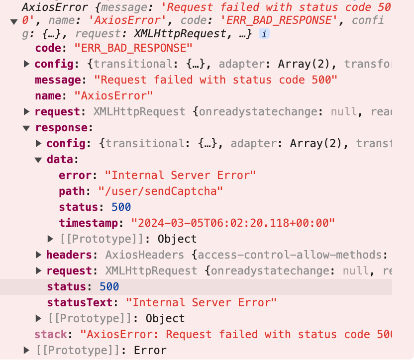
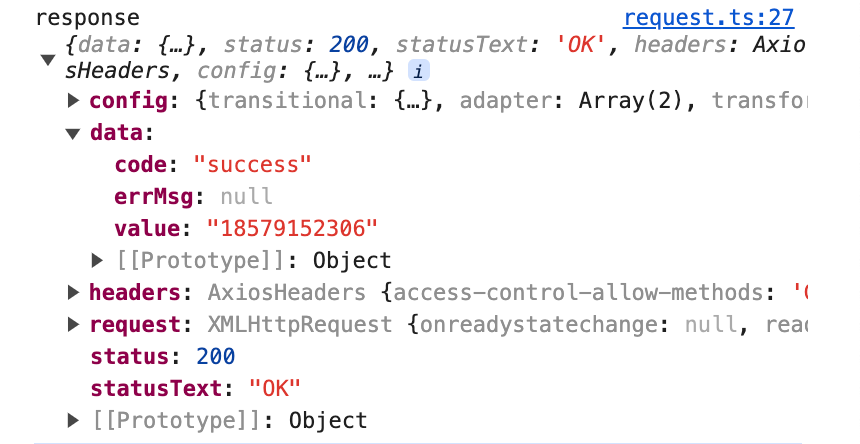
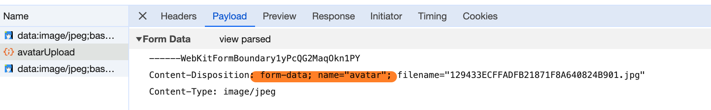

# 第一章 前端问卷系统开发

项目底层依赖一个公司前辈搭建一套代码，已具备代码检查、状态管理、路由导航、路由拦截、请求拦截、反向代理、全局弹窗配置、组件库初始化等基础配置，并且基于这些做了部分修改


## 1.1 项目初始化搭建指南

项目初始化主要学习一下 Webpack5 项目的搭建（包括前端环境搭建、底层代码打包、环境变量导出、静态资源加载、各种开发语言的支持等），Prettier、Eslint 和 Husky 搭配实现代码检查，React 主架构搭建（包括依赖包安装、组件库使用与配置、React-Router 路由系统搭建、Zustand 状态管理库等），最后是一些常用工具库的安装（包括 Echarts、Axios 等）


### 1.1.1 全局发布订阅组件

首先我想开始学习封装一个全局发布订阅组件，用到的依赖是：`@ekuaibao/messagecenter`，主要使用其导出的 `MessageCenter` 类，然后在根组件位置引入一个  `GlobalWatchEvent` 全局监听组件。即可实现全局的发布订阅。**组件优点：当有些函数或者 hook 只能在函数组件中使用时，使用此全局监听组件可以实现全局的一个使用**


工具类项目位置：`src/utils/tools/app_utils.ts`

```ts
import MessageCenter from '@ekuaibao/messagecenter'
import { EVENT_NAME } from '@/consts/eventListener'

/** 
 * 全局发布订阅工具类
 * @emit 触发监听事件
 * @invoke 异步触发监听事件
 * @open 打开弹窗
 * @close 关闭弹窗
 */
class AppContext extends MessageCenter {
  open<T>(key: string, props?: any, ...params: any[]): Promise<T> {
    return this.invoke(EVENT_NAME['@@:open:layer'], key, props, ...params)
  }

  close(...params: any[]) {
    return this.invoke(EVENT_NAME['@@:close:layer'], ...params)
  }
}

const app = new AppContext()
export { app }
```

全局发布订阅组件项目位置：`src/main/components/GlobalWatchEvent.tsx`

```tsx
import React, { useEffect } from 'react'
import { app } from '@/utils/tools/app_utils'
import { EVENT_NAME } from '@/consts/eventListener'
import { useNavigate } from 'react-router-dom'

const GlobalWatchEvent = () => {
  const navigate = useNavigate()

  useEffect(() => {
    app.watch(EVENT_NAME.useNavigate, useNavigateListener)
    return () => {
      app.un(EVENT_NAME.useNavigate, useNavigateListener)
    }
  }, [])
  
  // 封装了路由跳转监听函数
  const useNavigateListener = (to, options) => {
    navigate(to, options)
  }
  return <></>
}

export default GlobalWatchEvent
```

全局监听事件统一封装在：`src/utils/tools/watch_utils.ts`

```ts
import { EVENT_NAME } from '@/consts/eventListener'
import { app } from './app_utils'
import type { NavigateFunction } from 'react-router-dom'

/** 路由跳转方法，同useNavigate()方法使用，使得在组件外也可以实现路由跳转 */
export const navigate: NavigateFunction = (...args) => {
  app.emit(EVENT_NAME.useNavigate, ...args)
}
```

我们在任意页面任意组件内调用触发

```ts
navigate('/app/home')

// 触发事件和传入函数参数，无法获取函数返回值
app.emit(EVENT_NAME.globalTestEvent, { name: 'cocoon' })

// 可获取函数返回值，但是返回结果为异步的
const res = await app.invoke(EVENT_NAME.globalTestEvent, { name: 'cocoon' })
```


### 1.1.2 全局弹窗监听事件

上一节我们封装了一个全局监听的实例，这一节我们开始进阶：实现在任意组件中打开一个自定义的弹窗组件事件。

首先我们要封装一个全局的监听组件放在根组件中，组件位置：`src/main/components/GlobalLayerManager.tsx`。这里引用了 `@ekd/enhance-layer-manager`，这个库来实现打开弹窗的效果。

```tsx
import React from 'react'
import { EnhanceLayerManager } from '@ekd/enhance-layer-manager'
import { routerLayerList } from '@/routers/routerList'
import { app } from '@/utils/tools/app_utils'
import { EVENT_NAME } from '@/consts/eventListener'
import type { ILayerManagerProps } from '@ekd/enhance-layer-manager'

@EnhanceLayerManager((props) => props.layers) // layers 为我们自定义的弹窗组件，由此得到一个 layerManager
class LayerManager extends React.Component<ILayerManagerProps & { layers: any }> {
  componentDidMount() {
    app.watch(EVENT_NAME['@@:open:layer'], this.handleOpenLayer) // 监听打开弹窗事件
    app.watch(EVENT_NAME['@@:close:layer'], this.handleCloseLayer) // 监听关闭弹窗事件
  }

  componentWillUnmount() {
    app.un(EVENT_NAME['@@:open:layer'], this.handleOpenLayer)
    app.un(EVENT_NAME['@@:close:layer'], this.handleCloseLayer)
  }

  handleOpenLayer = (key: string, props: any, isSingle?: boolean) => {
    const { layerManager } = this.props
    // 打开弹窗组件的代码，存入弹窗 key 和 组件参数 props
    return isSingle ? layerManager?.open(key, props) : layerManager?.push(key, props)
  }

  handleCloseLayer = () => {
    const { layerManager } = this.props
    layerManager?.close()
  }

  render() {
    return <></>
  }
}

const GlobalLayerManager = () => {
  return <LayerManager layers={routerLayerList} /> // 由这里传入弹窗组件匹配规则
}

export default GlobalLayerManager
```

为了方便调用弹窗的监听事件，我们直接在 app 实例中封装两个方法，代码位置：`src/utils/tools/app_utils.ts`

```ts
class AppContext extends MessageCenter {
  open<T>(key: string, props?: any, ...params: any[]): Promise<T> {
    return this.invoke(EVENT_NAME['@@:open:layer'], key, props, ...params)
  }

  close(...params: any[]) {
    return this.invoke(EVENT_NAME['@@:close:layer'], ...params)
  }
}
```

最后就是如何创建我们自定义的弹窗了，我们得写一份弹窗路径规则，然后就是自定义弹窗组件的封装。在 `view` 文件夹新建 `CommonLayer` 下新建 `router.layers.ts`，参数可以直接参考 antd 的 `ModalProps`。使用 `BaseModalLayer` 添加标题和底部

```ts
/** 默认弹窗选项，无footer、无title、无padding */
export const modelDefaultOptions = {
  enhancer: 'modal',
  maskClosable: true,
  centered: true,
  closable: false,
  footer: null,
  bodyStyle: { padding: 0 },
}

/** localStorage缓存key */
export const LOCALSTORAGE_KEY = {
  userId: 'userId',
}
```

```ts
import { modelDefaultOptions } from '@/consts'
import type { ModalProps } from 'antd'

// 规范弹窗前缀
const layerPrefix = '@UserInfo:'

export default [
  {
    ...modelDefaultOptions,
    width: 500,
    key: `${layerPrefix}UserInfoView`,
    getComponent: () => import('./components/UserInfoView'),
  },
] as ModalProps
```

弹窗案例：`src/views/UserInfoLayer/components/UserInfoView/index.tsx`

```tsx
import React from 'react'
import UserInfoMain from './UserInfoMain'
import BaseModelLayer from '@/components/BaseModelLayer'
import type { ILayerProps } from '@ekd/enhance-layer-manager'
import type { ButtonProps } from 'antd/lib/button/button'

const UserInfoView = React.forwardRef(({ layer }: ILayerProps) => {
  const actions: ButtonProps[] = [
    {
      name: '取消',
      onClick: () => layer.emitCancel(),
    },
    {
      name: '确认',
      type: 'primary',
      onClick: () => layer.emitCancel(),
    },
  ]

  return (
    <BaseModelLayer actions={actions} title="个人中心">
      <UserInfoMain />
    </BaseModelLayer>
  )
})
export default UserInfoView
```

在项目任意位置调用事件即可，使用 `layer.emitOk` 返回的数据我们异步的方式获取

```ts
const res = await app.open('@Common:SlideToUnlock', { name: 'cocoon' })
```


### 1.1.3 项目开发配置记录

关闭 Webpack Dev Server 中的页面全屏错误覆盖（overlay）功能：

进入 `config/webpack.dev.js` 在 `devServer` 对象中添加配置：`client: { overlay: false }`


## 1.2 项目全局组件封装指南

### 1.2.1 表单生成器构建使用

表单生成器，可通过一个简单的配置得到一个实用性表单，具体封装过程和使用教程如下

#### 1.2.1.1 表单生成器封装

首先参考 antd 的 From 表单进行二次封装：https://4x-ant-design.antgroup.com/components/form-cn/#Form，如果需要一些统一的样式或者属性的话就可以在这里一键初始化，细节处理的话请查看源码

```jsx
<Form
  size={size}
  ref={formRef}
  layout={layout}
  labelAlign={labelAlign}
  {...getFormItemLayout()}
  initialValues={initialValues}
  scrollToFirstError={scrollToFirstError}
  className={classNames(styles['form-generator'], className)}
  onFinish={onFinish}
  onValuesChange={onValuesChange}
>
  {renderFromItem()}
</Form>
```

然后是表单单项的封装，antd 的表单单项构建为 `Form.Item` + `FieldComponent`，因此我们这里拆分成两层渲染。`Form.Item` 的二次封装参考：https://4x-ant-design.antgroup.com/components/form-cn/#Form.Item

```jsx
<Form.Item
  name={field}
  key={field}
  tooltip={tooltip}
  rules={rules}
  label={renderLabel(item)}
  validateTrigger={validateTrigger}
  help={help}
  hasFeedback={hasFeedback}
  validateStatus={validateStatus}
>
  <RenderField
    formItem={item}
    isDisabled={isDisabled}
    isPreviewMode={isPreviewMode}
    previewModeItems={previewModeItems}
    disabledItems={disabledItems}
    customRenderField={customRenderField}
  />
</Form.Item>
```

我们单独封装一个组件 `RenderField` 进行 `FieldComponent` 组件的映射渲染，这一个步骤最为关键。1. 首先是根据 `formItem.type` 在 `FieldMap` 中获取 `FieldComponent` 的映射 2. 其次是统一封装了三个属性：`placeholder`、`previewMode`、`disabled`，方便进行通用属性管理

```tsx
export interface RenderFieldProps {
  value: any // value和onChange由上层的Form.Item自动生成
  onChange: (...arg: any[]) => any
  formItem: FormComponentItem
  isDisabled?: FormGeneratorProps['isDisabled']
  isPreviewMode?: FormGeneratorProps['isPreviewMode']
  disabledItems?: FormGeneratorProps['disabledItems']
  previewModeItems?: FormGeneratorProps['previewModeItems']
  customRenderField?: FormGeneratorProps['customRenderField']
}

const RenderField = ({
  value,
  onChange,
  formItem,
  isDisabled,
  isPreviewMode,
  disabledItems = [],
  previewModeItems = [],
  customRenderField,
}: RenderFieldProps) => {
  const disabled = isDisabled || disabledItems?.includes(formItem.field)
  const previewMode = isPreviewMode || previewModeItems?.includes(formItem.field)
  const placeholder = placeholderBuilder(formItem)

  if (customRenderField) {
    const customFieldComponent = customRenderField?.({
      ...formItem,
      value,
      onChange,
      disabled,
      placeholder,
      previewMode,
    }) || <div />
    return customFieldComponent
  }

  return (
    FieldMap[formItem.type]?.({
      ...formItem,
      value,
      onChange,
      disabled,
      placeholder,
      // previewMode,
    }) || <div />
  )
}

export default RenderField
```

最后展示一下 `FieldMap` 组件的代码既可理解 `RenderField` 映射的用法了

```tsx
export const FieldMap: Record<FORM_TYPE, any> = {
  [FORM_TYPE.input]: (props) => <FieldInput {...props} />,
  [FORM_TYPE.password]: (props) => <FieldPassword {...props} />,
  [FORM_TYPE.captcha]: (props) => <FieldCaptcha {...props} />,
  [FORM_TYPE.phone]: (props) => <FieldPhone {...props} />,
}
```


#### 1.2.1.2 表单生成器构造

我们再 `fields` 文件夹中需要手动封装 `FieldComponent`，只需要操作三步即可添加一个 `FieldComponent`！

首先封装一份 `FieldComponent`，例如：`src/components/FormGenerator/Fields/FieldInput`

```tsx
import React from 'react'
import { Input } from 'antd'
import type { FormComponentItem } from '../../types/formType'

export interface FieldInputProps extends FormComponentItem {
  suffix?: React.ReactNode
  addonBefore?: React.ReactNode
}

const FieldInput = ({
  value,
  onChange,
  style,
  placeholder,
  size,
  allowClear = true,
  disabled,
  suffix,
  addonBefore,
}: FieldInputProps) => {
  return (
    <Input
      value={value}
      onChange={onChange}
      style={style}
      size={size}
      allowClear={allowClear}
      placeholder={placeholder}
      disabled={disabled}
      suffix={suffix}
      addonBefore={addonBefore}
    />
  )
}

export default FieldInput
```

然后将 `FieldInputProps` 类型添加到 `FormComponentsProps` 中，用作 `FormGeneratorProps['components']` 的类型

```ts
export enum FORM_TYPE {
  /** 常规输入框 */
  input = 'input',
 }

export type FormComponentsProps = FormComponentItem &
  (FieldCaptchaProps | FieldInputProps | FieldPasswordProps | FieldPhoneProps)
```

最后在 `FieldMap` 中添加对应 `FieldComponent` 的映射函数

```tsx
export const FieldMap: Record<FORM_TYPE, any> = {
  [FORM_TYPE.input]: (props) => <FieldInput {...props} />,
}
```


#### 1.2.1.3 表单生成器使用

简单的使用一份表单只需要传入两个参数即可，即一份表单实例，一份 `FormGeneratorProps['components']` 数组配置

```tsx
<FormGenerator formRef={loginFormRef} components={formComponents} />
```

这是一份配置案例，参数遵循：`FormGenerator/types/formType.ts/FormComponentItem`

```ts
export const fieldPassword: FormComponentsProps = {
  field: 'password',
  label: '密码',
  type: FORM_TYPE.password,
  hiddenLabel: true,
  placeholder: '请输入密码',
  rules: [
    {
      pattern: /^(?=.*[A-Z])(?=.*[a-z])(?=.*\d)[A-Za-z\d`~!@#$%^&*()-_=+/?\\|]{10,20}$/,
      message: '请输入正确格式的密码',
    },
  ],
}

export const fieldConfirmPassword: FormComponentsProps = {
  field: 'confirmPassword',
  label: '确认密码',
  type: FORM_TYPE.password,
  hiddenLabel: true,
  placeholder: '请确认密码',
  rules: [
    (formRef) => ({
      validator(rules, value) {
        if (!value || formRef.getFieldValue('password') === value) {
          return Promise.resolve()
        }
        return Promise.reject(new Error('两次密码输入不一致'))
      },
    }),
  ],
}
```

通过实例，我们可以校验表单、初始化表单、验证表单等多种操作！！

```ts
loginFormRef.current?.validateFields()
const res = await formRef?.current?.validateFields(['phone'])
```


### 1.2.2 后端接口联调配置指南

这里主要是与后端进行联调的相关配置：反向代理、axios 二次封装、接口返回数据规范等问题

#### 1.2.2.1 接口返回数据规范

后端接口返回的响应只有两种情况：响应成功、响应失败

**响应失败：** axios 的响应拦截器会进行 `Promise.reject(err)`，因此不会走响应成功的代码。

**响应成功：** 响应成功的化 axiso 的响应拦截器会得到一个 `response` 对象，里面的 `data` 属性就是后端返回的数据

**数据规范：**data 中有三个属性：code：状态码、errMsg：错误信息、value：成功数据

| 响应失败                                                     | 响应成功                                                     |
| ------------------------------------------------------------ | ------------------------------------------------------------ |
|  |  |


#### 1.2.2.2 接口联调配置封装

首先进行反向代理，修改后端接口地址：`config/setupProxy.js`

```js
module.exports = {
  '/api/*': {
    target: 'http://192.168.10.179:8080',
    changeOrigin: true,
    secure: false,
    pathRewrite: { '^/api': '' },
  },
}
```

然后进入 axiso 配置文件：`src/utils/request.ts`，配置baseURL前缀

```tsx
const axiosInstance = axios.create({
  baseURL: 'api/',
  timeout: 50000,
  headers: { 'Content-Type': 'application/json' },
})
```

请求拦截器

```tsx
axiosInstance.interceptors.request.use(
  (config) => {
    const newConfig = config
    if (!newConfig.headers) newConfig.headers = {} as any
    // newConfig.headers.Authorization = `bearer ...`
    return newConfig
  },
  (err) => {
    return Promise.reject(err)
  },
)
```

响应拦截器

```ts
axiosInstance.interceptors.response.use(
  (response) => {
    // 接口响应成功的统一处理，输出错误信息、登录权限拦截等
    const responseData = response.data || {}
    if (responseData.errMsg) message.error(responseData.errMsg)
    if (responseData.code === COMMON_STATUS.NOT_LOGIN) {
      window.location.replace(`${window.location.origin}/#/loginRegister`)
    }
    return response
  },
  (err) => {
    // 接口响应失败的统一处理，输出http常见的几个响应错误场景
    console.error(err)
    const errResponse = err?.response || {}
    switch (errResponse.status) {
      case HTTP_STATUS.BAD_GATEWAY:
        message.error('请求方式错误')
        break
      case HTTP_STATUS.NOT_FOUND:
        message.error('请求地址不存在')
        break
      default:
        message.error('系统接口异常')
        break
    }
    return Promise.reject(err)
  },
)
```

 接口调用时的统一封装函数，并支持 ts 类型

```ts
const safeRequest = <T>(url: string, options?: AxiosRequestConfig): Promise<T> => {
  return new Promise((resolve, reject) => {
    axiosInstance({ method: 'GET', ...options, url }).then(
      (res) => {
        // 直接将响应成功的value返回，不用管code、errMsg
        resolve(res.data.value)
      },
      (err) => {
        reject(err)
      },
    )
  })
}
```


#### 1.2.2.3 接口联调具体使用

进入 `src/services` 文件按创建不同业务创建文件：`user.services.ts`

具体配置参数参考：https://axios-http.com/zh/docs/req_config

```ts
export const sendCaptchaService = async (phone: string) => {
  const res = await request.post<boolean>('/user/sendCaptcha', {
    params: { phone },
  })
  return res // 即可获取到response.data.value
}
```


### 1.2.3 前端路由系统搭建指南

项目路由系统包含多个功能：页面缓存、页面切换、元信息赋值、路由组件懒加载等。接下来介绍路由系统底层是如何一步一步构建的。路由搭建的 API 主要还是使用 React-Router 提供，路由匹配使用 Routes 规则，而不是 useRoutes 路由表。

#### 1.2.3.1 路由表配置介绍

首先我们先熟悉路由表是如何使用的，路由表主要分为两层：全局路由和 layout 路由。

其中 layout 路由最外层是搭载 layout 组件，配置路由表信息文件地址：`src/routers/routerList.ts`

```ts
import type { IRoutersData } from './types'

/** 全局路由页面 */
const globalRouterList: IRoutersData = [
  {
    path: '/',
    redirect: '/app/systemHome',
  },
  {
    path: '/loginRegister',
    component: () => import('@/views/LoginRegister'),
  },
]

/** layout路由页面 */
const files = require.context('../views', true, /(router|router.layers)\.(js|ts)$/)
const routerList: IRoutersData = []
const routerLayerList: IRoutersData = []

files.keys().forEach((key) => {
  const child = files(key).default
  if (/router.layers/g.test(key)) {
    routerLayerList.push(...child)
    return
  }
  routerList.push(...child)
})

export { routerList, globalRouterList, routerLayerList }
```

路由表配置选项可选属性

```ts
export type LazyFn = () => Promise<{ default: ComponentType<any> }>
export interface RouterItem {
  /** 路由地址 */
  path: string
  /** 网页标题 */
  title?: string
  /** 重置跳转指定路由 */
  redirect?: string
  /** 默认pc页面 */
  component?: LazyFn
  /** pc页面，双端展示时使用 */
  componentPc?: LazyFn
  /** h5页面，双端展示时使用 */
  componentH5?: LazyFn
}
```

在 `view` 文件夹下创建路由组件：`router.ts`

```ts
import type { IRoutersData } from '@/routers/types'

export default [
  {
    path: '/app/systemHome',
    component: () => import('@/views/SystemHome'),
  },
] as IRoutersData
```


#### 1.2.3.2 路由系统核心组件

我们开始搭建一个自定义的路由系统，用到的组件有 React-Router 中的 `Routes`、`Route`、`Navigate`

核心组件 `Routers` 用来进行路由表匹配：`src/routers/index.tsx`

```tsx
const Routers = () => {
  return (
    <Routes>
      {globalRouterList?.map((item) => {
        return interceptorRoute(item)
      })}
      <Route path="/app" element={<BaseLayout />}>
        {routerList.map((item) => {
          return interceptorRoute(item)
        })}
        <Route path="*" element={<Exception />} key="noMatch" />
      </Route>
      <Route path="*" element={<Exception />} key="noMatch" />
    </Routes>
  )
}
```

然后是详细的 `interceptorRoute` 路由组件生成器：`KeepAliveWrapper` => `PrivateRoute` => `lazyComponent`

从缓存路由组件到私有化路由组件再到异步加载真实的路由组件，一站式服务

```tsx
const interceptorRoute = (item: RouterItem) => {
  if (item.redirect) {
    const redirect = item.redirect || '/'
    return <Route path={item.path} key={item.path} element={<Navigate replace to={redirect} />} />
  }

  // 动态展示电脑端还是手机端
  let newComponent = item.component
  if (!newComponent) {
    newComponent = isMobile() ? item.componentH5 : item.componentPc
  }

  // 异步加载路由组件
  const lazyComponent = LazyComponent(newComponent)
  const getRouteComponent = () => {
    return (
      <KeepAliveWrapper>
        <PrivateRoute item={item} component={lazyComponent} />
      </KeepAliveWrapper>
    )
  }

  return <Route path={item.path} key={item.path} element={getRouteComponent()} />
}
```

最后别忘了在 main 组件中导入路由系统，并使用哈希路由

```tsx
<HashRouter>
  <Routes />
</HashRouter>
```


## 1.3 项目业务开发记录指南

### 1.3.1 BaseLayout 整体设计

我这边设计是上侧有两个分区，左侧只有一级菜单栏。点击分区切换菜单栏并跳转至菜单栏对应路由，点击菜单栏直接跳转路由

1. 点击菜单操作只做路由跳转，不做状态更新！
2. 状态更新根据路由动态变化，在仓库中创建一个监听并更新函数！

`BaseLayout` 组件设计，监听 `location` 变化并执行 `monitorPathChange` 函数

```tsx
const BaseLayout = () => {
  const { Header, Content, Sider } = Layout
  const location = useLocation()
  const monitorPathChange = useLayoutStore((s) => s.monitorPathChange)

  useEffect(() => {
    monitorPathChange(location.pathname)
  }, [location, monitorPathChange])

  return (
    <Layout className={styles['base-layout']}>
      <Header className={styles['base-layout-header']}>
        <div className={styles['header-logo']} onClick={() => navigate('/')}>
          
          <div className={styles['log-title']}>小智问卷</div>
        </div>
        <HeaderMenu />
      </Header>
      <Layout>
        <Sider width={220} theme="light">
          <SiderMenu />
        </Sider>
        <Layout style={{ padding: '24px' }}>
          <Content>
            <Outlet />
          </Content>
        </Layout>
      </Layout>
    </Layout>
  )
}
```

`monitorPathChange` 函数负责当路由路径变化时**更新分区状态和菜单栏状态**

```ts
monitorPathChange: (pathName) => {
  const path = pathName.match(/\/([^/]+)$/)?.[1] as any
  if (Object.values(WORK_AREA_KEY).includes(path)) {
    // 跳转到工作区指定path
    set({
      headerMenuKey: HEADER_MENU_KEY.workingArea,
      workingAreaKey: path,
    })
  }
  if (Object.values(TEMPLATE_KEY).includes(path)) {
    // 跳转到模板库指定path
    set({
      headerMenuKey: HEADER_MENU_KEY.templateLibrary,
      templateLibraryKey: path,
    })
  }
}
```

分区组件 `HeaderMenu` 设计，当 `HEADER_MENU_KEY` 添加一个分区时在这里添加对应代码即可

```tsx
const HeaderMenu = () => {
  const headerMenuKey = useLayoutStore((s) => s.headerMenuKey)
  const workingAreaKey = useLayoutStore((s) => s.workingAreaKey)
  const templateLibraryKey = useLayoutStore((s) => s.templateLibraryKey)

  const menuItems = [
    {
      label: '工作台',
      key: HEADER_MENU_KEY.workingArea,
    },
    {
      label: '模板库',
      key: HEADER_MENU_KEY.templateLibrary,
    },
  ]

  const menuClick: MenuProps['onClick'] = (e) => {
    if (e.key === HEADER_MENU_KEY.templateLibrary) {
      navigate(`/app/${templateLibraryKey || TEMPLATE_KEY.questionnaireSurvey}`)
    }
    if (e.key === HEADER_MENU_KEY.workingArea) {
      navigate(`/app/${workingAreaKey || WORK_AREA_KEY.systemHome}`)
    }
  }

  return (
    <Menu
      mode="horizontal"
      className={styles['header-menu']}
      selectedKeys={[headerMenuKey]}
      items={menuItems}
      onClick={menuClick}
    />
  )
}
```

菜单栏组件 `SiderMenu` 设计，当新增一个分区和对应菜单栏时，在此添加配置即可

```tsx
const getIconComponent = (ICON) => {
  return React.createElement(ICON, { style: { fontSize: 16 } })
}

const SiderMenu = () => {
  const headerMenuKey = useLayoutStore((s) => s.headerMenuKey)
  const workingAreaKey = useLayoutStore((s) => s.workingAreaKey)
  const templateLibraryKey = useLayoutStore((s) => s.templateLibraryKey)

  const menuItemsByWorkingAreaKey = [
    {
      label: '全部问卷',
      key: WORK_AREA_KEY.systemHome,
      icon: getIconComponent(HomeOutlined),
    },
    {
      label: '星标问卷',
      key: WORK_AREA_KEY.starQuestionnaire,
      icon: getIconComponent(StarOutlined),
    },
    {
      label: '回收站',
      key: WORK_AREA_KEY.recycleBin,
      icon: getIconComponent(RestOutlined),
    },
  ]

  const menuItemsByTemplateLibraryKey = [
    {
      label: '问卷调查',
      key: TEMPLATE_KEY.questionnaireSurvey,
      icon: getIconComponent(FireOutlined),
    },
    {
      label: '在线考试',
      key: TEMPLATE_KEY.onlineExamination,
      icon: getIconComponent(CalculatorOutlined),
    },
    {
      label: '投票评选',
      key: TEMPLATE_KEY.votingTemplate,
      icon: getIconComponent(LikeOutlined),
    },
  ]

  const getMenuItems = () => {
    switch (headerMenuKey) {
      case HEADER_MENU_KEY.workingArea:
        return menuItemsByWorkingAreaKey
      case HEADER_MENU_KEY.templateLibrary:
        return menuItemsByTemplateLibraryKey
      default:
        return menuItemsByWorkingAreaKey
    }
  }

  const getSelectedKey = () => {
    switch (headerMenuKey) {
      case HEADER_MENU_KEY.workingArea:
        return workingAreaKey
      case HEADER_MENU_KEY.templateLibrary:
        return templateLibraryKey
      default:
        return workingAreaKey
    }
  }

  return (
    <div className={styles['sider-menu']}>
      <Menu
        mode="vertical"
        items={getMenuItems()}
        onClick={(e) => navigate(`/app/${e.key}`)}
        selectedKeys={[getSelectedKey()]}
      />
      <div>个人中心</div>
    </div>
  )
}
```

分区和菜单栏的 KEY 值预览，新增分区和菜单栏时首先在这里新增

```ts
export enum HEADER_MENU_KEY {
  workingArea = 'workingArea',
  templateLibrary = 'templateLibrary',
}

export enum WORK_AREA_KEY {
  systemHome = 'systemHome',
  starQuestionnaire = 'starQuestionnaire',
  recycleBin = 'recycleBin',
}

export enum TEMPLATE_KEY {
  questionnaireSurvey = 'questionnaireSurvey',
  onlineExamination = 'onlineExamination',
  votingTemplate = 'votingTemplate',
}
```


### 1.3.2 头像上传功能整体设计

#### 1.3.2.1 AvatarUpload 封装

这里还没有深入了解 antd 的上传组件的用法和封装：https://4x-ant-design.antgroup.com/components/upload-cn/

只是简单的对于上传头像的业务需求进行了实际的开发和使用，下面是一步一步的封装步骤

具体组件地址：`src/components/FormGenerator/Fields/FieldAvatarUpload/index.tsx`，`ImgCrop` 是一个图片裁切的组件，文档地址：https://github.com/nanxiaobei/antd-img-crop

```tsx
<div className={styles['avatar-upload']}>
  <ImgCrop aspectSlider rotationSlider>
    <Upload
      name="avatar" // 传输的文件对象名称，和后端接口对应
      listType="picture-card"
      className="avatar-uploader"
      showUploadList={false} // 不使用文件列表
      action="/api/userInfo/avatarUpload" // 手动添加/api为了实现代理
      beforeUpload={beforeUpload}
      onChange={handleChange}
    >
      {/* ImageUrl存储的是选中图片的Base64格式的URL，用于前端展示 */}
      <Avatar src={imageUrl} icon={loading ? <LoadingOutlined /> : <UserAddOutlined />} />
    </Upload>
  </ImgCrop>
</div>
```

`avatar-upload` 样式如下，设置了一些自定义样式

```less
.avatar-upload {
  :global {
    .ant-upload-select-picture-card {
      width: 66px;
      height: 66px;
      border-radius: 50%;
      margin-right: 0;
      margin-bottom: 0;
    }

    .ant-avatar {
      width: 100%;
      height: 100%;
      line-height: 64px;
      color: rgba(20, 34, 52, 0.45);
      background-color: transparent;
    }
  }
}
```

`beforeUpload` 函数控制在文件上传前的一些配置，且已经可以获取到选择的文件对象！返回真表示继续往下进行

```ts
const beforeUpload = (file: RcFile) => {
  const isJpgOrPng = file.type === 'image/jpeg' || file.type === 'image/png'
  if (!isJpgOrPng) {
    message.error('只允许上传JPG/PNG格式文件')
  }
  const isLt2M = file.size / 1024 / 1024 < 2
  if (!isLt2M) {
    message.error('图片大小必须小于2MB')
  }
  return isJpgOrPng && isLt2M
}
```

`handleChange` 函数控制在文件上传后的一些配置和回调，该函数可获取到一个关键对象：`UploadFile`，其包含上次的文件对象 `originFileObj`、上传状态 `status`、后端的返回响应 `response` 和一些之前的上传配置对象等等

`getBase64` 函数是将一个文件对象 `originFileObj` 转换为一个 Base64 格式的 URL

```ts
const handleChange: UploadProps['onChange'] = (info: UploadChangeParam<UploadFile>) => {
  const getBase64 = (img: RcFile, callback: (url: string) => void) => {
    const reader = new FileReader()
    reader.addEventListener('load', () => callback(reader.result as string))
    reader.readAsDataURL(img)
  }

  if (info.file.status === 'error') {
    message.error('图片上传失败')
    return
  }

  if (info.file.status === 'uploading') {
    setLoading(true)
    return
  }

  if (info.file.status === 'done') {
    getBase64(info.file.originFileObj as RcFile, (url) => {
      console.log('info....', info)
      const avatarUrl = info.file.response?.value || ''
      onChange?.(avatarUrl) // 表单返回后端响应的上传成功的文件名
      setLoading(false) 
      setImageUrl(url) // ImageUrl存储的是Base64格式的URL，用于前端展示
    })
  }
}
```


#### 1.3.2.2 头像表单自定义样式

通过传入表单配置项和自定义样式来解决

```ts
export const fieldAvatarUpload: FormComponentsProps = {
  field: 'avatar',
  label: '头像',
  type: FORM_TYPE.avatarUpload,
  optional: true,
  className: styles['avatar-upload'],
}
```

`avatar-upload` 自定义样式类名，单独改变头像的 label 样式

```less
.avatar-upload {
  :global {
    .ant-form-item-label {
      display: flex;
      align-items: center;
    }

    .ant-form-item-label>label {
      margin-left: 11px !important;
    }
  }
}
```


# 第二章 后端问卷系统开发

整体项目初始化构建参考瑞吉外卖项目，主要用到的技术包括：SpringBoot、MySQL、MyBatisPlus、 Redis 等


## 2.1 项目初始化搭建指南

项目中还未用到的技术：分页、公共字段自动填充、ThreadLocal、Transactional


### 2.1.1 新建项目配置框架

新建 SpringBoot2 项目，选择 JDK1.8 + Java8，使用 `https://start.spring.io` 阿里云脚手架开始创建项目，初始依赖选择：`Spring Web`、`MySQL` 即可。然后进入 `pom.xml` 导入以下依赖：

```xml
<dependency>
    <groupId>org.projectlombok</groupId>
    <artifactId>lombok</artifactId>
    <version>1.18.20</version>
</dependency>

<dependency>
    <groupId>com.alibaba</groupId>
    <artifactId>fastjson</artifactId>
    <version>1.2.76</version>
</dependency>

<dependency>
    <groupId>commons-lang</groupId>
    <artifactId>commons-lang</artifactId>
    <version>2.6</version>
</dependency>

<dependency>
    <groupId>com.alibaba</groupId>
    <artifactId>druid</artifactId>
    <version>1.2.8</version>
</dependency>

<dependency>
    <groupId>com.alibaba</groupId>
    <artifactId>druid-spring-boot-starter</artifactId>
    <version>1.1.23</version>
</dependency>

<dependency>
    <groupId>com.baomidou</groupId>
    <artifactId>mybatis-plus-boot-starter</artifactId>
    <version>3.4.1</version>
</dependency>
```

在 `resource` 文件夹下创建 `application.yml` 配置文件

```yml
server:
  port: 8080
spring:
  application:
    name: questionnaire-survey
  datasource:
    druid:
      driver-class-name: com.mysql.cj.jdbc.Driver
      url: jdbc:mysql://localhost:3306/questionnaire_survey?serverTimezone=Asia/Shanghai&useUnicode=true&characterEncoding=utf-8&zeroDateTimeBehavior=convertToNull&useSSL=false&allowPublicKeyRetrieval=true
      username: root
      password: 2002CZYczy
mybatis-plus:
  configuration:
    map-underscore-to-camel-case: true
    log-impl: org.apache.ibatis.logging.stdout.StdOutImpl
  global-config:
    db-config:
      id-type: ASSIGN_ID
```

最后新建 `config` 文件夹创建 MVC 配置类 `WebMvcConfig`，后面多个配置可能需要在此拓展

```java
@Configuration
public class WebMvcConfig extends WebMvcConfigurationSupport {
}
```


### 2.1.2 数据库配置搭建指南

新建数据库：`questionnaire_survey`，字符集选择下面的配置，新建表：`user`


### 2.1.3 本地缓存库搭建指南

本地使用 Redis 进行项目的本地缓存库的搭建，本地启动之后，项目的主要配置：

添加 Spring-Redis 依赖、配置 Redis 本地端口、修改 Redis-Key 序列化器

```xml
<dependency>
    <groupId>org.springframework.boot</groupId>
    <artifactId>spring-boot-starter-data-redis</artifactId>
</dependency>
```

```yml
spring:
  redis:
    host: 127.0.0.1
    port: 6379
    database: 0
```

```java
@Configuration
public class RedisConfig extends CachingConfigurerSupport {
    @Bean
    public RedisTemplate<Object, Object> redisTemplate(RedisConnectionFactory connectionFactory) {
        RedisTemplate<Object, Object> redisTemplate = new RedisTemplate<>();
        redisTemplate.setKeySerializer(new StringRedisSerializer());
        redisTemplate.setConnectionFactory(connectionFactory);
        return redisTemplate;
    }
}
```


### 2.1.4 登录权限过滤器搭建

登录权限过滤器作用：当用户未登入时（本地缓存无法获取 userId）就给需要拦截的接口统一返回用户未登录状态

```json
{
  "errMsg": "用户未登录",
  "code": "notLogin",
  "value": null
}
```

直接在 `filter` 文件夹下创建 `LoginCheckFilter` 配置类就行，下面是使用模板

```java
import com.alibaba.fastjson.JSON;
import com.alibaba.fastjson.serializer.SerializerFeature;
import com.questionnaire.constant.GlobalConstant;
import com.questionnaire.constant.GlobalResCode;
import com.questionnaire.constant.GlobalResult;
import lombok.extern.slf4j.Slf4j;
import org.springframework.beans.factory.annotation.Autowired;
import org.springframework.data.redis.core.RedisTemplate;
import org.springframework.stereotype.Component;
import org.springframework.util.AntPathMatcher;

import javax.servlet.*;
import javax.servlet.annotation.WebFilter;
import javax.servlet.http.HttpServletRequest;
import javax.servlet.http.HttpServletResponse;
import java.io.IOException;

@Slf4j
@Component
@WebFilter(filterName = "LoginCheckFilter", urlPatterns = "/*")
public class LoginCheckFilter implements Filter {
    @Autowired
    private RedisTemplate redisTemplate;

    public static final AntPathMatcher PATH_MATCHER = new AntPathMatcher();

    @Override
    public void doFilter(ServletRequest servletRequest, ServletResponse servletResponse, FilterChain filterChain) throws IOException, ServletException {
        HttpServletRequest request = (HttpServletRequest) servletRequest;
        HttpServletResponse response = (HttpServletResponse) servletResponse;
        String requestURI = request.getRequestURI();
        Long userId = (Long) redisTemplate.opsForValue().get(GlobalConstant.USER_ID);

        // 不需要拦截的请求路径
        String[] urls = new String[]{
                "/user/*",
        };

        // 如果请求路径不需要拦截或者用户存在Redis登录状态则放行
        if (checkoutRequestURI(requestURI, urls) || userId != null) {
            filterChain.doFilter(request, response);
            return;
        }

        // 否则的话一律响应为用户未登录
        log.info("登录权限过滤器拦截到请求地址: {}", requestURI);
        response.getWriter().write(JSON.toJSONString(GlobalResult.error("用户未登录", GlobalResCode.NOT_LOGIN), SerializerFeature.BrowserCompatible));
    }

    public static boolean checkoutRequestURI(String requestURI, String[] urls) {
        for (String url : urls) {
            boolean match = PATH_MATCHER.match(url, requestURI);
            if (match) return true;
        }
        return false;
    }
}
```


### 2.1.5 全局自定义异常类搭建

全局自定义异常类作用：想要随时随地抛出自定义异常，然后给前端返回一个自定义错误状态，前端就不至于每次后端接口报错就只响应系统接口异常。首先在 `common` 文件夹创建工具类 `CustomException`

```java
/** 自定义业务异常类，用于输出业务异常错误信息 **/
public class CustomException extends RuntimeException {
    public CustomException(String errorMsg) {
        super(errorMsg);
    }
}
```

然后继续新建一个全局异常处理类 `GlobalExceptionHandler`

```java
import com.questionnaire.constant.GlobalResult;
import lombok.extern.slf4j.Slf4j;
import org.springframework.web.bind.annotation.ExceptionHandler;
import org.springframework.web.bind.annotation.RestControllerAdvice;
import java.sql.SQLIntegrityConstraintViolationException;

@Slf4j
@RestControllerAdvice
public class GlobalExceptionHandler {
    // sql语句报错异常处理
    @ExceptionHandler(SQLIntegrityConstraintViolationException.class)
    public GlobalResult<String> exceptionHandler(SQLIntegrityConstraintViolationException exception) {
        log.error(exception.getMessage());
        return GlobalResult.error("系统SQL语句异常");
    }

    // 自定义业务异常处理
    @ExceptionHandler(CustomException.class)
    public GlobalResult<String> exceptionHandler(CustomException customException) {
        String exceptionMsg = customException.getMessage();
        log.error(exceptionMsg);
        return GlobalResult.error(exceptionMsg);
    }
}
```

全局自定义异常类的使用方式

```java
throw new CustomException(body.getMessage());
```


### 2.1.6 数据状态转换器配置

我们会发现响应请求的时候 JSON 中输出了 Long 类型和 LocalDateTime 类型，但这并不是前端想要的 JSON 格式，前端需要将 Long 转换为字符串、LocalDateTime 类型转换为日期格式字符串，因此我们需要配置状态转换器

在 `common` 文件夹下新建数据状态转换器工具类 ` JacksonObjectMapper`，直接复制即可

```java
import com.fasterxml.jackson.databind.DeserializationFeature;
import com.fasterxml.jackson.databind.ObjectMapper;
import com.fasterxml.jackson.databind.module.SimpleModule;
import com.fasterxml.jackson.databind.ser.std.ToStringSerializer;
import com.fasterxml.jackson.datatype.jsr310.deser.LocalDateDeserializer;
import com.fasterxml.jackson.datatype.jsr310.deser.LocalDateTimeDeserializer;
import com.fasterxml.jackson.datatype.jsr310.deser.LocalTimeDeserializer;
import com.fasterxml.jackson.datatype.jsr310.ser.LocalDateSerializer;
import com.fasterxml.jackson.datatype.jsr310.ser.LocalDateTimeSerializer;
import com.fasterxml.jackson.datatype.jsr310.ser.LocalTimeSerializer;
import java.math.BigInteger;
import java.time.LocalDate;
import java.time.LocalDateTime;
import java.time.LocalTime;
import java.time.format.DateTimeFormatter;
import static com.fasterxml.jackson.databind.DeserializationFeature.FAIL_ON_UNKNOWN_PROPERTIES;

public class JacksonObjectMapper extends ObjectMapper {
    public static final String DEFAULT_DATE_FORMAT = "yyyy-MM-dd";
    public static final String DEFAULT_DATE_TIME_FORMAT = "yyyy-MM-dd HH:mm:ss";
    public static final String DEFAULT_TIME_FORMAT = "HH:mm:ss";

    /**
     * 将Long转换为字符串
     * 将LocalDateTime类型转换为日期格式字符串
     */
    public JacksonObjectMapper() {
        super();
        // 收到未知属性时不报异常
        this.configure(FAIL_ON_UNKNOWN_PROPERTIES, false);

        // 反序列化时，属性不存在的兼容处理
        this.getDeserializationConfig().withoutFeatures(DeserializationFeature.FAIL_ON_UNKNOWN_PROPERTIES);

        SimpleModule simpleModule = new SimpleModule()
                .addDeserializer(LocalDateTime.class, new LocalDateTimeDeserializer(DateTimeFormatter.ofPattern(DEFAULT_DATE_TIME_FORMAT)))
                .addDeserializer(LocalDate.class, new LocalDateDeserializer(DateTimeFormatter.ofPattern(DEFAULT_DATE_FORMAT)))
                .addDeserializer(LocalTime.class, new LocalTimeDeserializer(DateTimeFormatter.ofPattern(DEFAULT_TIME_FORMAT)))

                .addSerializer(BigInteger.class, ToStringSerializer.instance)
                .addSerializer(Long.class, ToStringSerializer.instance)
                .addSerializer(LocalDateTime.class, new LocalDateTimeSerializer(DateTimeFormatter.ofPattern(DEFAULT_DATE_TIME_FORMAT)))
                .addSerializer(LocalDate.class, new LocalDateSerializer(DateTimeFormatter.ofPattern(DEFAULT_DATE_FORMAT)))
                .addSerializer(LocalTime.class, new LocalTimeSerializer(DateTimeFormatter.ofPattern(DEFAULT_TIME_FORMAT)));

        this.registerModule(simpleModule);
    }
}
```

然后去 MVC 配置类里面配置一下：`com/questionnaire/config/WebMvcConfig.java`

```java
@Configuration
public class WebMvcConfig extends WebMvcConfigurationSupport {
    @Override
    protected void extendMessageConverters(List<HttpMessageConverter<?>> converters) {
        MappingJackson2HttpMessageConverter messageConverter = new MappingJackson2HttpMessageConverter();
        // 设置对象转化器，底层使用jackson将java对象转为json
        messageConverter.setObjectMapper(new JacksonObjectMapper());
        converters.add(0, messageConverter);
    }
}
```


## 2.2 项目业务开发记录指南

### 2.2.1 头像上传功能业务设计

首先我们去资源文件中新建一份文件夹用来存储前端上传过来的头像文件，然后在 `application.yml` 添加配置

```yml
paths:
  userAvatar: /src/main/resources/userAvatar/
```

接下来是头像上传的功能开发，参考注释理解就行了，注意这段代码的使用：`@RequestPart(value = "avatar")`

```java
@Value("${paths.userAvatar}")
private String userAvatarPath;

@PostMapping("/avatarUpload")
public GlobalResult<String> avatarUpload(@RequestPart(value = "avatar")MultipartFile file) throws IOException {
    // 文件存储地址为项目根路径+资源路径
    String projectPath = System.getProperty("user.dir");
    String basePath = projectPath + userAvatarPath;
    // 如果文件存储的文件夹不存在则新建
    File dir = new File(basePath);
    if (!dir.exists()) dir.mkdirs();
    // 重命名文件
    String originalFilename = file.getOriginalFilename();
    String suffix = null;
    if (originalFilename != null) {
        suffix = originalFilename.substring(originalFilename.lastIndexOf("."));
    }
    String fileName = UUID.randomUUID() + suffix;

    // 头像文件存储在本地磁盘
    try {
        file.transferTo(new File(basePath + fileName));
    } catch (IOException exception) {
        throw new RuntimeException(exception);
    }

    // 返回头像的文件名即可，作为User.avatar
    return GlobalResult.success(fileName);
}
```



最后是头像预览接口的开发，当调用 `/userInfo/avatarDownload/图片名` 时将返回一张图片

```java
@GetMapping("/avatarDownload/{avatarFile}")
public void avatarDownload(HttpServletResponse response, @PathVariable String avatarFile) {
    // 文件存储地址为项目根路径+资源路径
    String projectPath = System.getProperty("user.dir");
    String basePath = projectPath + userAvatarPath;

    try {
        // 输入流，通过输入流读取文件内容
        FileInputStream fileInputStream = new FileInputStream(new File(basePath + avatarFile));
        // 输出流，通过输出流将文件写回浏览器
        ServletOutputStream outputStream =response.getOutputStream();

        int length = 0;
        byte[] bytes = new byte[1024];
        while (length != -1) {
            length = fileInputStream.read(bytes);
            outputStream.write(bytes, 0, length); // 写入
            outputStream.flush(); // 刷新
        }

        outputStream.close();
        fileInputStream.close();
    } catch (IOException e) {
        throw new RuntimeException(e);
    }
}
```

