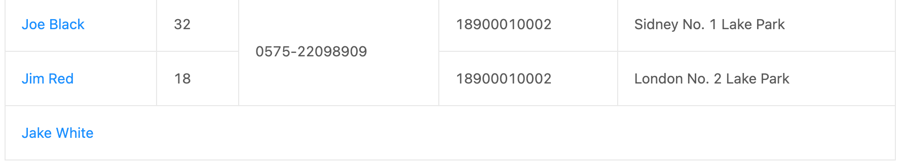

# 第一章 公务云项目架构

测试环境部署：

1. 进入 http://10.0.0.8:7001/#/project，新建项目然后进入分支管理添加一个分支
2. 填写好应用与分支，然后回到项目列表点击发布按钮
3. 点击应用管理，选择刚刚分支所在的应用点击发布管理
4. 在待发布列表中找到你的分支然后点击提交发布，当上面的部署按钮为空闲状态时点击部署即可
5. 如果部署失败，说明待部署的分支里面有冲突。如果是你的分支有问题，那么在本地拉一下 publish/qa 分支
6. 然后在本地手动一个一个合并待部署的分支，查看哪条分支有冲突，合并完之后再推一下远程，最后点部署即可


正式环境部署：

1. 当一个需求测试完成时，将最新的 master 代码合并到开发分支
2. 进入 http://wiki.gongwuyun.com/pages/viewpage.action?pageId=72395860 添加一份上线单
3. 在测试部门组把上线单发给测试要求上线即可


## 1.1 项目主要功能集成

### 1.1.1 桌面区域弹窗集成

在桌面区域可以显示多个弹窗模块（项目称为 Tabs），有些组件模块，有些是 iframe 模块。首先是通过 `Desktop` 这个组件进行对全局 `Redux Store` 中 `main` 仓库的 `state` 进行响应，监听 `tabs` 的变化进行弹窗的渲染。代码位置：src/modules/main_v2/desktop/index.jsx


因此通过调用 `action` 和 `reducer` 更新 `tabs` 的数据即可实现弹窗的添加和删除。代码位置：src/reducer/main_v2/index.js、src/actions/main_v2/index.js


一般在任意代码中可以调用封装好的工具库来进行弹窗的添加或删除。代码位置：src/common/desktopUtil.js

```js
/**
 * 添加指定的tab页
 * @param {*} param
 * @param {string} param.title tab标题
 * @param {string} param.tabName tab页对应的name id
 * @param {object} [param.state]
 * @param {boolean} [param.force]
 * @param {function} [param.callback]
 */
tabAdd: ({ title, tabName, state, force, callback, options }) =>
  store.dispatch(actions.main.tabAdd(title, tabName, state, force, callback, options)),
tabRemove: key => store.dispatch(actions.main.tabRemove(key)),
tabRemoveMult: keys => store.dispatch(actions.main.tabRemoveMult(keys)),
setTabTop: key => store.dispatch(actions.main.setTabTop(key)),
tabReplace: ({ replaceTabName, title, tabName, state = {} }) =>
  store.dispatch(actions.main.tabReplace(replaceTabName, title, tabName, state)),
tabReload: () => store.dispatch(actions.main.tabReload()),
tabClear: () => store.dispatch(actions.main.tabClear()),
tabUpdate: ({ key, state, layout }) =>
  store.dispatch(actions.main.tabUpdate({ key, state, layout }))
```

```ts
desktopUtil.tabAdd({
  title: `投票配置`,
  tabName: "votingConfig",
  state: {
    fromTabId: location.openId,
    selectionList: voteList.length > 0 ? voteList : undefined
  },
  options: {
    layout: {
      hideTab: true,
      mode: LayoutMode.modal,
      width: 800,
      height: 625
    }
  }
})
```


我们通过传入 `tabs` 中的 `tabName` 来决定打开哪个弹窗，具体的映射代码在这两个文件中：`src/modules/main_v2/tab-frame-config.ts`、`src/modules/main_v2/tabModules.js`。因此当我们打开一个弹窗模块时，首先看是不是 `iframe` 页面然后根据其路由查找对应项目及组件，否则的话就在主项目中查找。


### 1.1.2 微前端应用使用方式

在主项目的索引页面中 `src/modules/main_v2/tab-frame-config.ts` 会映射多个 `iframe` 路由。路由映射方式：项目名 + 路由名，`moduleName` + `pageName`。例如 `contract-factory/supervison-editor.html` 就对应 `contract-factory` 中 `page`
目录的 `supervison-editor` 组件


**useBridge**

在弹窗模块中与父页面（打开该页面的组件）进行通信使用 `useBridge` 这个 `Hook` 创建一个 `bridge` 对象。初始化一般就是通过 `onReady` 这个钩子调用 `getTabState` 获取父页面传入的 `state`。然后通过 `bridge` 对象可以新建删除弹指定的弹窗模块

```ts
import { useBridge } from '@gwy/ui-biz-form-lib';

const bridge = useBridge({
  onReady: async () => {
    // 通过bridge.tabAdd存入的state获取
    const { appId, postId } = await bridge.getTabState();
  }
});
```


**getTabInfo(tabId?: string)**

获取当前 tab 的信息，也可以指定 tabId

```js
key: string;
title?: string;
tabName: string;
state?: Record<string, any>;
```


**getTabState**

获取当前 tab 的 state 数据，通常是由入口传入


**onReady**

在同一个弹窗中，如果一个弹窗已被打开，但是通过另一个操作也打开了该弹窗，那么 useBridge 重新会被触发 onReady 钩子，直接引起组件的重新渲染。


**onTabData、sendTabData（旧版本使用）**

当其他应用调用 sendTabData 时并且传入的 tabId 为当前应用时，则会触发此回调函数。

```js
// 父应用
const bridge = useBridge({
  onTabData: ({ eventType }) => {
    if (eventType === 'reload') {
      reload();
    }
  },
});

const toTopic = async (item) => {
  const tabInfo = await bridge.getTabInfo();
  bridge.tabAdd({
    title: '主题讨论',
    tabName: 'topic',
    state: {
      id: item.id,
      key: tabInfo.key,
    },
  });
};
```

```js
// 子应用，不传入
bridge.sendTabData(state?.key, { eventType: 'reload' });
```


**onEvent、triggerEvent（新版本使用）**

如果要实现在微应用里触发主项目的函数，可以使用 onEvent 和 triggerEvent 来实现。案例：子应用：src/pages/template-wrapper/index.tsx 主应用：

```js
const bridge = useBridge({
  onReady: async () => {},
  onEvent: ({ eventType }) => {
    if (eventType === 'reload') {
      getListData();
    }
  },
});

const { openId } = await bridge.getTabState();
bridge.tabAdd({
  title: '合同确认',
  tabName: 'contractConfirmDetail',
  state: {
    fromTabId: openId,
    ...record,
  },
  options: {
    layout: {
      hideTab: true,
      mode: LayoutMode.modal,
      width: 980,
      height: 800,
    },
  },
});

const { fromTabId } = await bridge.getTabState();
fromTabId && bridge.triggerEvent(fromTabId, { eventType: 'reload' });
```

```jsx
import Iframe from "@/modules/iframe"

(<Iframe
  onEvent={({ eventType }) => {
    if (eventType === "goBack") goBack()
  }}
  url={iframeModule.metaManageSystem}
  data={{ state: props.location.state }}
/>)

bridge.triggerEvent('', { eventType: 'goBack' });
```


**从代办打开**

如果从代办打开，这后端传递的数据在 bizParam 这个 JSOM 字符串里面，主项目的 src/modules/waitingWork/jump.js 这个文件将这个对象解析出来并放在 state.params 对象里，另外整条代办的数据会放在 state.record 对象里

```jsx
// 区分是从代办打开还是直接通过bridge.tabAdd打开
const state = await bridge.getTabState();
let _params: any = {};
if (state?.record?.bizId) {
  _params = state?.params || {};
} else {
  _params = state;
}
const { contractUrl, fromTabId, status, userId, dataId, datasourceId, ruleId } = _params;
```


**允许弹窗拖动**

当在主项目声明一个应用的时候，主项目里的应用默认支持拖拽，其他项目中的应用需要手动加一个 id：`contractConfirmDetail: "contract-confirm-detail.html"`，给应用构建的组件最外层添加一个 id 即可。


### 1.1.3 数据元项目笔记记录

组件位置在：contract-factory/src/pages/onlyoffice-application-view-manage/index.tsx

通过在公务云-事务管理-我的应用中点击某个配置好的数据元应用来打开，渲染一个数据元动态表格。


弹窗中获取入口传递的 appId 这个参数即可，调用 dataElementAPI.getAppViewDataList 获取表格数据，调用 dataElementAPI.getAppViewConfigs 获取表格列数据（标签数据）

```tsx
const getViewConfig = async () => {
  const data = await dataElementAPI.getAppViewConfigs({
    appId: state.appId,
    approveId: state.isPreview ? state.approveId : '',
  });
  console.log('getViewConfig', data);
  const { showTags, datasourceId } = data || {};
  setTags(showTags || []);
  setDatasourceId(datasourceId);
};

const data = await dataElementAPI.getAppViewDataList({
  appId: state.appId,
  pageSize,
  currentPage: current,
  approveId: state.isPreview ? state.approveId : '',
});
console.log('getDataSource', data);
const { total, records } = data || {};
```


最后通过将标签和表格数据在 src/pages/onlyoffice-application-view-manage/data-element-view/tag-table.tsx 中通过映射对应获取到最终的 columns


### 1.1.4 项目常用功能点记录

**蓝色顶部弹窗样式**

new-gwy-web/src/modules/organization/deptmentTree/DragTree/merge-dialog-new.tsx


**弹窗添加圆角、实现拖拽**

contract-factory/src/pages/onlyoffice-application-designer-v3/components/tabs-left/components/fields-libs-modal/index.tsx

```js
// 添加圆角需要加上
wrapClassName="modal-border-round" modal
<TabsHeaderNew className={styles.tabsHeader} title="字段库" leftTitle onClose={onCancel} canDrag />
```

```css
.tabsHeader {
  border-radius: 6px 6px 0 0;
}
```


**嵌套表单及列表，同时支持自定义渲染表单**

自定义表单即被 Form.Item 包裹并 props 自动接收 value 和 onChange

src/pages/onlyoffice-application-designer-v3/components/control-panel/button-options-modal/components/event-params.tsx


**拖拽排序列表**

contract-factory/src/pages/onlyoffice-application-designer-v3/components/app-manage/sort-columns/index.tsx


**设置全局订阅监听事件**

去 src/pages/onlyoffice-application-apply/dynamic-word-v3/dynamic-table-new/utils.ts 添加一个监听事件

```js
actions: {
  relationTagChange: 'relationTagChange',
  relationTagChangeInTable: 'relationTagChangeInTable',
  optionsItemChange: 'optionsItemChange',
  getIfCanInput: 'getIfCanInput',
  getBankBranchesAction: 'getBankBranchesAction',
}
```

组件里面监听事件

```jsx
useEffect(() => {
  const getBankBranchesWatcher = customWatcher.injectWatcher(
    customWatcher.actions.getBankBranchesAction,
    async ({ data }) => {
      await getBankBranches();
      if (!isEmpty(data)) onChange(data);
    },
  );
  return () => {
    getBankBranchesWatcher();
  };
}, []);
```

全局任意地方订阅事件

```js
customWatcher.dispatchEvent(customWatcher.actions.getBankBranchesAction, { data });
```


### 1.1.5 项目接口编写规范

**contract-factory 项目接口定义**

```jsx
/**
 * 获取表单应用列表通用排序设置
 */
export const getGeneralListSort = (params) =>
  dataWrapper(requestUtil.get('ideal-new-datasource/api/datasource/generalListSort/get', { params }));

/**
 * 保存表单应用列表通用排序设置
 */
export const saveGeneralListSort = (params) =>
  dataWrapper(requestUtil.post('ideal-new-datasource/api/datasource/generalListSort/save', params));
```

**contract-factory 项目接口调用，通过 try catch 来捕获**

```jsx
const handleConfirm = async () => {
  try {
    await form.validateFields();
    const values = form.getFieldsValue();
    await dataSourceV3API.saveGeneralListSort({
      userId,
      objectId: state.appId,
      type: state.appType,
      sortJson: JSON.stringify(values.sortRules),
    });
    setSortRules(values.sortRules);
    setSortOpen(false);
    initData();
  } catch (error) {
  	message.error(getErrorMsg(error));  
  }
};
```


### 1.1.6 项目代码编写规范

**项目目录创建规范**

当要新建一个组件时，如果它所依赖的父级还没有其他子组件，则建议直接在父级文件夹下创建文件夹，而不用新建 components 文件夹，因为我一般会在 components 这个文件夹里放一些小组件，这些组件不需要套一层文件夹的。所以我的页面级目录会类似与写成这样，**那规范就是大组件直接放文件夹里，小组件放 components 里。**


**类型及常量编写规范**

不管，这个组件及其子组件用到的通用类型、枚举和常量都写在最外层文件夹里的 const.ts 里面，因为没有那么多精力去再对这些常量通过文件来进行区分！

```md
前端命名规范：https://developer.aliyun.com/article/951001

1. 组件文件命名规范：大驼峰命名，公司用的是横杠命名
2. 变量命名规范：无论是普通变量、对象、数组还是对象的键，都是小驼峰命名
3. 常量命名规范：通过 const 定义一个常量，命名方式为 VAR_TYPE，字母全部大写
4. 枚举命名规范：枚举名称为大驼峰，枚举的键为常量命名规范
```

```ts
const ENTRY_POST_AUTO = 12324,

export enum ExecutionEventType {
  /** 入职 */
  ENTRY_POST = 10,
  /** 离职 */
  LEAVE_POST = 13,
  /** 入职邀请 */
  INVITE_POST = 14,
  /** 自动盖章 */
  AUTO_SEAL = 21,
}

export interface EventParamsConfig {
  label: string;
  type: number;
  toolType?: number;
  ifAutoSet?: boolean;
  dataSave?: number;
}
```


**重构功能梳理总结**

首先需要学会梳理，无论是业务逻辑还是代码实现。每个流程肯定有对应的代码步骤，把代码梳理好了就可以着手设计重构计划了。

另外最关键的一点就是不能影响以前功能的使用，所以要做到基本是新增代码，历史逻辑全部要处理不能遗漏！因此大概分为以下步骤：

- 明确重构的需求业务及最终目标
- 梳理代码逻辑，整理所有业务场景
- 着手开发，代码以新增为主，历史逻辑要兼容
- 严格自测，设计到重构场景的业务都需要自测一遍


## 1.2 开发任务列表梳理

### 1.2.1 封装审批框连线组件

需要封装一个组件，生成一个画布，画出审批节点和 `diff` 节点的连线。实现思路：

1. 在 `container` 组件中渗透一个 `addDiffItem` 和 `removeDiffItem` 函数，在 `Item` 组件中通过是否 `showDiff` 触发这两个函数并传入该 `item` 组件绑定的节点和 `diff` 节点实例还有一些另外的绘制属性
2. 然后在 `container` 组件维护一个 `diffList` 属性，并在全局渲染中保持不变。当 `addDiffItem` 和 `removeDiffItem` 函数设置 `diffList` 的值，并触发一个防抖函数 `drawLink` 开始绘制连线
3. 绘制函数 `drawLink` 中首先清除画布，然后遍历 `diffList` 列表绘制每一条连线


组件位置：

`new-gwy-web/src/component/approve-diff-container/index.tsx`


### 1.2.2 投稿事务添加上传附件

需求文档：https://lanhuapp.com/web/#/item/project/product?tid=25260f73-a35e-4b80-9052-4012b91adf7c&pid=3f56a68b-60db-4ae9-be73-a6309621248b&versionId=063ba6ee-6070-4ae9-a263-2595d2f47166&docId=1c6816f7-bf68-4705-a545-c5b030d52693&docType=axure&pageId=e69a91767b1b47a9a7052c4da712b60c&image_id=1c6816f7-bf68-4705-a545-c5b030d52693&parentId=3de843d7-e64f-431e-a996-55358afef90b

测试账号：13500000004 投稿审核 13500000005 投稿发起

需要将两个组件添加上传附件的控件：

1. contract-factory/src/pages/submission-text-designer/index.tsx 投稿事务发起
2. contract-factory/src/pages/submission-application-approval/index.tsx 投稿事务审批


### 1.2.3 建工论坛后台管理系统

线圈列表页开发：

1. 需求文档：https://lanhuapp.com/web/#/item/project/product?tid=25260f73-a35e-4b80-9052-4012b91adf7c&pid=5ce99f06-6212-4b7e-b138-05e707fa7337&versionId=6aecc225-4179-43e5-b3d8-699e7ddda80a&docId=0d213f61-4a0e-42b0-9d58-4ef753687064&docType=axure&pageId=e69a91767b1b47a9a7052c4da712b60c&image_id=0d213f61-4a0e-42b0-9d58-4ef753687064&parentId=d85872c9-3ebe-47cd-a36b-7e1e2266902d
2. 代码路径：gw-manage-bbs/src/pages/manage/coilList/coilList/index.tsx


意见征集添加留言板块：

1. 需求文档：https://lanhuapp.com/web/#/item/project/product?tid=25260f73-a35e-4b80-9052-4012b91adf7c&pid=0ee45295-9181-4570-a0ce-d5d48bfcf758&versionId=a1cfca3f-e8a8-4174-8000-a29a1dd8d7f3&docId=cfd1487f-3850-486d-afc6-039fa080e03c&docType=axure&pageId=e69a91767b1b47a9a7052c4da712b60c&image_id=cfd1487f-3850-486d-afc6-039fa080e03c&parentId=c5d9fe2f-e340-4fd7-abda-be4c9be3faf1
2. 管理后台代码路径：gw-manage-bbs/src/pages/manage/vote/vote/index.tsx 分支：feature/0418-lyj-coil
3. 建工论坛代码路径：bbs-jg/pages/index.js 分支：feature/0418-czy-vote


主体沙龙模块开发：

1. 需求文档：https://lanhuapp.com/link/#/invite?sid=lX0Vf4lq
2. 分支：feature/20240417_czy_salon


### 1.2.4 勤务会议交互优化

**C0412勤务会议交互优化**

PRD：https://lanhuapp.com/link/#/invite?sid=lXu1Ovx7

测试账号：罗建 18273956459 白凤英 13500457496


**部门设置取消有效出勤时间、休息时间两个字段（完成）**

组件位置：new-gwy-web/src/modules/organization/deptmentTree/dept-inner-approve/components/attend-diff-info/index.tsx


**部门设置的派生形式字段没有回显（完成）**

组件位置：new-gwy-web/src/modules/organization/deptmentTree/dept-inner/components/dept-info/basic-info/info-new/index.tsx

后端接口 ideal-new-org/api/org/departmentEditNew/getBaseInfo 返回的 deriveAlignType 为 null


**会议厅修改时间后状态异常（完成）**

当修改会议内容之后，后端接口返回的 meeting.status 变为了 1，前端将状态为1和为0的情况一致就行了

组件位置：new-gwy-web/src/modules/im/meeting/ConferenceHomePage/index.jsx

```jsx
const inMeetingList = meetingList.filter(m => m.status === 4 || m.status === 0)
const willMeetingList = meetingList.filter(m => m.status === 2 || m.status === 3)

inMeetingList
(
  <Button
    type="primary"
    className={styled.iconDiv}
    onClick={this.clickItem.bind(this, list)}>
    <span className={styled.iconText}>
      {list.status
        ? list.conferenceForm === 1
          ? "进入会议"
          : "进行中"
        : "待确认"}
    </span>
  </Button>
)

willMeetingList
直接渲染待开始按钮
```


 **首页底部会议厅图标样式（完成）**

当全部会议确认参加后会显示蓝色图标

组件位置：new-gwy-web/src/modules/main_v2/footer/index.jsx


**群公告消息框样式和添加已作废图标（完成）**

deleteStatus = 0 则加上已作废图标，接口地址：ideal-new-imapi/api/tigase/shiku_muc_msgs，组件位置：new-gwy-web/src/modules/im/chatRoom/message/notice.jsx

目前的问题是历史聊天记录默认走 indexDB 缓存，然后已作废的状态在content里面位于缓存中，导致已作废的图标无法同步回显。只有删除右侧聊天框记录才能清空indexDB缓存然后调用接口来达到更新。

现在的解决方法是在获取缓存的时候更新一下content就行，代码位置：src/common/im-sdk/webim.js:613

```js
// 更新content
if (selfRecord && selfRecord.content) {
  bUpdates.content = selfRecord.content
}
```

另外还发现一个bug就是删除群公告之后，消息框里面的群公告没有同步删除，后端接口的问题，代码位置：src/modules/im/noticeModalList/component/manage/index.jsx


### 1.2.5 制表工场结构性设计

整体上是这么一个设计思路：从消息通知中进入「待处理事物」弹窗，展示所有待处理的应用事物列表


点击处理进入「待处理的应用事物详细审批」弹窗，展示审批表单


可以通过「待处理事物」弹窗右上角历史查询或者「事务管理-我的应用-历史查询」中进入「历史查询」弹窗，展示所有已处理已审批的应用事物列表


可以通过点击查看和IM消息中「{处理的岗位名称+在岗人员}通过了您发起的{应用名称}，查看详情」进入「待处理的应用事物详细」弹窗，展示详细表单


设计思路：

1. 新建待处理事物列表弹窗，获取到一系列参数，进行表格的渲染
2. 历史查询弹窗沿用待处理事物列表弹窗，用一个属性做判断即可
3. 新建待处理的应用事物详细审批弹窗，参考onlyoffice-application-apply进行动态表单渲染
4. 待处理的应用事物详细查看弹窗沿用审批弹窗，用一个属性做判断即可


主项目入口代码位置：

1. 消息通知-待处理事务（进入「待处理事务」弹窗）：src/modules/waitingWork/jump.js:2623
2. 我的应用-历史查询（进入「历史查询」弹窗）：src/modules/postAffair/my-application/index.tsx:89
3. IM 消息-查看详情（进入「审批详情」弹窗）：src/modules/im/chatRoom/message/assistant.jsx:376


### 1.2.6 部门点位分析列表优化

组件位置：src/modules/dutyDynamic/subUserList/footPoint/deptPointAnalysis/index.jsx

antd 列表有滚动条和边框时，会存在列头的竖线和内容区的竖线对不齐的问题

- 解决方法一：添加横向滚动条，但是滚动到边缘时还是会出现对不齐的情况
- 解决方法二：用外层盒子实现滚动条效果，不在列表内部实现
- 解决方法三：直接不展示边框样式


### 1.2.7 BaseLayer 封装

主项目BaseLayer组件分支： feature/0524_czy_tabs

制表工厂tabs-header-new添加灰色主题分支：feature/0524_czy_tabs


### 1.2.8 勤务异常申诉优化

C0524勤务点位统计及勤务申诉优化

需求一：点击异常考勤代办时弹出提示，全局只弹一次。当在代办中点击一个勤务异常申诉代办时，弹出提示框，无法点击其他代办和滚动代办列表。

解决思路：使用 React 提供的传送门组件 createPortal：https://zh-hans.react.dev/reference/react-dom/createPortal

将弹窗提示传送到最外层 App 组件下面，通过使用绝对定位来确定位置展示，入口组件自己控制显示隐藏。

代码位置：src/component/draggable/schedule/PendingWork.jsx


需求二：从我的勤务-出勤页面进入时，第一次就会弹出，切换其他日期这个提醒也还在，除非点击我知道了才会消失。

解决思路：在 src/modules/dutyDynamic/my-attend-modal/dynamic-modal.tsx 组件中监听 rightActiveKey，当为出勤页面时并且未展示过异常申诉提示，展示提示。将提示绑定到日历组件 dom 中，即可居中显示也可以跟随拖动。

```tsx
useEffect(() => {
  // 监听rightActiveKey，当为出勤页面时并且未展示过异常申诉提示，展示提示
  if (rightActiveKey === 3 && !storage.kget("hasShowExceptionAppeal")) {
    setShowExceptionAppeal(true)
    storage.kset("hasShowExceptionAppeal", true)
  }
}, [rightActiveKey])
```

```tsx
{showExceptionAppeal &&
  createPortal(
    <ExceptionAppeal
      style={{ top: "50%", left: "50%", transform: "translate(-50%, -50%)" }}
      confirmClick={() => {
        setShowExceptionAppeal(false)
      }}
    />,
    document.getElementById("my-attend-modal-container")
)}
```


### 1.2.9 指令交互优化

需求C0601指令交互优化，前端需求：

1. 要求将下拉选项改成树形结构，通过公司或集团进行分级，点击
2. 顶部提示只显示该成员将于"MM月DD日HH:mm"收到指令，有时间就显示否则不显示


当前 userPostList 的数据格式


### 1.2.10 公司项目地图替换

1.项目：gw-web-jyec，分支：feature/0618_czy_map

2.项目：gw-web-plgl，分支：feature/0618_czy_map

3.项目：gw-web-plsj，分支：feature/0618_czy_map


### 1.2.11 lxhk 前台接口总结

**公益大事记分类列表和数据列表两个接口**

组件位置：components/home-map/index.tsx


**理想花开榜新闻分页列表和新闻详细页列表**

展示组件位置：components/top-news/index.tsx

分页列表组件位置：pages/flower-news/news-list/index.tsx

详细页组件位置：pages/flower-news/[id].tsx


**理想的声音新闻分页列表和新闻详细页列表**

展示组件位置：components/voice-news/index.tsx

分页列表组件位置：pages/voice-news/news-list/index.tsx

详细页组件位置：pages/voice-news/[id].tsx


**山海协作全部数据列表**

展示组件位置：components/cooperation/index.tsx


**基金会成果全部数据列表**

展示组件位置：components/achievement/index.tsx


**奖学成果新闻分页列表和新闻详细页列表**

展示组件位置：components/award-news/index.tsx

分页列表组件位置：pages/award-news/news-list/index.tsx

详细页组件位置：pages/award-news/[id].tsx


理想花开榜分页列表过滤未发布的： /api/bizStandings/page

理想花开榜分页列表过滤未发布的：/api/bizSound/page

特别鸣谢列表过滤未发布的：/api/special/thanks/getByCategoryId?categoryId=${id}


### 1.2.12 会客厅im已读优化

text消息代码位置：src/modules/im/chatRoom/message/text/index.tsx:247

- 当前会客厅@全体成员但是没有人已读时：obj没有**readMembers**和**atMembersNum**


- 当会客厅@全体成员有人已读时：obj没有**atMembersNum**，所以一直为黄色灯


- 当会客厅@单个成员时，parseCall函数接收到的members数组为空导致callNames也为空数组，下面为正常情况


因此无法走下面的字符串匹配回调，导致@单人时没有灯。


### 1.2.13 个人中心隔离

根据state.user.orgGroupInfo中的**personalFlag**字段进行判断，如果为true说明是个人中心，组件位置：

1. 组织架构：src/modules/organization/organizationManagerNew/organizationManageNewMon/index.jsx
2. 系统设置-联勤设置：src/modules/attendanceRuleModal/index.jsx
3. 系统设置-员工设置：src/modules/organization/staffManageModal/index.jsx
4. 事务管理-个人表单：src/modules/postAffair/post-menu/index.tsx


勤务模块bug修复：src/modules/dutyDynamic/my-attend-modal/attend-right.tsx:328


日历标题修改组件位置：src/component/draggable/Weather.jsx


### 1.2.14 主题讨论交互优化

1. 用户可以在主题讨论列表中删除自己创建的主题讨论，列表中返回字段isMyTopic，接口地址：ideal-new-org/api/topic/list
2. 用户可以在主题讨论详细页中删除自己创建的主题讨论，主题讨论信息中返回字段isMyTopic，接口地址：ideal-new-org/api/topic/topicInfo
3. 提供一个删除主题讨论的接口
4. 进入众议院时获取新增的评论被回复数量，提供一个新接口获取
5. 获取当前用户的消息回复列表，新增的回复放在最前面，提供一个新接口获取。数据结构如下

```js
{
  id: 'a749c5da41644f4eb4e4460c5e8e284b',
  content: '@姜桂芳   早上好中国，现在我有冰淇淋！',
  topicId: 'e27c7ccc24694134adaa9bc2b1df4645',
  createTime: '2024-07-16 14:50:13',
  userName: '姜桂芳',
  portraitUrl: 'https://10.0.0.12:8089/avatar/o/1886/10001886.jpg?1709177733020?time=1709177730391',
},
```

5. 留言接口不知道要不要适配，需要后端通知，接口地址：http://localhost:3000/api/ideal-new-org/api/topic/comment


### 1.2.15 属员考评交互优化

测试账号：管理岗 17011111101 执行岗 13777371734

一、新增考评设置-属员考评：通过表格实现管理岗对每个部门进行不同的属员考评设置模式

组件位置：src/modules/deptMarkSetting/index.tsx

获取考评表格接口：新增，提供表格数据，每一项包含部门名称、考评选项、考评方式

修改考评表格接口：新增


二、属员考评-按选项考评模式：逻辑基本不用改，根据后端返回的考评选项过滤即可，还有就是文案改下

组件位置：src/modules/dutyDynamic/subUserList/subUserMark.jsx

获取对应岗位考评接口：ideal-new-attend/api/attend/gradeNew/evaluationScore/info，需要多提供一个考评方式和考评选项数组


三、属员考评-按星级考评模式：新增的模块，先根据后端返回的考评模式进行切换，在渲染对应样式

组件位置：src/modules/dutyDynamic/subUserList/subUserMark.jsx

接口和上面的一样


四、我的勤务-考评栏：可查看选中日期管理岗对你的考评和申诉，改下样式即可（完成）

组件位置：src/modules/dutyDynamic/my-attend-modal/check-grade/check-grade.tsx

不需要联调


五、属员勤务-考评栏：可查看选中日期管理岗对属员的考评，改下样式即可（完成）

组件位置：src/modules/dutyDynamic/dynamic-approval-modal/check-grade/index.tsx

不需要联调


六、考评申诉代办：管理岗处理属员对与考评的申诉，区分两种考评模式并改下样式

组件位置：src/modules/dutyDynamic/subUserList/noticeSubUserMark.jsx

获取对应岗位考评接口：ideal-new-attend/api/attend/gradeNew/evaluationScore/info，需要多提供一个考评方式和考评选项数组


**此次项目经验**

- 这一次出现的问题有：1. 测试阶段发现popover动态变化高度之后无法重新定位导致和设计稿不符合 2. 沟通之后要求产品根据高度固定来重新设计，上线之后导致市场认为样式不满意 3. 重构了评分赋值方式，由于没有和后端沟通好导致和app端评分方式不同步，上线之后才发现问题 4. 上线之后市场直接要求再改逻辑，并且需求中并没有提出 5. 项目没有去评审，导致理解不全问题

- 原始逻辑（包括定义的枚举和常量）不要去改变它的结构，不然和后端沟通成本很高。如果想要去重构一定先整理好思路，再和产品和后端沟通好。
- 开发阶段严格按照需求设计的来做，如果碰到设计与开发逻辑冲突一定要及时提出与沟通。不要等到测试阶段才发现，不然想出解决办法再到开发完成时间会很赶，又太好让让产品直接改设计，因为可能会越改越乱。所以还是只能靠开发来想出解决方案。
- 上线之后如果是一些细微的bug或者样式问题可以整理好一起改一下，如果是涉及到逻辑的修改则要求排到下一个需求里面去。不要产品要求做什么就直接去做，需要思考和商量。
- 如果现在空了一定要主动去评审可能会被安排到的需求，合理的评估时间和确定到提测时间和上线时间，如果不清楚及时找上级确认
- 如果碰到测试和产品提出的问题要一一记录，安排时间逐一解决，另外不要太依赖前辈们，如果自己实在想不出来解决方案再找他们求助！


### 1.2.16 通用合同确认表单设计

https://wiki.gongwuyun.com/pages/viewpage.action?pageId=88152505

一、个人表单新增【合同确认记录】

接口地址：ideal-new-journal/api/journal/folder/list，接口参数：

```js
{
  "moduleType": 1,
  "type": "1",
  "folderId": null,
  "postId": null
}
```

需要多返回一个对象：

```js
{
  "type": 1,
  "folderId": null,
  "folderName": null,
  "formId": "fixed019",
  "specialType": null,
  "ifCanStart": null,
  "formName": "合同确认记录",
  "frontComponent": null,
  "allocatorPostId": null,
  "topFlag": 0,
  "childrenList": null
}
```


二、代办打开合同确认详细页面

获取代办列表接口：ideal-new-common/api/pending/find


三、代办逻辑梳理、模块之间通信逻辑梳理


### 1.2.17 数据单元属性关联应用

https://wiki.gongwuyun.com/pages/viewpage.action?pageId=88152578

一、性别填充工具类要显示高级属性

参考：系统设置  - 数据元 - 自定义标签 - 智能识别 - 性别填充，他们两个的下拉选项要一致

src/pages/meta-manage-system/components/org-tag-data/components/tag-config-v2/components/data-material-groups/index.tsx

二、数据来源字段删除，不需要动态渲染其余字段 


### 1.2.18 部门向上考评设置优化

部门向下考评组件：src/modules/dutyDynamic/subUserList/departmentUserMark.jsx（属员对部门、上级考评）

- 任务点：1. 根据传入的选项进行筛选 2. 高度自适应变化 3. 支持按星级按选项考评 4. 考评改成四种通用的形式

- 逻辑梳理：1. 当选择部门树时，会调用获取评分接口，这个时候选择判断评分类型、渲染评分数据和过滤评分选项

- 后端联调：1. 获取向上考评接口：ideal-new-org/api/endScore/getEndScoreDetail，需要多提供一个考评方式和考评选项数组 2. 获取部门考评接口：ideal-new-org/api/department/score/set/getLastScoreDetail，需要多提供一个考评方式和考评选项数组


部门考评详细组件：src/modules/dutyDynamic/subUserList/appealDepartUserMark.jsx（部门领导查看、申诉）

- 任务点：1. 根据传入的选项进行筛选 2. 考评数据改成四种通用的形式进行展示 3. 布局改变较多


部门考评申诉代办组件：src/modules/dutyDynamic/subUserList/approveDepartUserMark.jsx（属员处理部门领导考评申诉）

- 任务点：1. 根据传入的选项进行筛选 2. 支持按星级按选项考评 3. 考评改成四种通用的形式 4. 布局改变较多
- 后端联调：1. 部门考评申诉代办获取部门考评详情接口：ideal-new-org/api/departmentScore/getApprovingDetail，需要多提供一个考评方式和考评选项数组


### 1.2.19 Tree组件自定义新增选中

**可自定义添加树节点**

- 组件内部解耦：treeData 以及其他组件内部状态都由组件内部维护！只有 value 和 onChange 是和外部交流的工具。并且在表单提交时可通过 value 获取该组件内部的数据

- 支持单选、多选，最终提交接口时也只调一次接口


**数列选项全选取消全选**

- 默认选中的配置从接口里面得到 ideal-new-datasource/api/datasource/v2/getRuleSetInfo，data.datasourceDataRuleV2VO.rules。渗透进入 tagConfigsList，该列表里面的项默认选中

- 选择组件内部解耦：src/pages/onlyoffice-application-designer-v3/components/components-panel/datasource-config-dialog/components/select-tags/index.tsx，组件内部维护 checked 数组，通过下面的函数判断是否是全选状态

- 取消勾选某个项后，直接控制 tagConfigsList 进行同步勾选状态数据更新


**此次项目学习到的经验**

- 接口联调方案一定要合理！不能处于被动，像这次后端提的方案前端实现起来特别困难！导致时间浪费严重！

- 其实也不是后端联调的问题，这次主要还是把维护数据那里想太复杂了，思维不够清晰。


### 1.2.20 制表工场标签配置优化

**项目开发梳理**

1. 数列标题 + 新增配置下拉菜单，实现点击 From 表单动态显隐。删除标签配置时将 tagConfigsMap 恢复成初始化的值。src/pages/onlyoffice-application-designer-v3/components/components-panel/datasource-config-dialog/index.tsx


2. 配置标签表单布局改变，src/pages/onlyoffice-application-designer-v3/components/components-panel/datasource-config-dialog/components/tags-widget/index.tsx


3. 拖拽排序固定高度，src/pages/onlyoffice-application-designer-v3/components/components-panel/datasource-config-dialog/components/select-tags/index.module.scss


4. 动态报表修改布局，src/pages/onlyoffice-application-designer-v3/components/components-panel/datasource-config-dialog/components/dynamic-table-setting/index.tsx


**此次项目学习到的经验**

1. 对开发背景还不熟，自测不够充分导致上线之后还有 bug
1. 逻辑梳理还是不够严谨，开发时没有考虑到多方面的因素比如数据有更改那后端接口有没有继续支持等。
1. 开发之前一定要先把原页面的交互逻辑确认清楚和数据获取方式确认清楚，并发现到底做了哪些交互的改变，然后再进行项目的开发


### 1.2.21 勤务反馈问题更新设计

在考勤组里面勾选了四个，在部门设置中才能选四个，在部门设置中选了三个，岗位设置中只能选三个，岗位设置中选了两个，当前岗位的人在选择考勤组模式时只能选择两个考勤模式，需求：https://lanhuapp.com/web/#/item/project/stage?pid=1b955d91-3150-4d4b-b32a-90f281a767e1&tid=25260f73-a35e-4b80-9052-4012b91adf7c&see=all


**部门设置中的勤务设置**

- 组件地址：src/modules/organization/deptmentTree/dept-inner/components/attend-form/index.tsx
- 接口：https://apifox.com/apidoc/shared-089183ed-2d0f-4ec4-859e-b8841afbcb94/api-206530347


**岗位设置中的勤务设置**

- 组件地址：src/modules/organization/deptmentTree/attendSetting1.jsx
- 接口：https://apifox.com/apidoc/shared-0f9da234-587a-40b3-a17c-602797f4ccb8/api-206339876


**日历中的部门勤务设置和批量派班**

- 部门勤务设置组件地址：src/modules/dutyDynamic/dynamic-approval-modal/dutySetting/index.tsx
- 批量派班组件位置：src/modules/dutyDynamic/dispatch-modal/batch-form/index.tsx
- 接口：https://apifox.com/apidoc/shared-089183ed-2d0f-4ec4-859e-b8841afbcb94/api-206530347


**日历申请里面考勤模式的所有选择**

- 排班申请组件位置：src/modules/dutyDynamic/my-attend-modal/scheduling/index.jsx:595

- 加班申请组件位置：src/modules/dutyDynamic/my-attend-modal/overWork/index.jsx
- 时段变更组件位置：src/modules/dutyDynamic/my-attend-modal/change/index.jsx
- 接口：https://apifox.com/apidoc/shared-0f9da234-587a-40b3-a17c-602797f4ccb8/api-40259296


异常申诉编辑

- 提交接口：ideal-new-attend/api/attendSet/updateAttendOtherSet
- 获取接口：ideal-new-attend/api/attendSet/getAttendOtherSetList


部门设置中的勤务信息

- 接口：ideal-new-org/api/org/departmentEditNew/getBaseInfo
- 字段：data.departmentAttendSet.types


岗位管理的勤务信息

- 接口：ideal-new-org/api/org/departmentEditNew/getPostInfo
- 字段：data.postAttendSet.types


### 1.2.22 绩效统计相关工具设计

需求：

1. 点击公式区的标签时，弹出配置筛选条件弹窗，选项标签为选中标签同数列下的所有标签，另外运算规则不能选变量只能选固定值
2. 函数区开放两个函数计算 COUNT、SUM，当选择这两个函数时，左侧仅可选择标签，不可选择字段


开发：

1. 公式计算根组件，**需要外层多传入一个 allTags 字段来选择所有标签**：src/pages/meta-manage-system/components/org-tag-data/components/tag-config-v2/components/tool-item/func-calc/components/formula/index.tsx
2. 公式计算外层组件，通过 MetadataContext 从某上层获取 tags, fields, allTags  ：src/pages/meta-manage-system/components/org-tag-data/components/tag-config-v2/components/tool-item/func-calc/index.tsx
3. **公式计算外层组件引用弹窗（AddCalcFieldModal）**：src/pages/onlyoffice-application-designer-v3/components/tabs-left/components/add-calc-field-modal/index.tsx，需要给两个 MetadataContext 都传入 allTags
4. 公式计算外层组件引用弹窗被两个页面使用：1. src/pages/onlyoffice-application-designer-v3/components/tabs-left/components/add-dynamic-form-modal/dynamic-table/index.tsx 2. src/pages/onlyoffice-application-designer-v3/components/tabs-left/index.tsx 需要这两个页面中给 AddCalcFieldModal 传入 allTags 属性


### 1.2.23 B0828组织架构更新角标

节点组件有两个位置：

1. src/modules/organization/myOrganNew/MTreeNode/index.jsx
2. src/modules/organization/deptmentTree/MTreeNode/index.jsx


两个问题：

1. 点击有角标的部门后组织管理上的角标也要同步减掉
2. 那种特殊情况的点击部门的菜单后端无法消除角标


### 1.2.24 C0902组织架构长假图标

组织架构人员查看右上角添加 “休” 标识：

1. src/modules/organization/myOrganNew/PostHandle/postHandle.jsx:754，后端数据接口：ideal-new-org/api/org/departmentEditNew/departmentDetail（详细），ideal-new-org/api/org/blocNew/approveOrganizationDetail（审批），字段：executePostList、organizationPostList
2. src/modules/organization/deptmentTree/postHandle.jsx:546，后端数据接口：ideal-new-org/api/org/departmentEditNew/departmentDetail（详细），ideal-new-org/api/org/structureNew/approveDepartmentDetail（审批），字段：executePostList


请假标识回显设置：

1. 正常的列表配置，如果接口返回的数组为空则默认渲染一个条件组，选中全部部门和勾选全部条件
2. 当勾选了某个条件后就开启校验规则
3. 新增条件组默认选中自定义部门，并且不勾选全部条件
4. 数据结构只有一层列表，字段都在对象里面，由后端给出字段名
5. 组件位置：src/modules/holidaySet/holidayIdentify/index.tsx


勤务人员添加 “休” 标识：

1. 下方联勤人员 - 人员头像组件：src/modules/dutyDynamic/subUserList/index.jsx -> src/modules/dutyDynamic/subUserList/userNode.jsx -> src/modules/dutyDynamic/mapAvatar.jsx
2. 数据链路获取：src/modules/dutyDynamic/index.jsx:311，字段：subUserList，接口：ideal-new-attend/api/attend/home/subUserList


### 1.2.25 B0904标签模板管理设计

时间评估

1. 周一：上午写完模板管理页面的静态（细节：点击名字进行修改、点击版本号进行下拉选择、列表也要同步），下午写完新增模板管理页面的静态和审批页面的静态。另外还要写完“隐藏【审批授权】入口”这个点。
2. 周二：先联调新增模板的接口，同时要处理 IM 消息和代办弹出审批弹窗。再联调审批接口，新增了一条数据之后即可联调模板管理页面的接口。最后做个收尾，合同标签和应用层的下拉选项要支持。


系统设置 - 模板管理

1. src/pages/template-manage-system/index.tsx，默认展示模板管理页面
2. 点击新增展示新增模板页面
3. 首先获取选择框下拉选项，并筛选有权限的数据，如果数组为空则展示"你没有权限"


模板管理操作

1. 进入页面首先调用 ”进入编辑模式的接口“ 会获取到审批id
1. 然后通过这个审批id调用 ”判断是否处于审批的接口“ 判断当前是编辑模式还是查看模式
1. 再根据审批id调用 ”获取模板列表的接口“，渲染模板列表
1. 点击提交审核调用 ”提交审核的接口“，然后调用 ”判断是否处于审批的接口“ 更新当前模式
1. 点击取消操作调用 ”取消编辑的接口“，然后再调用 ”进入编辑模式的接口“ 获取新的审批id


TODO

1. 首先是调通新增模板的接口，有数据就行。完善制作模板弹窗，对接好新增接口（调研一下如何新增模板的）
2. 然后调一下渲染列表接口，再调一下查看当前版本和历史版本接口
3. 还有调一下点击卡片直接编辑当前模板的接口（获取模板详细接口）
4. 最后是取消操作和提交审批两个接口


**此次项目学习到的经验**

1. 大致开发思路已经没什么问题，因为很多都是新增的模块。这次和后端确定逻辑也相对比较顺利，就是时间实在太紧张了。
2. 问题一：项目要用到通用的组件，因此在应用组件之后该组件对应的功能要全部实现。这一点我没有注意这个细节导致测试也是很晚才发现这个问题，因此以后这一点也需要注意。（对应的是引用了制作模板那个弹窗，结构出来了但是功能其实是没有实现的）
3. 问题二：碰到bug总想着不是自己项目的问题害怕去解决，应该要先去排查bug出现的原因，如果不是这个项目的bug就不用管了。另外如果实在排查不出bug再去找高级解决。


### 1.2.26 C0912制表工场调整设计

任务梳理：

1. 新增表单管理弹窗，上方可选岗位，左侧显示有权限的数列，创建表单按钮进入制表工厂并且支持切换旧版
1. 右侧存在两个tab，显示表单管理和可用表单两个模块，本质是只要迁移组件即可


制表工厂（onlyofficeApplicatioDesignerNew）入口整理：

1. 右下角制表工厂图标：src/modules/main_v2/footer/index.jsx:88，现需要替换成表单管理（onlyofficeApplicationFormManage）
2. 从旧版进入：src/pages/onlyoffice-application-manage/index.tsx:450，现需要替换成表单管理（onlyofficeApplicationFormManage）
3. 表单管理新增表单入口：新增的功能
4. 表单管理页面双击表单管理中的某个表单：进入该表单的制表工厂
5. 旧版跳转页面应用配置入口：不做变更


需要后端修改的问题：

1. 查看数列弹窗永远显示“自”：ideal-new-datasource/api/datasource/v2/getRuleListByPostId 接口的ruleVO.ruleDetailVOS.rules.source字段为null
2. 左下方制表工厂改成表单管理：ideal-new-user/api/user/layoutModule/getUserLayout，moduleName 改下即可


### 1.2.27 B0915组织架构删除合并

任务梳理：

1. 集团撤销部门入口函数位置地址：src/modules/organization/myOrganNew/index.jsx:492，现区分一下删除集团和撤销部门，如果是删除集团则走原弹窗，如果是撤销部门则走新弹窗
2. 公司撤销部门入口函数位置地址：src/modules/organization/deptmentTree/index.jsx，现区分一下删除岗位和撤销部门，如果是删除岗位则走原弹窗，如果是撤销部门则走新弹窗
3. 原集团撤销部门弹窗地址：src/modules/organization/myOrganNew/deleteDeptOrPost.jsx
4. 原公司撤销部门弹窗地址：src/modules/organization/deptmentTree/deleteDeptOrPost.jsx
5. 新集团撤销部门弹窗地址：src/modules/organization/myOrganNew/delete-org-modal/index.tsx
6. 新公司撤销部门弹窗地址：src/modules/organization/deptmentTree/delete-dept-modal/index.tsx


拖拽时获取两个拖拽对象：

1. 集团画布拖拽触发的钩子：src/modules/organization/myOrganNew/DragTree/useDrag.jsx
2. 集团画布节点拖拽函数位置：src/modules/organization/myOrganNew/MTreeNode/index.jsx:200
3. 公司画布拖拽触发的钩子：src/modules/organization/deptmentTree/DragTree/useDrag.jsx
4. 公司画布节点拖拽函数位置： src/modules/organization/deptmentTree/MTreeNode/index.jsx:160


**最近项目学习到的经验：**

1. 不要随意修改已有的代码，必须有依据、有理由的处理并且没有副作用
2. 如果排查出是第三方组件问题，则去谷歌一下就大概率可以解决


组件位置：

1. 集团架构下人员角标渲染：src/modules/organization/myOrganNew/PostHandle/postHandle.jsx:645，附件组织人员列表下，该人员有人事岗则显示“职”代替原来的“组”，没有则显示“离”。对接一下直接通过字段还是需要前端再判断一下是否是附件组织 `showDeptInfo.organizationType === ORGANIZATION_TYPE.ATTACH`
2. 组织信息查看添加附建组织信息栏：src/modules/organization/organizationManagerNew/bloc-base-info-modal/organization-info.tsx


### 1.2.28 C0928表单管理梳理优化

可用表单：

1. 维度只区分普通表单和公司表单，各自分组和置顶状态不同

2. 具有卡片和列表两种显示效果

3. 分组有移入分组和创建分组两个弹窗，操作有创建、移入、点击面包屑、解散分组等

4. 置顶只有两个，给某个表单置顶和取消置顶，在分组里面也可以置顶


### 1.2.29 B0931制表工场字段优化

需求只做第四点和第六点：https://wiki.gongwuyun.com/pages/viewpage.action?pageId=88162186

第四点：

1. 动态报表中的公式计算支持选中筛选条件
2. 统计项由于不和统计字段保持一致所以没动
3. 如果从字段库选了的字段，那么打开字段编辑页面时会有 **选中数列的所有标签没有包含公式里面的标签** 的情况

第六点（配置动态报表）：

1. 点击添加字段，下拉可选择【创建字段】或者【从字段库选择】
2. 从字段库选择字段时排除统计类型的字段，如果选中了统计类型的字段后端直接报错
3. 若选择的字段中，公式包含标签所在数列未配置，则动态报表中叹号提示
4. 点击字段二次编辑页面的提示缺少的数列id，支持一键配置，点击一键配置后刷新当前动态报表配置

额外任务：

1. 在计算字段面板里面配置阶梯计算的时候，选择的数列标签最外层无法显示“平台通用数列”，但是动态报表里面可以。
   1. 获取数列数据接口地址：/api/datasource/v2/getRuleListByPostId
   2. ruleVO 对象（所有数列数据）中存在 orgName 字段
   3. appV2VO.datasourceDataRuleV2Tags（配置的数列数据）orgName 字段为空

2. 在计算字段里面配置阶梯计算字段，也有一个校验规则，如果触发了需要一键配置，但是这个产品里没有提及。


### 1.2.30 B1006印章工具表单优化

1. 规则表对应标签对象数据：src/pages/meta-manage-system/components/org-tag-data/components/category-table-modal/index.tsx:70
1. 输出类型：点击查看印章，可查看当前数据元的选择的印章。点击盖章可从选择的印章中选择插入图片。
1. 输入类型：点击选择印章，可从所有有权限的印章中选择需要的印章。点击盖章可从选择的印章中选择插入图片。


### 1.2.31 C1104分管群设置优化

新增分管群弹窗：src/modules/organization/deptmentTree/dept-inner/components/dept-info/multi-dept-group/index.jsx

部门分管群设置：src/modules/organization/deptmentTree/dept-inner/components/dept-info/mul-group/index.jsx

部门分管群设置审批：src/modules/organization/deptmentTree/dept-inner-approve/components/mul-group-diff/index.tsx


### 1.2.32 C1110个人中心功能设计

1. 首先个人中心分为编辑模式和查看模式，通过右上角【设置看板】进行切换。编辑模式展示左侧模块，右侧每个模块展示删除按钮。
2. 目前个人中心有五个模块，每个模块有横竖两种样式


### 1.2.33 C1128会议模块交互优化

1. src/modules/im/chatRoom/chat/rightMenu.jsx
2. src/common/im-sdk/webim.js:2000
3. src/modules/im/meeting/meetingDetailModal/index.jsx:802


### 1.2.34 C1136表单权限功能迭代

标识回显：

1. 动态报表：src/pages/onlyoffice-application-designer-v3/components/tabs-left/components/add-dynamic-form-modal/dynamic-table/components/tag-card/index.tsx
2. 数列总览：src/pages/meta-manage-system/components/org-tag-data/components/category-table-desc-modal/index.tsx
3. 标签配置：src/pages/onlyoffice-application-designer-v3/components/components-panel/datasource-config-dialog/components/tag-config-card/index.tsx

表单排序功能：

1. 排序列表直接使用外面列表进行渲染，过滤掉置顶项
2. 在排序列表排完序后保存排序索引
3. 在渲染外部列表时将文件夹、表单两个列表根据保存的排序索引进行排序
4. 排序规则为：没有在排序列表的项直接排在前面，在里面的根据排序列表进行一次排序即可
5. 新增和取消置顶的项后端返回的列表默认排在置顶项的后面

文件夹编辑之后跳转最外层bug修复：

1. 取消维护 currentFoldObjList 字段，currentFoldObj 对象根据 breadcrumItems 和 folderAppList 来获取
2. 因此当刷新列表之后文件夹数据依然可以得到维护，要确保只通过一份数据来源来维护各个变量数据

当创建表单时配置的数列为空时，后端返回的 datasourceSetDTO 为 null，因此需要手动配置 tagSetDTOS：

1. 具体代码：src/pages/onlyoffice-application-designer-v3/components/tabs-left/components/rule-config-modal/index.tsx:243


### 1.2.35 B1229同岗位自动审批

旧表单执行事件位置：src/pages/onlyoffice-application-designer/components/events-setting/customer-setting.tsx

稿件编辑页面：src/pages/submission-text-designer/index.tsx


### 1.2.36 编辑器组件支持多标签

**当前初始化单个编辑器步骤**

- 初始化一个编辑器 ref 和初始化编辑器配置

```jsx
const [editorConfig, setEditorConfig] = useState(null);
const [editorReady, setEditorReady] = useState(false);
const editorRef = useRef({
  fileKey: '',
  fileUrl: '',
  fileName: '',
  editorId: uniqueId('onlyoffice-'),
});
```

- 调用getAppDetail获取fileUrl、templateAttachmentFileUrls，使用templateAttachmentFileUrls[0]或者fileUrl作为文件地址

```jsx
const _fileUrl = isEmpty(templateAttachmentFileUrls) ? fileUrl : templateAttachmentFileUrls[0];
```

- 调用getEditorConfig函数，给editorRef和editorConfig赋值

```jsx
const getEditorConfig = useCallback(async (url, isView = false) => {
  const { filename: fileName, key } = await onlyofficeAPI.uploadFile({
    fileUrl: url,
    uid,
    disableCache: true,
  });
  const { model } = await onlyofficeAPI.getConfig({
    fileName,
    ulang: 'zh',
    uid,
  });
  if (isView && model) model.editorConfig.mode = 'view';
  editorRef.current.fileKey = key;
  editorRef.current.fileUrl = url;
  editorRef.current.fileName = fileName;
  setEditorReady(false);
  setEditorConfig(model);
}, []);
```

- 最后是渲染编辑器组件

```jsx
<Editor
  id={editorRef.current.editorId}
  config={editorConfig}
  onDocAndPluginReady={() => setEditorReady(true)}
/>
```


**编辑器的使用**

- 目前就两个文件用到了editorRef，一个是主文件：src/pages/onlyoffice-application-apply/dynamic-word-v3/index.tsx
- 一个是盖章组件src/pages/onlyoffice-application-apply/dynamic-word-v3/render-dynamic-item/attachment/item.tsx


### 1.2.37 B0117银行网点工具完善

存数据格式参考枚举类型数据，无论单选多选都存一个网点数组，单选为一个网点，多选为多个网点。

```jsx
// 将value存入: ['4312dsffd', 'sadad2'] -> '4312dsffd,sadad2' 
if (toolType === TOOL_TYPE.bankBranches) {
  return JSON.stringify([{ value: (value || []).join(','), toolType: TOOL_TYPE.bankBranches }]);
}
```

```jsx
// 解析出localValue，要和上面那个value一致
const parseValue = JSON.parse(value);
const { value: localValue } = parseValue instanceof Array ? parseValue[0] || {} : parseValue || {};
if (toolType === TOOL_TYPE.enum || toolType === TOOL_TYPE.bankBranches) {
  return { localValue: (localValue || '').split(','), parseValue };
}
```


### 1.2.38 B0136拆分与同批次整合

**功能一：移除高级筛选条件中的【同组数据筛选】配置项，筛选条件弹窗新增【同组数据主行数据筛选开关】**

1. 先新增一个mainDataFilterKey开关，在src/pages/onlyoffice-application-designer-v3/components/meta-filter/components/filter-group/index.tsx中写好，剩下的就是在其他组件使用这个组件的时候如何给这个字段初始化和获取这个字段了
2. 主要在这两个地方添加这个开关：
   1. 有列表-列表数据：src/pages/onlyoffice-application-designer-v3/components/tabs-left/components/trigger-setting-panel/index.tsx
   2. 数列配置-筛选条件：src/pages/onlyoffice-application-designer-v3/components/tabs-left/components/rule-config-modal/components/tags-widget/index.tsx

3. 通用筛选条件组件：src/pages/onlyoffice-application-designer-v3/components/meta-filter/components/filter-group/index.tsx，由于此组件没有受控（即没有接收 value 和 onChange）因此只作为 Form.Item 的模板使用。它的外层还需要封装一层 Form 来进行受控。
4. 由于 ListFilterModal 弹窗弹窗组件只对 whereFilters 字段受控了，导致和 whereFilters 字段同级的字段还需要手动控制。具体可以参考这个字段的处理：mainDataFilterKey，组件处理顺序如下：FilterGroup - ListFilterModal - tags-widget


## 1.3 组件使用技巧与总结

### 1.3.1 CustomForm 表单生成

**表单配置项**

主项目的旧表单使用的是 CustomForm 组件进行生成的，也是通过传入配置项实现的。使用方法具体可参考组件：src/modules/attendanceRule/attendGroupSet/addAttendGroup.jsx，通过配置项的 type 类型决定是什么类型的表单项。

```jsx
{
  label: "考勤组名称",
  key: "name",
  type: "input",
  span: 24,
  props: {
    placeholder: "请输入考勤组名称，支持中文/英文/数字 ≤10字符"
  },
  rules: [
    { required: true, message: "请输入考勤组名称" },
    { max: 10, message: "限制输入10个字符" }
  ]
},
```


**表单样式**

通过直接传入 formItemLayout 属性对象可定制 From 的样式

```jsx
formItemLayout: {
  colon: false,
  hideRequiredMark: false,
  labelAlign: "left",
  labelCol: { span: 4 },
  wrapperCol: { span: 20 }
},
```

当表单为垂直布局时，默认一个表单项占据一行，如果要使几个表单项并排显示则只需要规定相邻的几个配置项 span 相加等于 24 即可，另外再控制 labelCol 和 wrapperCol 以适应行内的布局

```jsx
{
  label: "单次可排天数",
  key: "applyDayLimit",
  type: "input",
  span: 12,
  labelCol: { span: 8 },
  wrapperCol: { span: 16 },
},
{
  label: "休息时段申请加班",
  key: "ifOvertimeResttime",
  type: "radio",
  initialValue: "1",
  span: 12,
  labelCol: { span: 10 },
  wrapperCol: { span: 14 },
},
```


### 1.3.2 antd 表格组件开发技巧

**onRow & onHeaderRow**

表格组件属性，给表格某行或者表格头部行设置鼠标行为属性或者其他组件属性 className、key、id 等等 ，https://4x-ant-design.antgroup.com/components/table-cn/#onRow-%E7%94%A8%E6%B3%95

```tsx
<Table
  onRow={record => {
    return {
      onClick: event => {}, // 点击行
      onDoubleClick: event => {},
      onContextMenu: event => {},
      onMouseEnter: event => {}, // 鼠标移入行
      onMouseLeave: event => {},
    };
  }}
  onHeaderRow={(columns, index) => {
    return {
      onClick: () => {}, // 点击表头行
    };
  }}
/>
```


**onCell & onHeaderCell**

表格 column 属性，给表格某个单元格或者头部单元格设置设置鼠标行为属性或者其他组件属性，具体可参考 https://4x-ant-design.antgroup.com/components/table-cn/#onRow-%E7%94%A8%E6%B3%95

当表格某个单元格或者头部单元格设置为自定义组件时，那么还可以作为组件参数传入，详细参考样例：https://4x-ant-design.antgroup.com/components/table-cn/#components-table-demo-edit-cell

```tsx
const EditableCell: React.FC<EditableCellProps> = ({
  title, 
  editable,
  children, // 继承自EditableCellProps，就是column里面的render
  dataIndex,
  record,
  handleSave,
  ...restProps
}) => {...}

const columns = defaultColumns.map((col) => {
  if (!col.editable) {
    return col;
  }
  return {
    ...col,
    onCell: (record: DataType) => ({
      record,
      editable: col.editable,
      dataIndex: col.dataIndex,
      title: col.title,
      handleSave,
      onClick: () => {
        console.log("1111");
      },
    }),
  };
});

<Table
  components={{
    body: {
      cell: EditableCell,
    },
  }}
  dataSource={dataSource}
  columns={columns as ColumnTypes}
/>
```


**表格表头列合并**

下面表格配置中会将 Home phone 和 Phone 列合并成 Home phone 一个列头，通过分配 colSpan 来达到目的。参考示例：https://3x.ant.design/components/table-cn/#components-table-demo-colspan-rowspan


```js
const columns = [
  {
    title: 'Name',
    dataIndex: 'name',
  },
  {
    title: 'Home phone',
    colSpan: 2,
    dataIndex: 'tel',
  },
  {
    title: 'Phone',
    colSpan: 0,
    dataIndex: 'phone',
    render: renderContent,
  },
  {
    title: 'Address',
    dataIndex: 'address',
  }
];
```


**表格单元格列合并**

通过对数组中每一份 column 的 colSpan 进行分配即可，其中通过使用 render 函数返回对象的形式来达到目的。下面是将 Name 这一列直接占据表格一整行的效果



```js
const renderContent = (value, row, index) => {
  const obj = {
    children: value,
    props: {},
  };
  if (index === 4) {
    obj.props.colSpan = 0;
  }
  return obj;
};

const columns = [
  {
    title: 'Name',
    dataIndex: 'name',
    render: (text, row, index) => {
      if (index < 4) {
        return <a>{text}</a>;
      }
      return {
        children: <a>{text}</a>,
        props: {
          colSpan: 5,
        },
      };
    },
  },
  {
    title: 'Age',
    dataIndex: 'age',
    render: renderContent,
  },
  {
    title: 'Home phone',
    dataIndex: 'tel',
    render: renderContent,
  },
  {
    title: 'Phone',
    dataIndex: 'phone',
    render: renderContent,
  },
  {
    title: 'Address',
    dataIndex: 'address',
    render: renderContent,
  },
];
```


**表格单元格行合并**

通过在一个 column 中对每个 index 分配 rowSpan 来达到目的，下面是将第3行和第4行进行合并，只展示第三行的内容

```js
{
  title: 'Home phone',
  dataIndex: 'tel',
  render: (value, row, index) => {
    const obj = {
      children: value,
      props: {},
    };
    if (index === 2) {
      obj.props.rowSpan = 2;
    }
    if (index === 3) {
      obj.props.rowSpan = 0;
    }
    return obj;
  },
},
```


**表格排序 sort**

通过 sort 属性可以将当前传入 Table 组件的所有数据排序，可按升降序排序，通过自定义排序函数可以自定义规则：1. 当 `sortOrder === 'descend'` 为降序时，函数返回负数则当前项排后面 2. 当 `sortOrder === 'ascend'` 为升序时，函数返回正数则当前项排后面

```jsx
{
  title: 'Chinese Score',
  dataIndex: 'chinese',
  sorter: {
    compare: (a, b, sortOrder) => {
      if (sortOrder === 'descend') { 
        if (!a.chinese) return -1; // 判空处理，为空默认排在队尾
        if (!b.chinese) return 1;
        return a.chinese - b.chinese;
      } else {
        if (!a.chinese) return 1; // 判空处理，为空默认排在队尾
        if (!b.chinese) return -1;
        return a.chinese - b.chinese;
      }
    },
    multiple: 3, // 配置多列排序并确定优先级
  },
},
{
  title: 'Math Score',
  dataIndex: 'math',
  sorter: {
    compare: (a, b) => a.math - b.math,
    multiple: 2,
  },
},
```


**高宽度滚动条 scroll**

当需要固定宽度高度时直接写死即可：`{ x: '100px' || 'max-content', y: '145px' }` 

当需要自适应高度宽度时可以使用这样一个模板：`{ x: '100%', y: 'calc(100vh - 200px)' }`，其中 200px 是手动调出来的，可以实现自适应高度变化，前提是其他区域高度像素值固定。

也可以根据外层盒子的高度来实现 table 响应式：

```jsx
const tableRef = useRef(null)
const size = useSize(tableRef) || { width: 0, height: 0 }
<div className={styles["account-box-table"]} ref={tableRef}>
  <Table
    size="small"
    dataSource={accountData}
    columns={accountColumns}
    pagination={false}
    scroll={{ y: size?.height - 45 }}
  />
</div>
```


### 1.3.3 antd@4 表单组件开发技巧

**Form hooks**

- Form.useForm：在函数组件中可直接使用这个钩子代替 `useRef`，通过创建表单实例 `form=useForm()` 实例拥有的属性以及函数如下：https://4x-ant-design.antgroup.com/components/form-cn/#FormInstance

- Form.useFormInstance：用于深层次子组件获取到顶层 From 表单的实例，避免一个 form 不断渗透传递带来的麻烦：https://4x-ant-design.antgroup.com/components/form-cn/#Form.useFormInstance

- Form.useWatch：通过这个钩子可实时获取表单对象的某个值，只需要传入 NamePath 即可。**通常用于计算属性的使用**，偶尔也可用作监听，**但是监听表单的交互建议还是使用表单内部的 onChange 事件**：https://4x-ant-design.antgroup.com/components/form-cn/#Form.useWatch


**Form.Item.name**

单个 Form.Item 里面的 name 自动继承父级的 name，因此 Form 里面的控件 name 层级森严

**普通属性**

定义 name 属性为了给表单对象添加一项属性，下面是最普通的一项直接在对象下添加字符串类型属性 nickname

```tsx
 <Form.Item
  {...formItemLayout}
  name="nickname"
>
  <Input placeholder="Please input your nickname" />
</Form.Item>
```

**对象属性**

下面是在顶层对象下添加一个对象属性，使用方式是进行顶层使用无 name 的 Form.Item（也可以用其他 DOM 包裹，符合样式即可），内部使用 NamePath 进行对象的拼接，达到添加了一个对象属性的作用：`address: {province,street}`

```tsx
<Form.Item label="Address">
  <Input.Group compact>
    <Form.Item
      name={['address', 'province']}
      noStyle
      rules={[{ required: true, message: 'Province is required' }]}
    >
      <Select placeholder="Select province">
        <Option value="Zhejiang">Zhejiang</Option>
        <Option value="Jiangsu">Jiangsu</Option>
      </Select>
    </Form.Item>
    <Form.Item
      name={['address', 'street']}
      noStyle
      rules={[{ required: true, message: 'Street is required' }]}
    >
      <Input style={{ width: '50%' }} placeholder="Input street" />
    </Form.Item>
  </Input.Group>
</Form.Item>
```

**数组属性**

在顶层对象添加一个数组属性肯定要用到 Form.List，`fields` 只用于数组的渲染、`field` 对象里面的 `key、name` 都是数组的索引、执行 `add` 函数即可在数组中添加一项、执行 `remove(field.name)` 即可删除指定的数组项

数组内部每一项可以是一个普通属性，但通常是一个对象属性。 **NamePath 不用写顶层的 name：`[field.name, 'sight']`。**

因此得到一个数组属性：`sights: [{sight,price}]` 

```tsx
<Form.List name="sights">
  {(fields, { add, remove }) => (
    {fields.map(field => (
      <Space key={field.key} align="baseline">
        <Form.Item
          {...field}
          label="Sight"
          name={[field.name, 'sight']}
          rules={[{ required: true, message: 'Missing sight' }]}
        >
          <Select disabled={!form.getFieldValue('area')} style={{ width: 130 }}>
            {(sights[form.getFieldValue('area') as SightsKeys] || []).map(item => (
              <Option key={item} value={item}>
                {item}
              </Option>
            ))}
          </Select>
        </Form.Item>
       <Form.Item
          {...field}
          label="Price"
          name={[field.name, 'price']}
          rules={[{ required: true, message: 'Missing price' }]}
        >
          <Input />
        </Form.Item>
        <MinusCircleOutlined onClick={() => remove(field.name)} />
      </Space>
    ))}
  )}
</Form.List>
```


**From 常用属性**

- from：传入通过 `useForm` 创建表单实例，实现双向绑定
- colon：配置 Form.Item 的 `colon` 的默认值。表示是否显示 label 后面的冒号
- labelCol：设置表单默认的 label 占比，对象类型：https://4x-ant-design.antgroup.com/components/grid-cn/#Col
- wrapperCol：设置表单默认的输入项占比，对象类型：https://4x-ant-design.antgroup.com/components/grid-cn/#Col

```jsx
// 指定label的宽度，然后wrapper自适应
labelCol={{ flex: '110px' }}
wrapperCol={{ flex: 1 }}
labelWrap={true}

// 指定label和wrapper按比例定义宽度
labelCol={{ span: 4 }}
wrapperCol={{ span: 14 }}
```

- requiredMark：是否添加必选样式，就是左上角那个星号，和 Form.Item 的 required 效果一致
- dependencies：如果一个字段设置了 `dependencies` 属性。那么它所依赖的字段更新时，该字段将自动触发更新与校验。
- valuePropName：子节点的值的属性名，大多数控件都是 `value`，但像 `Checkbox`、`Switch` 等组件就是 `checked`


 **Form.List**

现有基础 Form.List 组件案例：contract-factory/src/pages/onlyoffice-application-view-manage-v3/data-element-view/components/sort-rules.tsx


**onValuesChange**

字段值更新时触发回调事件，每个控件 onChange 之后都会触发，`function(changedValues, allValues)`

changedValues 为修改字段的一个对象，从根对象起需要 namepath 来逐层获取

**另外手动的 setFieldsValue 无法触发这个回调**

```jsx
// namePath: ['orgList', 'orgListIndex', 'ruleRows', 'ruleRowsIndex' ...]
// 如果是数组则需要判空取值
onValuesChange={(values) => {
  const ruleRows = (values?.orgList || []).filter((n) => n)[0]?.ruleRows || []; // 去除empty项
  if (isEmpty(ruleRows)) return;
  const multiRows = ruleRows?.filter((n) => n)[0]?.multiRows || []; // 去除empty项
  ......
}}
```


**onFieldsChange**

字段更新时触发回调事件，相对于 onValuesChange 这个回调不止字段的值变化会触发，只要字段的状态更新后就会触发。

**另外手动的 setFieldsValue 无法触发这个回调**

[为什么字段设置 `rules` 后更改值 `onFieldsChange` 会触发三次？](https://4x-ant-design.antgroup.com/components/form-cn/#%E4%B8%BA%E4%BB%80%E4%B9%88%E5%AD%97%E6%AE%B5%E8%AE%BE%E7%BD%AE-rules-%E5%90%8E%E6%9B%B4%E6%94%B9%E5%80%BC-onFieldsChange-%E4%BC%9A%E8%A7%A6%E5%8F%91%E4%B8%89%E6%AC%A1%EF%BC%9F)

```jsx
// 通过changeField获取更新的值的namePath
onFieldsChange={(changeField) => {
  const { name } = changeField[0] || {}; // 这里的name就是一个namePath数组
  const data = form.getFieldValue(data)
  ......
}
```


**initialValues**

初始化整个表单通常在组件初始化的时候搭配 setFieldsValue 设置表单的值。而 initialValues 或者表单单项的 initialValue 通常用来设置静态的值。


### 1.3.4 antd@3 表单组件开发技巧

**Form.create**

使用装饰器的方式直接将 form 实例封装到 this.props 上，实例上可使用的 API 和构建时传入的 options 如下：https://3x.ant.design/components/form-cn/#Form.create(options)

```jsx
// 类组件注入
@Form.create({...option})
class CustomizedForm extends React.Component {
  const { form } = this.props
}

// 函数组件注入
const HolidayIdentify = ({form}) => {}
export default Form.create()(HolidayIdentify)
```


**onChange 监听表单域的值**

其中如果想要监听表单域的值，onValuesChange 方法可以获取，但是却无法操作组件内部的值，因为无法获取 this。

想要在组件内监听表单域的值并操作组件状态的话可以直接在表单域组件中绑定 onChange 事件

```jsx
handleSelectChange = value => {
  console.log(value);
  this.props.form.setFieldsValue({
    note: `Hi, ${value === 'male' ? 'man' : 'lady'}!`,
  });
};

<Form.Item label="Gender">
  {getFieldDecorator('gender', {
    rules: [{ required: true, message: 'Please select your gender!' }],
  })(
    <Select
      placeholder="Select a option and change input text above"
      onChange={this.handleSelectChange}
    >
      <Option value="male">male</Option>
      <Option value="female">female</Option>
    </Select>
  )}
</Form.Item>
```


**getFieldDecorator**

旧版本如果想要对某个输入组件进行受控的话，需要借助 getFieldDecorator 函数来配置。封装之后会默认对输入组件的 value 进行绑定因此不需要再输入数组上绑定 value 属性了。但是依然可以使用 onChange 函数进行监听该组件值的变化。其中可传入的配置如下：https://3x.ant.design/components/form-cn/#this.props.form.getFieldDecorator(id,-options)

```jsx
<Form.Item>
  {getFieldDecorator("condition", { initialValue: conditionCheck })(
    <Checkbox.Group className={styles.conditionCheckBox}>
      {renderCondition(conditionPopoverList)}
    </Checkbox.Group>
  )}
</Form.Item>
```


**rules.validator**

设置自定义规则校验，和新版的 validator 函数是不一样的。使用方式如下，通过使用 callback 来进行错误反馈

```tsx
const startTimeValidator = (rule, value, callback) => {
  const endTime = getFieldValue("voteInfo.endTime")
  if (endTime && endTime?.isBefore(value)) {
    return callback("开始时间应在截止时间之后")
  }
  return callback()
}

// 作为getFieldDecorator的options传入
rules: [
  { required: true, message: "请选择开始时间" },
  { validator: startTimeValidator }
]
```

新版本直接返回 promise 来进行错误反馈，如果要获取其他表单域的值可以使用下面的方法

```tsx
({ getFieldValue }) => ({
  validator(rule, value) {
    if (!value || getFieldValue('password') === value) {
      return Promise.resolve();
    }
    return Promise.reject(new Error('not match!'));
  },
})
```


**Form.List**

antd@3 没有 Form.List，需要自己手动生成一个 keys 字段并维护，然后通过循环 keys 生成列表。我们在组件初始化中生成一个 id 和 keys，并通过初始数据初始化它们，initListValues 可以通过初始化函数设置。

**具体实例参考：/Users/cocoon/IdeaLink/new-gwy-web/src/modules/holidaySet/holidayIdentify/index.tsx**

```jsx
const id = useRef(0)
const initKeys = useMemo(() => initListValues.map((_, index) => index), [initListValues])

getFieldDecorator("keys", { initialValue: initKeys })
useEffect(() => {
  if (!isEmpty(initListValues) && id.current === 0) {
    id.current = initListValues?.length
  }
}, [initListValues])

// 渲染列表
getFieldValue("keys").map((key, index) => {}
```

```jsx
const initFormValue = async () => {
  setLoading(true)
  const data = await getHolidayIdentifySetting(orgInfo.orgId)
  if (isEmpty(data)) {
    setInitListValues([{...}])
  } else {
    const initList = data?.map(item => ({...}))
    setInitListValues(cloneDeep(initList))
  }
  setLoading(false)
}
```

除了初始化的时候会控制 id 和 keys，另外还有添加和删除时也需要控制。

```jsx
// 新增条件组
const add = () => {
  const keys = getFieldValue("keys")
  const nextKeys = keys.concat(id.current++)
  setFieldsValue({
    keys: nextKeys
  })
}

// 删除条件组
const remove = k => {
  const keys = getFieldValue("keys")
  if (keys.length === 1) return
  setFieldsValue({
    keys: keys.filter(key => key !== k)
  })
}
```

初始化完 id 和 keys 就需要初始化列表中的对象了，依然通过 initListValues 进行赋值

```jsx
const initListItem = initListValues?.[key] ?? {}
<Form.Item label="">
  {getFieldDecorator(`list[${key}].departmentIds`, {
    initialValue: initListItem?.departmentIds || [],
    rules: [{ required: true, message: " " }]
  })(
    <Select>
      {renderDepartOptions(key)}
    </Select>
  )}
</Form.Item>
```

如果某次交互需要重新设置列表的值（设计到长度的改变）则需要额外再设置一下 id 和 keys

```jsx
id.current = listData.length
setFieldsValue({
  keys: listData.map((_, index) => index),
  list: listData
})
```


**嵌套 From.List**

实现一个列表参考上一条，如果要实现一个嵌套列表则方式都一致。给嵌套列表封装一个组件，在组件内部维护列表的状态（id、keys、列表字段）**具体案例可参考：/Users/cocoon/IdeaLink/new-gwy-web/src/modules/authorize/fundVerifyAuth/index.jsx**


**列表模式的动态选项渲染**

例如我想要在列表下选择的部门唯一，则下拉选项需要单独渲染，方式可以参考以下函数

```jsx
// 渲染表单类型选项
const renderAffairTypeOpt = currentKey => {
  const { keys = [], authFormList = [] } = getFieldsValue() || {}
  const disabledDatas = []
  keys.forEach(key => {
    if (key !== currentKey) {
      const { affairType } = authFormList[key] || {}
      disabledDatas.push(affairType)
    }
  })
  return affairTypeList?.map(item => (
    <Select.Option value={item.value} disabled={disabledDatas?.includes(item.value)}>
      {item.label}
    </Select.Option>
  ))
}

// 注意key为keys里面项而不是index
{renderAffairTypeOpt(key)}
```


### 1.3.5 Swiper 组件开发技巧

Swiper 可独立于框架开发，不同的 Swiper 版本或者不同的框架开发只是构建轮播图和调用 API 的方式不同。其核心配置和一些回调函数的用法都是相同的。下面会列出一些常用的 Swiper 案例，可供参考。

1. /Users/cocoon/IdeaLink/gw-web-lxhk/components/achievement/index.tsx
2. /Users/cocoon/IdeaLink/gw-web-lxhk/components/banner/index.tsx


### 1.3.6 antd 组件开发与调试记录

**popover组件定位失败**

当传入content中的组件和popover不在同一层组件的时候，会导致如果 content 中的组件高宽度内部发生变化，popover 定位失败的问题。解决方案：在有交互导致高宽度发生变化的位置调用一下父组件的 `this.setState({})` 即可，作用是引起父组件重新渲染但不会引起当前组件重新渲染。从而实现popover高度自动调整。**注意：如果父组件设置了PureComponent，则setState({})无法引起重新渲染**

```jsx
class Demo extends React.Component {
  <div>
    <a onClick={() => {
      const { changeKey } = props;
      this.setState({ list: [1, 2, 3, 4, 5, 6] });
    }}>Close</a>
    {this.state.list.map((item, index) => (
      <div className="box" key={index}>
        1
      </div>
    ))}
  </div>
}

<Popover
  content={
    <Demo
      changeKey={() => {
        this.setState({});
      }}
    />
  }
  title="Title"
  trigger="click"
  visible={this.state.visible}
  onVisibleChange={this.handleVisibleChange}
>
  <Button type="primary" style={{ marginTop: 200 }}>
    Click me
  </Button>
</Popover>
```


**Dropdown触发失败**

当你想使用 Dropdown 组件上的 getPopupContainer 属性时，有的时候会触发一个问题：触发会失效，即 Dropdown 没有渲染到指定的组件上。**调试：可以通过在 DOM 上查看有没有加载上去。可以看到如果 node 组件上没有 ant-dropdown-open 类名说明没有挂载成功。**最后发现当 getPopupContainer 写成 `getPopupContainer={(node) => node}` 时，如果node有渲染上的变化则触发会失效。解决方案：在 node 的最外层再套一层 div 即可

```jsx
const onClick = ({ key }) => {
  const value = items.find((item) => item?.key === key);
  setName(value?.label || "111");
};

<Dropdown
  menu={{ items, onClick }}
  trigger={["click"]}
  getPopupContainer={(node) => node}
>
  {/* <div className="name">{name}</div> */}
  <div>
    <div className="name">{name}</div>
  </div>
</Dropdown>
```


**Select 可根据滚动区域自动滚动**

菜单滚动定位问题可以参考这个示例，只需要指定其挂载的节点，并且该节点需要添加 ` position: "relative"` 样式即可生效。下面的示例是挂载到其父节点上，并且给父节点开启了  `position: "relative"` 因此可以跟着一起滚动。

```jsx
<div className="box" id="box">
  <div className="line">1</div>
  <div style={{ position: "relative" }}>
    <Dropdown
      menu={{ items, onClick }}
      trigger={["click"]}
      getPopupContainer={(node) => node.parentElement}
    >
      <div className="name">{name}</div>
    </Dropdown>
  </div>
  <div className="line">1</div>
  <div className="line">1</div>
</div>
```


## 1.4 平台重构项目需求

### 1.4.1 公司企业基本信息

原项目组件地址：

1. 原集团信息查看弹窗：src/modules/organization/organizationManagerNew/company-base-info-modal/index.tsx
2. 原公司信息查看弹窗：src/modules/organization/organizationManagerNew/bloc-base-info-modal/index.tsx


左侧架构树梳理：

1. 架构树顶层节点梳理：根节点、标题节点，根节点下只有标题节点，标题节点起到分类效果
2. 架构树标题节点梳理：标题节点分为 **分公司、副级部门、下级运营部门、下级附建组织** 四大类
3. 分公司标题节点包含：只有一级，各个分公司部门（部门节点）可点击，点击右侧信息栏展示对应的分公司信息
4. 副级部门标题节点包含：只有一级，各个副级部门（部门节点）不可点击，只做展示
5. 下级运营部门标题节点包含：只有一级，各个运营部门（部门节点）不可点击，只做展示
6. 下级附建组织标题节点包含：有两级，第一级为各个附建组织总部（集团节点），可点击，点击右侧信息栏展示对应的附建组织总部信息。可展开，第二级为附建组织总部展开后的各个附建组织（部门节点），可点击，点击右侧信息栏展示对应的附建组织信息


可点击节点梳理：

1. 根节点（企业信息节点）：右侧展示企业信息包含以下字段：基本信息、营业执照、组织关系、董监高信息、分公司、副级部门、下级运营部门、下级附建组织等
2. 分公司部门节点：右侧展示分公司信息包含以下字段：基本信息、平台登记信息
3. 附建组织总部节点：右侧展示附建组织总部信息包含以下字段：基本信息、组织关系、附建组织信息、副级部门、下级部门


