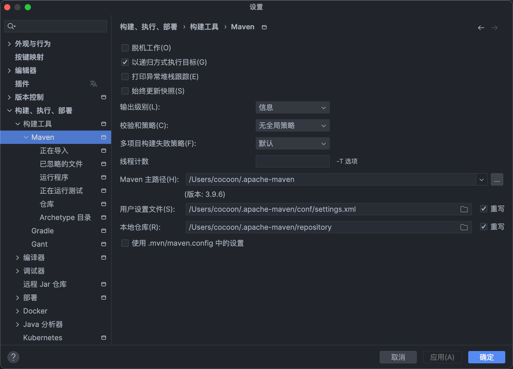

# 第一章 Java 学习笔记

这里记录学习 Java Web 开发的笔记，主要模块包括：Java + SpringBoot + MySQL + MyBatis + Redis 。

Java中 JDK8（JDK1.8）、JDK11、JDK17，该怎么选择：https://cloud.tencent.com/developer/article/1977236


## 1.1 前期知识点索引 

这里记录一下个人 Java 生态的课程学习路线：

- Java 基础：https://www.bilibili.com/video/BV12J41137hu
- Java 泛型：https://www.bilibili.com/video/BV1xJ411n77R
- Java 注解与反射：https://www.bilibili.com/video/BV1p4411P7V3
- Java 多线程：https://www.bilibili.com/video/BV1V4411p7EF
- Java Web（SpringBoot+Maven+Mybatis）：https://www.bilibili.com/video/BV1m84y1w7Tb
- SSM 框架（Spring+SpringMVC+Maven+SpringBoot+MyBatisPlus）：https://www.bilibili.com/video/BV1Fi4y1S7ix
- MyBatisPlus 高级：https://www.bilibili.com/video/BV1Xu411A7tL
- 瑞吉外卖业务开发：https://www.bilibili.com/video/BV13a411q753


### 1.1.1 Java 语法

多态的概念：https://www.liaoxuefeng.com/wiki/1252599548343744/1260455778791232

> `Person p = new Student()` 一个实际类型为 Student，引用类型为 Person 的实例。多态具有一个非常强大的功能，就是允许添加更多类型的子类实现功能扩展，却不需要修改基于父类的代码。


`final`修饰符有多种作用：

- `final`修饰的方法可以阻止被覆写；
- `final`修饰的class可以阻止被继承；
- **`final`修饰的字段必须在创建对象时初始化，随后不可修改。**
- https://www.liaoxuefeng.com/wiki/1252599548343744/1260455778791232


面向抽象编程的本质就是：

- 上层代码只定义规范（例如：`abstract class Person`）；
- 不需要子类就可以实现业务逻辑（正常编译）；
- 具体的业务逻辑由不同的子类实现，调用者并不关心。
- https://www.liaoxuefeng.com/wiki/1252599548343744/1260456371027744


接口类型的定义：

- 如果一个抽象类没有字段，所有方法全部都是抽象方法，就可以把该抽象类改写为接口：`interface`。
- 在接口中，可以定义`default`方法，实现类时可以不必覆写`default`方法。

- `interface`是可以有静态字段的，并且静态字段必须为`final`类型：`public static final int MALE = 1;`

- `interface`定义抽象方法：`public abstract void num();`

- https://www.liaoxuefeng.com/wiki/1252599548343744/1260456790454816

```java
@SpringBootApplication
public class SpringbootLearnApplication {

    public static void main(String[] args) {
        SpringApplication.run(SpringbootLearnApplication.class, args);
        // 创建接口实例的两种方式
        TestInterface t1 = new TestInterfaceImpl();
        TestInterface t2 = new TestInterface() {
            @Override
            public String getStr() {
                return null;
            }
        };
    }
}

interface TestInterface {
    String getStr();
}

class TestInterfaceImpl implements TestInterface {
    @Override
    public String getStr() {
        return null;
    }
}
```


静态字段的定义：

- 在一个`class`中定义的字段，我们称之为实例字段。还有一种字段，是用`static`修饰的字段，称为静态字段.
- 调用实例方法必须通过一个实例变量，而调用静态方法则不需要实例变量，通过类名就可以调用。
- **因为静态方法不属于实例，因此，静态方法内部，无法访问`this`变量，也无法访问实例字段，它只能访问静态字段。**
- https://www.liaoxuefeng.com/wiki/1252599548343744/1260464690677856


输入和输出以及占位符：

- %s、%f、%d 占位符
- 引用类型输出通常使用 `toString`
- https://www.liaoxuefeng.com/wiki/1252599548343744/1255887264020640


字符串核心方法：

- join、split、replace、isBlank、isEmpty、substring、equalsIgnoreCase、equals、indexOf、contains

- 格式化字符串：`s.formatted("cocoon", 12)`、`String.format("%s...%d", "cocoon", 12)`

- 更高效的字符串拼接：StringBuilder（链式拼接）、StringJoiner（已固定分隔符链式拼接）

- https://www.liaoxuefeng.com/wiki/1252599548343744/1260469698963456


日期与时间类：

- 旧版类：https://www.liaoxuefeng.com/wiki/1252599548343744/1303791989162017
- LocalDateTime：https://www.liaoxuefeng.com/wiki/1252599548343744/1303871087444002


java 包与 import：

- 默认自动 import 当前 package 的其他 class
- 一个 Java 程序默认自动引入 `import java.lang.*`
- https://www.liaoxuefeng.com/wiki/1252599548343744/1260467032946976


枚举类 enum：

- 枚举类既是类型又是常量，使用双等于号既会判断类型又会判断变量的值
- 默认定义为字符串，可以通过私有化构造函数给每个枚举常量添加字段
- https://www.liaoxuefeng.com/wiki/1252599548343744/1260473188087424


包装类：

- 想要把`int`基本类型变成一个引用类型，我们可以定义一个`Integer`类，它只包含一个实例字段`int`，这样，`Integer`类就可以视为`int`的包装类
- https://www.liaoxuefeng.com/wiki/1252599548343744/1260473794166400


注解与反射：

- 注解：注解是放在Java源码的类、方法、字段、参数前的一种给程序看的特殊“注释”
- 如何使用注解：https://www.liaoxuefeng.com/wiki/1252599548343744/1265102413966176
- 如何定义注解：https://www.liaoxuefeng.com/wiki/1252599548343744/1265102803921888
- 反射：这种通过`Class`实例（实例变量、`class`静态变量）获取`class`信息的方法称为反射（Reflection）
- 如何获取一个`class`的`Class`实例：https://www.liaoxuefeng.com/wiki/1252599548343744/1264799402020448


方法引用：

1. 在 Java 8 中，方法引用（Method Reference）是一种新的语法，用于简化 Lambda 表达式。它提供了一种简洁的方式来表示已经存在的方法或构造函数的引用。

2. 方法引用的语法是 `类名::方法名` 或 `对象名::方法名`。这里的 `类名` 可以是类名，也可以是接口名；`对象名` 是一个对象的引用。例如，`String::length` 表示对于给定的 String 对象，引用其 length 方法；`System.out::println` 表示引用 System.out 类的 out 对象的 println 方法。


### 1.1.2 SpringBoot 入门

**Springboot 接口开发三层架构**

- controller：控制层，接收前端发送的请求，对请求进行处理，并响应数据
- service：业务逻辑层，处理具体的业务逻辑
- dao：数据访问层（Data Access Object），负责数据访问操作，包括数据的增删改


**IOC&DI 控制反转与依赖注入**

将对象的控制权交给Spring的IOC容器，由IOC容器创建及管理对象。IOC容器创建的对象称为bean对象。在之前的入门案例中，要把某个对象交给IOC容器管理，需要在类上添加一个注解：@Component 。而Spring框架为了更好的标识web应用程序开发当中，bean对象到底归属于哪一层，又提供了@Component的衍生注解：

- @Controller    （标注在控制层类上）
- @Service          （标注在业务层类上）
- @Repository    （标注在数据访问层类上）
- 如果同类型的 bean 对象存在多个，则使用以下三个注解：@Resource、@Qualifier、@Primary

```java
@Repository
public class EmpDaoInstance implements EmpDao
```

```java
@Service
public class EmpServiceInstance implements EmpService {
    @Autowired // 运行时,从IOC容器中获取该类型对象,赋值给该变量
    private EmpDao;

    @Override
    public List<Emp> getEmpServiceList() {
        List<Emp> empServiceList = empDao.getEmpDaoList();
        empServiceList.forEach(emp -> {
          ......
        });
        return empServiceList;
    }
}
```


**请求响应参数解析**

```java
@RestController
public class RequestController {

    // 原始方式
    @RequestMapping("/simpleParam")
    public String simpleParam(HttpServletRequest request){
        //获取请求参数
        String name = request.getParameter("name");
        String ageStr = request.getParameter("age");
        int age = Integer.parseInt(ageStr);
        System.out.println(name+ ":" + age);
        return "OK";
    }

    // springboot方式
    @RequestMapping("/simpleParam")
    public String simpleParam(String name, Integer age){
        System.out.println(name+ ":" + age);
        return "OK";
    }

  	// @RequestParam注解上name对应路径参数上字段，required = false则是没对上就不会报错，否则的话会报错
    @RequestMapping("/simpleParam")
    public String simpleParam(@RequestParam(name = "name", required = false) String username) {
        System.out.println(username);
        return "OK";
    }


    // 实体参数（GET、POST请求的封装params对象）
    @RequestMapping("/simplePojo")
    public String simplePojo(User user) {
        System.out.println(user);
        return "OK";
    }

    // 普通数组参数
    @RequestMapping("/arrayParam")
    public String arrayParam(String[] hobby) {
        System.out.println(Arrays.toString(hobby));
        return "OK";
    }

  	// 列表集合参数（路径上显示的是字符串，但是@RequestParam可以进行解析）
    @RequestMapping("/listParam")
    public String listParam(@RequestParam List<String> hobby) {
        System.out.println(hobby);
        return "OK";
    }

    // 日期时间参数（路径上显示的是字符串，依然通过注解进行解析）
    @RequestMapping("/dateParam")
    public String dateParam(@DateTimeFormat(pattern = "yyyy-MM-dd HH:mm:ss") LocalDateTime time) {
        System.out.println(time);
        return "OK";
    }

    // JSON参数(通常是 POST 请求中的请求体参数)
    @RequestMapping("/jsonParam")
    public String jsonParam(@RequestBody User user){
        System.out.println(user);
        return "OK";
    }

    // 路径参数
    @RequestMapping("/path/{id}")
    public String pathParam(@PathVariable Integer id){
        System.out.println(id);
        return "OK";
    }

    @RequestMapping("/path/{id}/{name}")
    public String pathParam2(@PathVariable Integer id , @PathVariable String name){
        System.out.println(id);
        System.out.println(name);
        return "OK";
    }
}
```


### 1.1.3 MySQL 常用语法

这里主要介绍 Mysql 里的查询语言的语法。通常被包装为变量 `sqlStr`

参考文档：https://blog.csdn.net/liustreh/article/details/123411958


**数据库操作**

```sql
create database mysql01; //默认创建数据库

create database mysql01 default character set utf8; //创建指定默认字符集为交的数据库

drop database mysql01; //删除数据库

show databases; //查看所有数据库

show create databases; //查看数据库属性

SpringBoot、MySQL、MyBatisPlus、Redis
```


**常用数据类型**

```sql
// 创建一个学生表 编号为整型5个字节，名字为变长字符串类型10个字节，年龄不允许为空默认为20
create table student(id int(5),name varchar(10),age int not null default 20);

// 字符串类型
char(0-255) 定长字符串
varchar(0-65535) 变长字符串

// 日期和时间类型
date[日期 年月日] time[时间 时分秒] datetime[年月日 时分秒 YYYY-MM-DD HH:mm:ss]
```


**数据库表操作**

```sql
// 查看表
show tables;

// 查看表结构
desc 表名;

// 快速创建一个表结构相同的表 
create table 新表名 like 旧表名;

// 删除表，如果表结构存在的话
drop table if exits 表名;

// 修改表名
rename table 表名 to 新表名;

// 添加字段（新的列属性）
alter table 表名 add [column]  字段名 类型;

// 修改字段名
alter table 表名 change 旧字段名  新字段名 类型;

// 修改字段类型
alter table 表名 modify 字段 新字段类型;
```


**数据库表的增删改查操作**

1. insert 插入数据

```sql
// 插入全部数据（值的顺序一定要与字段对应）
insert into user values('张三','30','133324','男');

// 插入部分数据
insert into user(name,age,modile) values('小艾',20,'243252');
```


2. update 修改数据

```sql
// 一般更新
update 表名 set 字段名1 = 值1， 字段名2 = 值2，......

// 更新时加入计算
update user1 set age = age+1;

// 部分更新
update 表名 set 字段名1 = 值1，字段名2 = 值2，...where 字段条件
update user1 set sex='女' where name = '张三';
```


3. delete 删除数据

```sql
// 删除全部记录
delete from 表名;

// 按条件删除
delete from 表名 where 字段条件; 
delete from user1 where name = '张三';
delete from user1 where age<23 and name = '小天';

// 快速删除表数据（物理删除）
truncate 表名;
```


4. select 简单查询数据

```sql
// 取出表中的所有数据
select * from 表名;

// 查询指定列
select 字段名1，字段名2，.... from 表名

// 查询指定列带别名
select 字段名1 as  别名 ，字段名2 as 别名，.....
```


**条件查询与运算符**

1. 按条件查询：`where` 

2. 相关运算符：`< ` 小于 `=` 等于 `>` 大于 `>=` 大于等于 `<=` 小于等于  `<>`  或  `!=` 不等于

3. 逻辑运算符： `and (&&)` 与 `or(||)` 或  `not(!)` 非

4. 范围关键字：`between and`

5. `%` 通配符：代表任意长度的任意字符

6. `_` 通配符 代表一个字符长度的任意字符 用法与 `%` 一样，只不过只代表一个字符

```sql
select *from student where math>60 and ehglish>60;

select * from student where math  not in(66,76);

select * from student where math  between 56  and  66；

select * from student where name like '马%';

select * from student where name like '马_';
```


**关键词属性**：即指定字符为一些特殊关键词属性

```sql
// 在字段后面确认主键
create table user2(id int primary key,name varchar(10));

// 在字段后面确认自增
create table user3(id int primary key auto_increment,name  varchar(10));

// 其他关键词
create  table  user5 (
    id  int   primary  key   auto_increment，
    name  varchar(10),
    mobile  varchar(11)  unique,   --此字段值唯一
    sex   varchar(2)  not null     --此字段值唯一
    age  int  default  18
)
```

> 一般将 id 确认为主键和自增


**排序和函数**

1. 排序：`order by [asc] [desc]`， asc 按升排序  desc 降序排序

```sql
// 单列排序
select  *  from  student  order  by  math;        asc 默认可以不写
select  *  from  student  order  by  math  desc;   desc 必须写上

// 多列排序
select  *  from  student  order  by  math  desc, english  desc;
```


### 1.1.4 Maven 项目构建

首先要知道项目的 JDK 环境，然后是项目的 jar 包版本都依赖与 JDK 版本。新建一个 SpringBoot 项目，必须先使用 IDEA 构建框架， 勾选默认的依赖，试试看初始化项目是否跑的起来。然后 IDEA 会根据 `pom.xml` 自动下载项目的依赖。然后在 IDEA 中配置项目的 Maven 运行的 JDK 版本和 Java 的JDK 版本。配置好之后应该就可以跑通了。

IDEA 默认将 Maven 的配置和依赖放在了：`/Users/cocoon/.m2` 文件夹下，如果需要修改 Maven 的一些配置（比如修改镜像源）就可以在该文件夹下创建一个 `setting.xml` 文件

其他配置参考（不需要和文档一样用一个新的仓库地址）：https://blog.csdn.net/hzqit520/article/details/129166916


### 1.1.5 MyBatis 学习

- 官方文档：https://baomidou.com/
- 参考文档：https://cyborg2077.github.io/2022/09/20/MyBatisPlus

当构建 SpringBoot 项目时，勾选 MyBatis 依赖必须初始化 `application.properties`  里面的配置才能够启动项目，该配置的作用是链接数据库的。这里推荐下载插件：MyBatisX

```properties
spring.datasource.driver-class-name=com.mysql.cj.jdbc.Driver
spring.datasource.url=jdbc:mysql://localhost:3306/springboot
spring.datasource.username=root
spring.datasource.password=2002CZYczy
# 输出SQL语句日志
mybatis.configuration.log-impl=org.apache.ibatis.logging.stdout.StdOutImpl
# 开启mybatis的驼峰命名自动映射开关
mybatis.configuration.map-underscore-to-camel-case=true
```


**数据访问层入门代码**

```java
@Mapper
public interface UserMapper {
    /**
     * 查询所有的员工列表
     * 调用这个函数等于是执行了一个SQL语句，返回值就是该SQL语句的返回值
     * @return List<User>
     */
    @Select("select * from user")
    public List<User> list();

    /**
     * 删除某个员工
     * @param id
     */
    @Delete("delete from emp where id = #{id}")
    public void delete(Integer id);
}
```
```java
@Autowired
private UserMapper userMapper;

@Test
void contextLoads() {
    userMapper.delete(17);
    List<User> userList = userMapper.list();
    userList.forEach(System.out::println);
}
````


**使用注解操作SQL，简单的增删改查**

```java
/**
 * 删除某个员工
 * @param id
 */
@Delete("delete from emp where id = #{id}")
public void delete(Integer id);

/**
 * 导入新员工，导入成功后emp实例获取到一个主键属性id
 * @param emp
 */
@Options(useGeneratedKeys = true, keyProperty = "id")
@Insert("insert into emp(username, name, gender, image, job, entrydate, dept_id, create_time, update_time)" + "values (#{username},#{name},#{gender},#{image},#{job},#{entrydate},#{deptId},#{createTime},#{updateTime})")
public void insert(Emp emp);

/**
 * 更新某个员工的信息
 * @param emp
 */
@Update("update emp set username = #{username}, name = #{name}, gender = #{gender}, image = #{image}," + "job = #{job}, entrydate = #{entrydate}, dept_id = #{deptId},update_time = #{updateTime} where id = #{id}")
public void update(Emp emp);
```

```java
/**
 * 查询某员工信息，已开启mybatis的驼峰命名自动映射开关
 * @param id
 * @return Emp
 */
@Select("select * from emp where id = #{id}")
public Emp selectEmp(Integer id);

/**
 * 查询某员工信息，通过@Results，手动映射结果字段
 * @param id
 * @return
 */
@Results({
        @Result(column = "dept_id", property = "deptId"),
        @Result(column = "create_time", property = "createTime"),
        @Result(column = "update_time", property = "updateTime")
})
@Select("select * from emp where id = #{id}")
public Emp selectEmpV2(Integer id);
```

```java
/**
 * 模糊查询和多条件查询
 * concat 函数是SQL语句的字符串拼接函数
 */
@Select("select * from emp where name like concat('%',#{name},'%') and gender = #{gender} and " +
        "entrydate between #{begin} and #{end} order by update_time desc ")
public List<Emp> obscureList(String name, Short gender, LocalDate begin, LocalDate end);
```


**使用 XML 映射操作 SQL**

1. XML 映射文件的名称与 `Mapper` 接口名称一致，并且将 XML 映射文件和 `Mapper` 接口放置在相同包下
2. XML 映射文件的 `namespace` 属性为 `Mapper` 接口全限定名一致。
3. XML 映射文件中 SQL 语句的 `id` 与 `Mapper` 接口中的方法名一致，并保持返回类型一致。


**动态 SQL**

1. 在 XML 映射中使用动态 SQL，借助 `where`、`if`、`foreach`、`sql`、`include`、`set` 等标签实现
2. https://mybatis.org/mybatis-3/zh_CN/dynamic-sql.html

```java
/**
 * 模糊查询和多条件查询，使用XML映射实现SQL，并且支持动态SQL
 */
public List<Emp> activeObscureList(String name, Short gender, LocalDate begin, LocalDate end);

/**
 * 动态更新某个员工的信息
 * @param emp
 */
public void activeUpdateList(Emp emp);

/**
 * 批量删除员工
 * @param ids
 */
public void batchDelete(Integer[] ids);
```

```xml
<?xml version="1.0" encoding="UTF-8" ?>
<!DOCTYPE mapper
        PUBLIC "-//mybatis.org//DTD Mapper 3.0//EN"
        "http://mybatis.org/dtd/mybatis-3-mapper.dtd">
<mapper namespace="com.cocoon.mybatislearn.mapper.EmpMapper">
    <!--  定义sql语句常量  -->
    <sql id="commonSelect">
        select * from emp
    </sql>

    <select id="activeObscureList" resultType="com.cocoon.mybatislearn.pojo.Emp">
        <include refid="commonSelect"/>
        -- where标签只会在子元素有内容的情况下才插入where子句，而且会自动去除子句的开头的AND或OR
        <where>
            <if test="name != null">
                name like concat('%',#{name},'%')
            </if>
            <if test="gender != null">
                and gender = #{gender}
            </if>
            <if test="begin != null and end != null">
                and entrydate between #{begin} and #{end}
            </if>
        </where>
        order by update_time desc
    </select>

    <update id="activeUpdateList">
        update emp
        -- 动态地在行首插入set标签，并会删掉额外的逗号（用在update语句中）
        <set>
            <if test="username != null">username = #{username},</if>
            <if test="name != null">name = #{name},</if>
            <if test="gender != null">gender = #{gender},</if>
            <if test="image != null">image = #{image},</if>
            <if test="job != null">job = #{job},</if>
            <if test="entrydate != null">entrydate = #{entrydate},</if>
            <if test="deptId != null">dept_id = #{deptId},</if>
            <if test="updateTime != null">update_time = #{updateTime}</if>
        </set>
        where id = #{id}
    </update>

    <!--
        批量删除员工 (18,19,20)
        collection: 遍历的集合
        item: 遍历出来的元素
        separator: 分隔符
        open: 遍历开始前拼接的SQL片段
        close: 遍历结束后拼接的SQL片段
    -->
    <delete id="batchDelete">
        delete from emp where id in
        <foreach collection="ids" item="id" separator="," open="(" close=")">
            #{id}
        </foreach>
    </delete>
</mapper>
```


### 1.1.6 JavaWeb 学习

**Session和Cookie**

- 参考文档：https://cyborg2077.github.io/2022/08/20/JavaWeb07

```java
request.getSession().getAttribute(GlobalConstant.EMPLOYEE_ID)
request.getSession().setAttribute(GlobalConstant.EMPLOYEE_ID, queriedEmployee.getId());
```


**Http和Servlet**

- 参考文档：https://cyborg2077.github.io/2022/08/16/JavaWeb04/

- 视频链接：https://www.bilibili.com/video/BV1Qf4y1T7Hx?p=94


**Filter和Listener**

- 参考文档：https://cyborg2077.github.io/2022/08/21/JavaWeb08/
- 视频链接：https://www.bilibili.com/video/BV1Qf4y1T7Hx?p=134


### 1.1.7 SSM 框架学习

统一异常处理：https://cyborg2077.github.io/2022/09/10/SSMIntegration/#%E7%BB%9F%E4%B8%80%E5%BC%82%E5%B8%B8%E5%A4%84%E7%90%86


### 1.1.8 Redis 的使用方法

Redis 安装：https://developer.aliyun.com/article/1148552

记得修改 `/Applications/Redis/redis.conf` 里面两个配置

```
# 设置后台运行，关闭终端不会杀死进程
daemonize yes

# 设置快照文件地址，默认为执行命令所在地址
dir /Applications/Redis/
```


Redis GUI：https://macapp.org.cn/app/medis.html

终端启动本地 Redis 命令：/Applications/Redis/src/redis-server /Applications/Redis/redis.conf

Redis 常用命令大全：https://juejin.cn/post/6844904051377700871

瑞吉项目的使用方式查看：[1.2.7.1 登录验证码和ID缓存](#1.2.7.1 登录验证码和ID缓存)


### 1.1.9 Spring Cache 配置

这是一种在 SpringBoot 项目中使用缓存的策略，这里主要是搭配 Redis 进行缓存的开发

瑞吉项目的使用方式查看：[1.2.7.3 Spring Cache 缓存](1.2.7.3 Spring Cache 缓存)

Spring Cache 参考文档：https://juejin.cn/post/7330512499173572649


## 1.2 后端项目业务笔记

这里主要记录第一次后端项目的编写和构建笔记

- 学习视频：https://www.bilibili.com/video/BV13a411q753
- 瑞吉外卖项目基础：https://cyborg2077.github.io/2022/09/29/ReggieTakeOut/
- 瑞吉外卖项目优化：https://cyborg2077.github.io/2022/10/18/ReggieOptimization/


### 1.2.1 项目初始化构建

在创建spring boot或者spring cloud项目时，idea默认使用 [https://start.spring.io](https://start.spring.io/) 作为脚手架，创建完成后手动去添加相关的jar包组合。通过 [https://start.aliyun.com](https://start.aliyun.com/) 可以直接勾选ali相关的jar包，快速的引入集成。

首先需要电脑本地下载 JDK 8（该项目需要），另外电脑本地和 IDEA 配置好 Maven，然后开始新建 SpringBoot2 的项目，初始依赖选择 Spring Web、MySQL：




然后在 `pom.xml` 导入以下依赖，项目就直接可以运行了！然后参考课程再配置其他数据库和前端静态资源。

```xml
<dependency>
    <groupId>org.projectlombok</groupId>
    <artifactId>lombok</artifactId>
    <version>1.18.20</version>
</dependency>

<dependency>
    <groupId>com.alibaba</groupId>
    <artifactId>fastjson</artifactId>
    <version>1.2.76</version>
</dependency>

<dependency>
    <groupId>commons-lang</groupId>
    <artifactId>commons-lang</artifactId>
    <version>2.6</version>
</dependency>

<dependency>
    <groupId>com.alibaba</groupId>
    <artifactId>druid</artifactId>
    <version>1.2.8</version>
</dependency>

<dependency>
    <groupId>com.alibaba</groupId>
    <artifactId>druid-spring-boot-starter</artifactId>
    <version>1.1.23</version>
</dependency>

<dependency>
    <groupId>com.baomidou</groupId>
    <artifactId>mybatis-plus-boot-starter</artifactId>
    <version>3.4.1</version>
</dependency>
```

```yml
server:
  port: 8080
spring:
  application:
    name: questionnaire-survey
  datasource:
    druid:
      driver-class-name: com.mysql.cj.jdbc.Driver
      url: jdbc:mysql://localhost:3306/questionnaire_survey?serverTimezone=Asia/Shanghai&useUnicode=true&characterEncoding=utf-8&zeroDateTimeBehavior=convertToNull&useSSL=false&allowPublicKeyRetrieval=true
      username: root
      password: 2002CZYczy
mybatis-plus:
  configuration:
    map-underscore-to-camel-case: true
    log-impl: org.apache.ibatis.logging.stdout.StdOutImpl
  global-config:
    db-config:
      id-type: ASSIGN_ID
```


配置静态资源映射

```java
public class WebMvcConfig extends WebMvcConfigurationSupport {
    /**
     * 设置前端静态资源映射
     * @param registry
     */
    @Override
    protected void addResourceHandlers(ResourceHandlerRegistry registry) {
        //"classpath:"就是当前项目的"resources"
        //默认“localhost:8080/”->"classpath/static/"
        //现在将路径“localhost:8080/backend/**”映射到文件夹"classpath/backend/"
        log.info("开始进行静态资源映射...");
        registry.addResourceHandler("/backend/**").addResourceLocations("classpath:/backend/");
        registry.addResourceHandler("/front/**").addResourceLocations("classpath:/front/");
    }
}
```


### 1.2.2 项目前期开发记录

关于 SSM 框架的三层架构个人理解

1. `controller`：这一层位于最顶层，是直接用于响应接口的。基本用于调用 mp 的条件构造器和 `service` 层的`demoService` 实例封装好的业务方法，然后返回响应数据
1. `service`：这一层位于中间层，是用于封装操作数据库和业务逻辑的具体方法，实现 `controller` 层的高效复用
1. `mapper`：这一层位于最底层，基本上是继承 mp 提供好的父类然后用于构建 `service` 层的，无脑写死就行，没有其他逻辑


BUG 问题处理和开发记录

1. 遇到 bug：` Error attempting to get column 'create_time' from result set.` 解决方案：升级 druid 数据连接池版本 https://blog.csdn.net/niuzaiwenjie/article/details/124724330
2. 修改静态文件自动热更新：https://blog.csdn.net/qq_38680405/article/details/124753971
3. 修改静态文件里的 js 文件立刻生效：https://blog.csdn.net/qq_43039392/article/details/107591254
4. JSON.toJSONString 中文乱码：https://blog.csdn.net/m0_61594817/article/details/128678276


SpringBoot 整合 Redis 示例

1.  观看瑞吉项目的 Redis 入门篇
2. 示例代码位置：`/Users/cocoon/WorkMaterial/ReggieTakeout/Redis课程/代码/springdataredis_demo`


项目前期只是用于学习，部分接口业务并没有实现，如最后的用户下单功能和用户个人中心等。

剩余业务开发可以跟着参考文档进行开发


### 1.2.3 员工管理业务代码编写

#### 1.2.3.1 登录拦截过滤器

登录接口代码逻辑

```java
@PostMapping("/login")
public R<Employee> login(HttpServletRequest request, @RequestBody Employee employee) {
    // 密码加密
    String password = employee.getPassword();
    password = DigestUtils.md5DigestAsHex(password.getBytes());

    // mp条件构造器
    LambdaQueryWrapper<Employee> lqw = new LambdaQueryWrapper<Employee>();
    lqw.eq(Employee::getUsername, employee.getUsername());
    Employee queriedEmployee = employeeService.getOne(lqw);

    // 分情况判断
    if (queriedEmployee == null) return R.error("该用户不存在");
    if (!queriedEmployee.getPassword().equals(password)) return R.error("密码错误");
    if (queriedEmployee.getStatus() == 0) return R.error("该用户已被禁用");

    request.getSession().setAttribute(GlobalConstant.EMPLOYEE_ID, queriedEmployee.getId());
    return R.success(queriedEmployee);
}
```


开启请求拦截器（JavaWeb 知识点），除了请求静态资源和登录登出两个接口时，其余接口一律返回用户未登录响应

```java
@WebFilter(filterName = "LoginCheckFilter", urlPatterns = "/*")
public class LoginCheckFilter implements Filter {
    // 路径字符串匹配对象
    public static final AntPathMatcher PATH_MATCHER = new AntPathMatcher();

    @Override
    public void doFilter(ServletRequest servletRequest, ServletResponse servletResponse, FilterChain filterChain) throws IOException, ServletException {
        HttpServletRequest request = (HttpServletRequest) servletRequest;
        HttpServletResponse response = (HttpServletResponse) servletResponse;
        String requestURI = request.getRequestURI();
        // 不需要拦截的请求路径
        String[] urls = new String[]{
                "/employee/login", // 登录退出登录两个接口
                "/employee/logout",
                "/backend/**", // 静态页面资源
                "/front/**"
        };

        // 如果请求路径不需要拦截则放行
        if (checkoutRequestURI(requestURI, urls)) {
            filterChain.doFilter(request,response);
            return;
        }

        // 如果用户存在session登录状态则放行
        if (request.getSession().getAttribute(GlobalConstant.EMPLOYEE_ID) != null) {
            filterChain.doFilter(request,response);
            return;
        }

        // 否则的话一律响应为用户未登录
        response.getWriter().write(JSON.toJSONString(R.error("用户未登录"), SerializerFeature.BrowserCompatible));
    }

    public static boolean checkoutRequestURI(String requestURI, String[] urls) {
        for (String url : urls) {
            boolean match = PATH_MATCHER.match(url, requestURI);
            if (match) return true;
        }
        return false;
    }
}
```

```js
// 前端响应拦截器
service.interceptors.response.use(res => {
  const code = res.data.code;
  const msg = res.data.msg
  // 如果接口响应为用户未登录则直接跳转到登录页
  if (res.data.code === 0 && res.data.msg === '用户未登录') {
    console.log('---/backend/page/login/login.html---',code)
    localStorage.removeItem('userInfo')
    window.top.location.href = '/backend/page/login/login.html'
  } else {
    return res.data
  }
}
```


#### 1.2.3.2 全局异常响应处理

control 层业务逻辑

```java
@PostMapping
public GlobalResult<Employee> save(HttpServletRequest request, @RequestBody Employee employee) {
    // 除了前端传过来的属性还需要封装其他属性，id的话mp会自动随机生成
    employee.setPassword(DigestUtils.md5DigestAsHex("123456".getBytes()));
    employee.setCreateTime(LocalDateTime.now());
    employee.setUpdateTime(LocalDateTime.now());
    Long employeeId = (Long)request.getSession().getAttribute(GlobalConstant.EMPLOYEE_ID);
    employee.setCreateUser(employeeId);
    employee.setUpdateUser(employeeId);

    // mp新增员工，每个属性都不允许为null
    employeeService.save(employee);
    return GlobalResult.success(employee);
}
```


全局异常响应处理，基于 SpringBoot 框架

```java
@Slf4j
@RestControllerAdvice
public class GlobalExceptionHandler {
    @ExceptionHandler(SQLIntegrityConstraintViolationException.class)
    public GlobalResult<String> exceptionHandler(SQLIntegrityConstraintViolationException exception) {
        String exceptionMsg = exception.getMessage();
        log.error(exceptionMsg);

        // 处理“条目存在”SQL语句异常
        if (exceptionMsg.contains("Duplicate entry")) {
            String[] splitStr = exceptionMsg.split(" ");
            return GlobalResult.error(splitStr[2] + "已存在");
        }

        // 未知异常统一返回系统接口异常
        return GlobalResult.error("系统接口异常");
    }
}
```


#### 1.2.3.3 分页查询业务代码

我们现在可以用 MyBatisPlus 来简化分页查询的代码实现，关于 mp 的分页插件使用的官方文档：https://baomidou.com/pages/97710a/#paginationinnerinterceptor


首先我们拓展一下 mp 的插件支持 `config/MybatisPlusConfig.java`

```java
@Configuration
public class MybatisPlusConfig {
   /** mp分页插件 **/
    @Bean
    public MybatisPlusInterceptor mybatisPlusInterceptor() {
        MybatisPlusInterceptor mybatisPlusInterceptor = new MybatisPlusInterceptor();
        mybatisPlusInterceptor.addInnerInterceptor(new PaginationInnerInterceptor());
        return mybatisPlusInterceptor;
    }
}
```


然后就可以直接使用了

```java
@GetMapping("/page")
public GlobalResult<Page> page(int page, int pageSize, @RequestParam(required = false) String name) {
    log.info("page={},pageSize={},name={}", page, pageSize, name);
    Page pageInfo = new Page(page, pageSize);

    // 添加name搜索查询和按更新时间排序
    LambdaQueryWrapper<Employee> lqw = new LambdaQueryWrapper<>();
    lqw.like(!StringUtils.isEmpty(name), Employee::getName, name);
    lqw.orderByDesc(Employee::getUpdateTime);

    // 直接进行分页查询，mp会自动将结果帮我们封装到pageInfo对象中
    employeeService.page(pageInfo, lqw);
    return GlobalResult.success(pageInfo);
}
```


#### 1.2.3.4 配置数据状态转换器

我们会发现响应请求的时的 JSON 中输出了 Long 类型和 LocalDateTime 类型，但这并不是前端想要的 JSON 格式，前端需要将 Long 转换为字符串、LocalDateTime 类型转换为日期格式字符串，因此我们需要配置状态转换器


配置对象映射器 JacksonObjectMapper，继承 ObjectMapper `common/JacksonObjectMapper.java`
```java
......

/**
 * 对象映射器:基于jackson将Java对象转为json，或者将json转为Java对象
 * 将JSON解析为Java对象的过程称为 [从JSON反序列化Java对象]
 * 从Java对象生成JSON的过程称为 [序列化Java对象到JSON]
 */
public class JacksonObjectMapper extends ObjectMapper {

    public static final String DEFAULT_DATE_FORMAT = "yyyy-MM-dd";
    public static final String DEFAULT_DATE_TIME_FORMAT = "yyyy-MM-dd HH:mm:ss";
    public static final String DEFAULT_TIME_FORMAT = "HH:mm:ss";

    /**
     * 将Long转换为字符串
     * 将LocalDateTime类型转换为日期格式字符串
     */
    public JacksonObjectMapper() {
        super();
        //收到未知属性时不报异常
        this.configure(FAIL_ON_UNKNOWN_PROPERTIES, false);

        //反序列化时，属性不存在的兼容处理
        this.getDeserializationConfig().withoutFeatures(DeserializationFeature.FAIL_ON_UNKNOWN_PROPERTIES);

        SimpleModule simpleModule = new SimpleModule()
                .addDeserializer(LocalDateTime.class, new LocalDateTimeDeserializer(DateTimeFormatter.ofPattern(DEFAULT_DATE_TIME_FORMAT)))
                .addDeserializer(LocalDate.class, new LocalDateDeserializer(DateTimeFormatter.ofPattern(DEFAULT_DATE_FORMAT)))
                .addDeserializer(LocalTime.class, new LocalTimeDeserializer(DateTimeFormatter.ofPattern(DEFAULT_TIME_FORMAT)))

                .addSerializer(BigInteger.class, ToStringSerializer.instance)
                .addSerializer(Long.class, ToStringSerializer.instance)
                .addSerializer(LocalDateTime.class, new LocalDateTimeSerializer(DateTimeFormatter.ofPattern(DEFAULT_DATE_TIME_FORMAT)))
                .addSerializer(LocalDate.class, new LocalDateSerializer(DateTimeFormatter.ofPattern(DEFAULT_DATE_FORMAT)))
                .addSerializer(LocalTime.class, new LocalTimeSerializer(DateTimeFormatter.ofPattern(DEFAULT_TIME_FORMAT)));

        //注册功能模块 例如，可以添加自定义序列化器和反序列化器
        this.registerModule(simpleModule);
    }
}
```


扩展 MVC 框架的消息转换器

```java
@Configuration
public class WebMvcConfig extends WebMvcConfigurationSupport {
		......
    /** 拓展json数据转换器 **/
    @Override
    protected void extendMessageConverters(List<HttpMessageConverter<?>> converters) {
        MappingJackson2HttpMessageConverter messageConverter = new MappingJackson2HttpMessageConverter();
        // 设置对象转化器，底层使用jackson将java对象转为json
        messageConverter.setObjectMapper(new JacksonObjectMapper());
        // 将上面的消息转换器对象追加到mvc框架的转换器集合当中(index设置为0，表示设置在第一个位置，避免被其它转换器接收，从而达不到想要的功能)
        converters.add(0, messageConverter);
    }
}
```


JSON 数据转换效果

```json
{
    "id": 1759482252352401410,
    "username": "cocoon",
    "name": "cocoon",
    "password": "e10adc3949ba59abbe56e057f20f883e",
    "phone": "18579152306",
    "sex": "1",
    "idNumber": "360502200205130019",
    "status": 1,
    "createTime": [
        2024,
        2,
        19,
        15,
        37,
        13
    ],
    "updateTime": [
        2024,
        2,
        19,
        15,
        37,
        13
    ],
    "createUser": 1,
    "updateUser": 1
},
{
    "id": "1759489689688055810",
    "username": "czy",
    "name": "cocoon",
    "password": "e10adc3949ba59abbe56e057f20f883e",
    "phone": "18579152306",
    "sex": "1",
    "idNumber": "360502200205130019",
    "status": 1,
    "createTime": "2024-02-19 16:06:46",
    "updateTime": "2024-02-19 16:06:46",
    "createUser": "1759482252352401410",
    "updateUser": "1759482252352401410"
}
```


#### 1.2.3.5 更新员工业务代码

```java
/** 更新员工 **/
@PutMapping()
public GlobalResult<String> update(HttpServletRequest request, @RequestBody Employee employee) {
    // 需要另外再封装一些更新属性
    Long employeeId = (Long)request.getSession().getAttribute(GlobalConstant.EMPLOYEE_ID);
    employee.setUpdateUser(employeeId);
    employee.setUpdateUser(employeeId);
 
    // mp会根据主键id匹配更新
    employeeService.updateById(employee);
    return GlobalResult.success("更新员工成功");
}
```


#### 1.2.3.6 通用列表查询方式

通过前端传入的 GET 请求查询条件查询数据库

```java
@GetMapping("/list")
public GlobalResult<List<Dish>> getList(Dish dish) {
    // 查询条件，需要其他条件直接在后面加就行
    LambdaQueryWrapper<Dish> lqw = new LambdaQueryWrapper<>();
    lqw.eq(dish.getCategoryId() != null ,Dish::getCategoryId, dish.getCategoryId());
    lqw.eq(Dish::getStatus, 1);

    List<Dish> dishList = dishService.list(lqw);
    return GlobalResult.success(dishList);
}
```


### 1.2.4 分类管理业务代码编写

#### 1.2.4.1 公共字段自动填充

前面我们已经完成了对员工数据的添加与修改，在添加/修改员工数据的时候，**都需要指定一下创建人、创建时间、修改人、修改时间等字段，而这些字段又属于公共字段**，不仅员工表有这些字段，在菜品表、分类表等其他表中，也拥有这些字段。那我们有没有办法让这些字段在一个地方统一管理呢？这样可以简化我们的开发，答案就是使用 MybatisPlus 给我们提供的公共字段自动填充功能


首先去实体类中通过 `TableField` 注解标记某些属性需要自动化填充

```java
/** 创建时间，插入时自动填充 **/
@TableField(fill = FieldFill.INSERT)
private LocalDateTime createTime;

/** 更新时间，插入和更新时自动填充 **/
@TableField(fill = FieldFill.INSERT_UPDATE)
private LocalDateTime updateTime;

/** 创建人id，插入时自动填充 **/
@TableField(fill = FieldFill.INSERT)
private Long createUser;

/** 更新人id，插入和更新时自动填充 **/
@TableField(fill = FieldFill.INSERT_UPDATE)
private Long updateUser;
```


然后创建 `MyMetaObjectHandler` 工具类实现公共字段自动填充

```java
@Component
public class MyMetaObjectHandler implements MetaObjectHandler {
    /** 插入时自动填充字段 **/
    @Override
    public void insertFill(MetaObject metaObject) {
        metaObject.setValue("updateTime", LocalDateTime.now());
        metaObject.setValue("createTime", LocalDateTime.now());
        metaObject.setValue("updateUser", EmployeeIdThread.getEmployeeId());
        metaObject.setValue("createUser", EmployeeIdThread.getEmployeeId());
    }

    /** 更新时自动填充字段 **/
    @Override
    public void updateFill(MetaObject metaObject) {
        metaObject.setValue("updateTime", LocalDateTime.now());
        metaObject.setValue("updateUser", EmployeeIdThread.getEmployeeId());
    }
}
```


这样是完成了，然后可以在新增、更新员工时省略哪些封装公共字段的代码


#### 1.2.4.2 ThreadLocal 的使用

现在存在一个问题，如何获取当前登录用户的 id 值，我们可以使用ThreadLocal来解决这个问题，在学习ThreadLocal之前，我们需要先确认一个事情，就是客户端发送的每次 http 请求，对应的在服务端都会分配一个新的线程来处理，在处理过程中涉及到下面类中的方法都属于相同的一个线程（按顺序依次执行）：

```markdown
1. LoginCheckFilter 中的 doFilter 方法
2. EmployeeController中的 update 方法
3. MyMetaObjectHandler 中的 updateFill 方法
```


因此我们可以在 LoginCheckFilter 的 doFilter 方法中获取当前登录用户 id，并调用 ThreadLocal 的 set 方法来设置当前线程的线程局部变量的值（用户id)，然后在 MyMetaObjectHandler 的 updateFill 方法中调用 ThreadLocal 的 get 方法来获得当前线程所对应的线程局部变量的值（用户id)


首先我创建一个工具类 BaseContext 实现全局的统一使用
```java
package com.cocoon.reggieTakeout.common;

/** 基于ThreadLocal的封装工具类，用于当前线程内共享用户id **/
public class BaseContext {
    private static final ThreadLocal<Long> threadLocal = new ThreadLocal<>();

    public static void setCurrentId(Long id) {
        threadLocal.set(id);
    }

    public static Long getCurrentId() {
        return threadLocal.get();
    }
}
```


然后再之前提到的地方使用即可

```java
// src/main/java/com/cocoon/reggieTakeout/filter/LoginCheckFilter.java
if (employeeId != null) {
    BaseContext.setCurrentId(employeeId);
    filterChain.doFilter(request,response);
    return;
}

// src/main/java/com/cocoon/reggieTakeout/common/MyMetaObjectHandler.java
metaObject.setValue("createUser", BaseContext.getCurrentId());
```


#### 1.2.4.3 删除分类业务代码

业务需求：在分类管理列表页面，可以对某个分类进行删除操作并且当分类关联了菜品或者套餐时，此分类将不允许被删除

具体实现：在 `service` 层删除分类的业务逻辑方法，查询当前分类是否关联了菜品和套餐，关联了则抛出自定义异常

```java
// src/main/java/com/cocoon/reggieTakeout/service/impl/CategoryServiceImpl.java
@Service
public class CategoryServiceImpl extends ServiceImpl<CategoryMapper, Category> implements CategoryService {
    @Autowired
    private DishService dishService;

    @Autowired
    private SetmealService setmealService;

    /** 删除分类的业务逻辑方法 **/
    @Override
    public void remove(Long id) {
        // 查询当前分类是否关联了菜品和套餐
        LambdaQueryWrapper<Dish> lqwByDish = new LambdaQueryWrapper<>();
        LambdaQueryWrapper<Setmeal> lqwBySetmeal = new LambdaQueryWrapper<>();
        lqwByDish.eq(Dish::getCategoryId, id);
        lqwBySetmeal.eq(Setmeal::getCategoryId, id);
      
        if (dishService.count(lqwByDish) != 0) {
            throw new CustomException("当前分类下关联了菜品，不能删除");
        }
        if (setmealService.count(lqwBySetmeal) != 0) {
            throw new CustomException("当前分类下关联了套餐，不能删除");
        }
        // 都没有关联则按id删除
        super.removeById(id);
    }
}
```

```java
// src/main/java/com/cocoon/reggieTakeout/controller/CategoryController.java
@DeleteMapping()
public GlobalResult<String> delete(Long ids) {
    categoryService.remove(ids);
    return GlobalResult.success("分类信息删除成功");
}
```


#### 1.2.4.4 抛出自定义异常方式

定义一个自定义业务异常类，用于输出业务异常错误信息

```java
// src/main/java/com/cocoon/reggieTakeout/common/CustomException.java
package com.cocoon.reggieTakeout.common;

/** 自定义业务异常类，用于输出业务异常错误信息 **/
public class CustomException extends RuntimeException {
    public CustomException(String errorMsg) {
        super(errorMsg);
    }
}
```


在之前定义过的全局异常响应处理中捕获一下自定义业务异常即可

```java
// src/main/java/com/cocoon/reggieTakeout/common/GlobalExceptionHandler.java
@RestControllerAdvice
public class GlobalExceptionHandler {
		......
    /** 捕获自定义业务异常 **/
    @ExceptionHandler(CustomException.class)
    public GlobalResult<String> exceptionHandler(CustomException customException) {
        String exceptionMsg = customException.getMessage();
        log.error(exceptionMsg);
        return GlobalResult.error(exceptionMsg);
    }
}
```


然后随时随地即可抛出异常！

```java
throw new CustomException("当前分类下关联了菜品，不能删除");
````


### 1.2.5 菜品管理业务代码编写

#### 1.2.5.1 文件上传和下载功能

文件上传：

1. 前端利用组件上传功能会发送一个 POST 文件请求
2. 后端直接利用 SpringBoot 封装好的 `MultipartFile file` 接收即可，最后响应的数据为保存的文件名
3. 文件上传后暂存本地文件夹下，`bashPath` 路径是使用的 `application.yml` 导出的配置 `reggie.path`

```java
@PostMapping("/upload")
public GlobalResult<String> upload(MultipartFile file) throws IOException {
    // 如果文件存储的文件夹不存在则新建
    File dir = new File(basePath);
    if (!dir.exists()) dir.mkdirs();

    // 重命名文件
    String originalFilename = file.getOriginalFilename();
    String suffix = null;
    if (originalFilename != null) {
        suffix = originalFilename.substring(originalFilename.lastIndexOf("."));
    }
    String fileName = UUID.randomUUID() + suffix;

    // 实现文件上传，文件暂存本地磁盘
    try {
        file.transferTo(new File(basePath + fileName));
    } catch (IOException exception) {
        throw new RuntimeException(exception);
    }

    return GlobalResult.success(fileName);
}
```


文件下载：

1. 这里是直接通过 GET 请求了一个静态资源，传入一个文件名
2. 后端是直接响应之前文件上传那里存储的资源
3. 主要是看输入流和输出流之间是如何传输的

```java
@GetMapping("/download")
public void download(HttpServletResponse response, String name) {
    try {
        // 输入流，通过输入流读取文件内容
        FileInputStream fileInputStream = new FileInputStream(new File(basePath + name));
        // 输出流，通过输出流将文件写回浏览器
        ServletOutputStream outputStream =response.getOutputStream();
      
        int length = 0;
        byte[] bytes = new byte[1024];
        while (length != -1) {
            length = fileInputStream.read(bytes);
            outputStream.write(bytes, 0, length); // 写入
            outputStream.flush(); // 刷新
        }

        outputStream.close();
        fileInputStream.close();
    } catch (IOException e) {
        throw new RuntimeException(e);
    }
}
```


#### 1.2.5.2 菜品分页业务代码编写

这里主要是分页查询菜品列表业务，但是返回值中还需要返回菜品对应的分类名称，因此逻辑稍微复杂化了

```java
/** 分页查询菜品列表 **/
@GetMapping("/page")
public GlobalResult<Page<DishDto>> page(int page, int pageSize, String name) {
    // 封装好dishPageInfo对象
    Page<Dish> dishPageInfo = new Page<>(page, pageSize);
    LambdaQueryWrapper<Dish> lqw = new LambdaQueryWrapper<>();
    lqw.like(!StringUtils.isEmpty(name), Dish::getName, name);
    lqw.orderByDesc(Dish::getUpdateTime);
    dishService.page(dishPageInfo, lqw);

    // 封装dishDtoPageInfo对象，列表中添加categoryName属性
    Page<DishDto> dishDtoPageInfo = new Page<>();
    // 除了record属性，其余属性都拷贝dishPageInfo
    BeanUtils.copyProperties(dishPageInfo, dishDtoPageInfo, "records");
    List<Dish> records = dishPageInfo.getRecords();
    // 基于records封装dishDtoList
    List<DishDto> dishDtoList = records.stream().map(item -> {
        DishDto dishDto = new DishDto();
        BeanUtils.copyProperties(item, dishDto);
        Category category = categoryService.getById(item.getCategoryId());
        if (category != null) dishDto.setCategoryName(category.getName());
        return dishDto;
    }).collect(Collectors.toList());

    dishDtoPageInfo.setRecords(dishDtoList);
    return GlobalResult.success(dishDtoPageInfo);
}
```


#### 1.2.5.3 更新菜品业务编写

和新增菜品类似，不仅要更新 dish 表还需要更新 dish_flavor 表。这里是直接实现覆盖更新，而不是根据 id 更新（因为没有 dishFlavorId 属性），因此是先清除该菜品的口味数据，再更新该菜品的口味数据

```java
public void updateWithFlavor(DishDto dishDto) {
    this.updateById(dishDto);
    Long dishId = dishDto.getId();

    // 先清除该菜品的口味数据
    LambdaQueryWrapper<DishFlavor> lqw = new LambdaQueryWrapper<>();
    lqw.eq(DishFlavor::getDishId, dishId);
    dishFlavorService.remove(lqw);

    // 再更新该菜品的口味数据
    List<DishFlavor> dishFlavorList = dishDto.getFlavors();
    for (DishFlavor dishFlavor : dishFlavorList) {
        dishFlavor.setDishId(dishId);
    }

    // 最后保存口味数据列表
    dishFlavorService.saveBatch(dishFlavorList);
}
```


#### 1.2.5.4 批量删除和更新状态

前端发送请求进行批量删除：`http://localhost:8080/dish?ids=1413385247889891330,1413384757047271425`

同时还可以解决单个删除响应，一举两得！

```java
@DeleteMapping
public GlobalResult<String> batchDelete(@RequestParam List<Long> ids) {
    dishService.batchDeleteWithFlavor(ids);
    return GlobalResult.success("批量删除成功");
}
```

```java
@Override
public void batchDeleteWithFlavor(List<Long> ids) {
    // 首先判断选中的数组中是否有启售的
    LambdaQueryWrapper<Dish> dishLambdaQueryWrapper = new LambdaQueryWrapper<>();
    dishLambdaQueryWrapper.in(Dish::getId, ids).eq(Dish::getStatus, 1);
    int count = this.count(dishLambdaQueryWrapper);
    if (count > 0) {
        throw new CustomException("套餐正在售卖中，请先停售再进行删除");
    }

    // 删除关联的dish_flavor表
    LambdaQueryWrapper<DishFlavor> dishFlavorLambdaQueryWrapper = new LambdaQueryWrapper<>();
    dishFlavorLambdaQueryWrapper.in(DishFlavor::getDishId, ids);
    dishFlavorService.remove(dishFlavorLambdaQueryWrapper);

    // 删除dish表数据
    this.removeByIds(ids);
}
```


批量更新状态同理：`http://localhost:8080/dish/status/0?ids=1413385247889891330,1413384757047271425`

```java
@PostMapping("/status/{status}")
public GlobalResult<String> batchUpdateStatus(@PathVariable Integer status, @RequestParam List<Long> ids) {
    LambdaUpdateWrapper<Dish> lqw = new LambdaUpdateWrapper<>();
    lqw.in(Dish::getId, ids);
    lqw.set(Dish::getStatus, status);
    dishService.update(lqw);
    String statusStr = status == 1 ? "启售" : "停售";
    return GlobalResult.success("批量" + statusStr + "成功");
}
```


#### 1.2.5.5 @Transactional

如果一个 `ServiceImpl` 层操作了其他表，则最好添加这个注解，要么一起成功修改表结构，要么一起失败

```java
// src/main/java/com/cocoon/reggieTakeout/service/impl/DishServiceImpl.java
@Service
@Transactional
public class DishServiceImpl extends ServiceImpl<DishMapper, Dish> implements DishService {
    @Autowired
    private DishFlavorService dishFlavorService;
}
```

```java
// 记得去启动函数中再加上@EnableTransactionManagement
@Slf4j
@SpringBootApplication
@ServletComponentScan
@EnableTransactionManagement
public class ReggieTakeoutApplication {
    public static void main(String[] args) {
        SpringApplication.run(ReggieTakeoutApplication.class, args);
        log.info("项目启动成功...");
    }
}
```


### 1.2.6 移动端用户登录业务代码

#### 1.2.6.1 阿里云短信业务注册

使用阿里云账号注册阿里云密钥

```java
AccessKey ID
LTAI5tPVkwyZWWDjEj4Jatkz

AccessKey Secret
lJ4A5XVg0JEYfbLMJpoc1NKEcWfQxT
```


进入短信服务：https://dysms.console.aliyun.com/overview 先购买套餐包，有条件的话就去申请签名、模板

想偷懒就直接使用快速学习测试：https://dysms.console.aliyun.com/quickstart 添加手机号，选择专用测试签名、模板

然后点击调用 API 发送短信，得到：`TemplateCode`、`SignName`


去 `application.yml` 填写你前面得到的配置
```yml
message:
  accessKeyId: ...
  accessKeySecret: ...
  signName: 阿里云短信测试
  templateCode: SMS_154950909
```


然后新建一个用于发送短信的工具类

```xml
<dependency>
    <groupId>com.aliyun</groupId>
    <artifactId>dysmsapi20170525</artifactId>
    <version>2.0.24</version>
</dependency>
```

```java
package com.cocoon.reggieTakeout.constant;

import com.aliyun.dysmsapi20170525.Client;
import com.aliyun.dysmsapi20170525.models.SendSmsRequest;
import com.aliyun.dysmsapi20170525.models.SendSmsResponse;
import com.aliyun.dysmsapi20170525.models.SendSmsResponseBody;
import com.aliyun.teaopenapi.models.Config;
import com.aliyun.teautil.models.RuntimeOptions;
import lombok.Data;
import lombok.SneakyThrows;
import org.springframework.boot.context.properties.ConfigurationProperties;
import org.springframework.stereotype.Component;

@Data
@Component
@ConfigurationProperties(prefix = "message")
public class SendCode {
    private String accessKeyId;
    private String accessKeySecret;
    private String signName;
    private String templateCode;

    @SneakyThrows
    public Client createClient(String accessKeyId, String accessKeySecret) {
        Config config = new Config()
                // 必填，您的 AccessKey ID
                .setAccessKeyId(accessKeyId)
                // 必填，您的 AccessKey Secret
                .setAccessKeySecret(accessKeySecret);
        // 访问的域名
        config.endpoint = "dysmsapi.aliyuncs.com";
        return new Client(config);
    }

    /** 选择手机号发送短信验证码 **/
    @SneakyThrows
    public void sendMessage(String phoneNumber, String code) {
        Client client = createClient(accessKeyId, accessKeySecret);
        SendSmsRequest sendSmsRequest = new SendSmsRequest()
                .setSignName(signName)
                .setTemplateCode(templateCode)
                .setPhoneNumbers(phoneNumber)
                .setTemplateParam("{\"code\":\"" + code + "\"}");

        // 发送短信异常响应处理
        RuntimeOptions runtime = new RuntimeOptions();
        SendSmsResponse response = client.sendSmsWithOptions(sendSmsRequest, runtime);
        SendSmsResponseBody body = response.getBody();
        if (!body.getCode().equals("OK")) {
            throw new RuntimeException(body.getMessage());
        }
    }
}
```


最后在 Springboot 项目中实际使用

```java
@Slf4j
@RestController
@RequestMapping("/user")
public class UserController {
    @Autowired
    private SendCode sendCode;

    @PostMapping("/sendMsg")
    private GlobalResult<String> sendMsg(HttpSession session, @RequestBody User user) {
        String code = RandomUtil.buildCheckCode(4);
        sendCode.sendMessage("18579152306", code);
        session.setAttribute(GlobalConstant.USER_CODE, code);
        log.info("短信验证码：{}", code);
        return GlobalResult.success("手机验证码短信发送成功");
    }
}
```

```java
public class RandomUtil {
    /** 随机生成验证码，默认为4位 **/
    public static String buildCheckCode(Integer digit){
        String str = "0123456789";
        StringBuilder sb = new StringBuilder();
        Random random = new Random();
        int digitValue = digit == null ? 4 : digit;
        for (int i = 0; i < digitValue; i++) {
            char ch = str.charAt(random.nextInt(str.length()));
            sb.append(ch);
        }
        return sb.toString();
    }
}
```


#### 1.2.6.2 前台用户登录业务

登录拦截器需要添加一些功能，首先是放行用户登录登出两个接口，其次是如果用户登录了则可以从 session 中获取 userId，则用户登录了也放行，`LoginCheckFilter.java`

```java
// 不需要拦截的请求路径
String[] urls = new String[]{
        "/employee/login", // 员工登录退出登录
        "/employee/logout",
        "/backend/**",
        "/front/**",
        "/common/**",
        "/user/sendMsg", // 用户登录退出登录
        "/user/login"
};

Long userId = (Long) request.getSession().getAttribute(GlobalConstant.USER_ID);

// 如果用户存在session登录状态则放行（前台已登录）
if (userId != null) {
    BaseContext.setCurrentId(userId);
    filterChain.doFilter(request,response);
    return;
}
```


用户登录接口业务代码

```java
@PostMapping("/login")
private GlobalResult<User> login(HttpSession session, @RequestBody UserLoginDto userLoginDto) {
    String phone = userLoginDto.getPhone();
    String codeInSession = (String) session.getAttribute(phone);
    // 验证手机号和验证是否正确
    if (!StringUtils.isEmpty(codeInSession) && codeInSession.equals(userLoginDto.getCode())) {
        session.removeAttribute(phone);
        LambdaQueryWrapper<User> lqw = new LambdaQueryWrapper<>();
        lqw.eq(User::getPhone, phone);
        User user = userService.getOne(lqw);
        if (user == null) {
            user = new User();
            user.setPhone(phone);
            userService.save(user);
        }
        session.setAttribute(GlobalConstant.USER_ID, user.getId());
        return GlobalResult.success(user);
    }
    return GlobalResult.error("用户登录失败");
}
```


#### 1.2.6.3 菜品列表查询逻辑

根据传过来的分类 id 查询，并且还要封装分类名称和口味列表两个属性

```java
@GetMapping("/list")
public GlobalResult<List<DishDto>> getList(Dish dish) {
    // 先封装dishList
    LambdaQueryWrapper<Dish> lqw = new LambdaQueryWrapper<>();
    lqw.eq(dish.getCategoryId() != null ,Dish::getCategoryId, dish.getCategoryId());
    lqw.eq(Dish::getStatus, 1);
    List<Dish> dishList = dishService.list(lqw);

    // 再封装dishDtoList
    List<DishDto> dishDtoList = dishList.stream().map(item -> {
        DishDto dishDto = new DishDto();
        BeanUtils.copyProperties(item, dishDto);

        // 获取categoryName
        Category category = categoryService.getById(item.getCategoryId());
        if (category != null) dishDto.setCategoryName(category.getName());

        // 获取flavors
        LambdaQueryWrapper<DishFlavor> dishFlavorLambdaQueryWrapper = new LambdaQueryWrapper<>();
        dishFlavorLambdaQueryWrapper.eq(DishFlavor::getDishId, item.getId());
        List<DishFlavor> dishFlavorList = dishFlavorService.list(dishFlavorLambdaQueryWrapper);
        if (dishFlavorList != null) dishDto.setFlavors(dishFlavorList);

        return dishDto;
    }).collect(Collectors.toList());

    return GlobalResult.success(dishDtoList);
}
```


### 1.2.7 项目优化篇业务代码编写

#### 1.2.7.1 登录验证码和ID缓存

我们之前使用的是 Session 缓存策略，该缓存是窗口级别的当关闭浏览器窗口之后重新打开的话缓存就失效了，**因此这一章节统一替换成 Redis 缓存模式。Redis 是一种 nosql 的缓存策略。**首先导入 Redis 依赖，然后添加配置连接本地 Redis。

添加 Spring Redis 依赖

```xml
<dependency>
    <groupId>org.springframework.boot</groupId>
    <artifactId>spring-boot-starter-data-redis</artifactId>
</dependency>
```

添加 Spring Redis 配置

```yml
spring:
  redis:
    host: 127.0.0.1
    port: 6379
    database: 0 # 存储0号数据库
```

全局的 RedisConfig 用与修改 Redis Key 的序列化器

```java
package com.cocoon.reggieTakeout.config;

@Configuration
public class RedisConfig extends CachingConfigurerSupport {
    @Bean
    public RedisTemplate<Object, Object> redisTemplate(RedisConnectionFactory connectionFactory) {
        RedisTemplate<Object, Object> redisTemplate = new RedisTemplate<>();
        // 修改Redis Key的序列化器
        redisTemplate.setKeySerializer(new StringRedisSerializer());
        redisTemplate.setConnectionFactory(connectionFactory);
        return redisTemplate;
    }
}
```


Redis 缓存遵循 `key-value` 模式，使用 ` RedisTemplate` 设置和获取 String 类型缓存的方式如下

```java
@Autowired
private RedisTemplate redisTemplate;

redisTemplate.opsForValue().set(GlobalConstant.USER_ID, user.getId(), 7, TimeUnit.DAYS);
Long userId = (Long) redisTemplate.opsForValue().get(GlobalConstant.USER_ID);
redisTemplate.delete(GlobalConstant.USER_ID);
```


#### 1.2.7.2 根据套餐查询菜品缓存

由于 Redis value 存储方案开启了按 Spring 内置的序列器存储，因此当一个实体类继承了 `Serializable` 之后它就可以被 Redis 的 Spring 存储方式和设置和获取，查看如下代码会更加直观！


实现菜品列表缓存代码

```java
// 根据菜品分类获取缓存，如果存在则直接返回
List<DishDto> dishDtoList = null;
String dishDtoListRedisKey = "dish_" + dish.getCategoryId();
dishDtoList = (List<DishDto>) redisTemplate.opsForValue().get(dishDtoListRedisKey);
if (dishDtoList != null) return GlobalResult.success(dishDtoList);

// 不存在则正常查询流程然后手动缓存
......
redisTemplate.opsForValue().set(dishDtoListRedisKey, dishDtoList, 30, TimeUnit.MINUTES);
```


当更新菜品、更新菜品状态、删除菜品时需要清理缓存

```java
// 针对菜品分类清除缓存
String dishDtoListRedisKey = "dish_" + dishDto.getCategoryId();
redisTemplate.delete(dishDtoListRedisKey);

// 一键删除所有该类型缓存
Set keys = redisTemplate.keys("dish_*");
redisTemplate.delete(keys);
```


#### 1.2.7.3 Spring Cache 缓存

前面使用 Redis 缓存主要是使用 `RedisTemplate` 进行开发，然后在查询和更新删除操作时都需要手动进行代码编写缓存设置。因此如果我们再配置一下 `Spring Cache` 时，就可以直接使用注解的方式进行 Redis 缓存了！！！

首先添加依赖

```xml
<dependency>
    <groupId>org.springframework.boot</groupId>
    <artifactId>spring-boot-starter-cache</artifactId>
</dependency>
```

然后添加 Spring Cache 配置

```yml
spring:
  redis:
    host: 127.0.0.1
    port: 6379
    database: 0
  cache:
    redis:
      time-to-live: 1800000 # 设置缓存数据的过期时间
```

最后在启动类上添加 @EnableCaching 注解既可完成缓存配，另外我们需要认识三个注解：@CacheEvict、@Cacheable、@CachePut，学习文档：https://juejin.cn/post/7330512499173572649


当列表查询使使用 @Cacheable，这里会默认生成一个键名，value 就是 GlobalResult.success(list) 序列化后的字符串类型

```java
@GetMapping("/list")
// value 为缓存分类名称 key 为缓存分类下的键名
@Cacheable(value = "setmealCache", key = "#setmeal.categoryId")
public GlobalResult<List<Setmeal>> list(Setmeal setmeal){
    LambdaQueryWrapper<Setmeal> queryWrapper = new LambdaQueryWrapper<>();
    queryWrapper.eq(setmeal.getCategoryId() != null,Setmeal::getCategoryId,setmeal.getCategoryId());
    queryWrapper.eq(setmeal.getStatus() != null,Setmeal::getStatus,setmeal.getStatus());
    queryWrapper.orderByDesc(Setmeal::getUpdateTime);
    List<Setmeal> list = setmealService.list(queryWrapper);
    return GlobalResult.success(list);
}
```


当列表删除某个数据时使用 @CacheEvict，这里是当函数执行完毕就会自动删除键里的缓存

```java
@DeleteMapping
// 删除该分类下的所有键
@CacheEvict(value = "setmealCache", allEntries = true)
public GlobalResult<String> delete(@RequestParam List<Long> ids) {
    setmealService.deleteWithSetmealDish(ids);
    return GlobalResult.success("删除套餐成功");
}
```


#### 1.2.7.4 MySql 主从复制配置

这一节首先是需要两个数据库：master、slave，写入数据库数据时使用 master，读取数据库数据时使用 slave。这样可以分担数据库的压力并且还可以起到备份作用。 

具体操作步骤：https://cyborg2077.github.io/2022/10/18/ReggieOptimization/#%E9%A1%B9%E7%9B%AE%E5%AE%9E%E7%8E%B0%E8%AF%BB%E5%86%99%E5%88%86%E7%A6%BB


### 1.2.8 项目后期部署环节配置

#### 1.2.8.1 项目接口文档生成

使用 Swagger 框架在项目中添加相应的配置即可自动生成一份可读性 API 在线文档，另外再在接口上添加相应注解既可规范接口文档样式，参考文档：https://cyborg2077.github.io/2022/10/18/ReggieOptimization/#Swagger

这里主要使用第三方集成的框架：https://doc.xiaominfo.com/


#### 1.2.8.2 前端项目 Nginx 部署

将前端项目打包好后回得到一份 dist 文件夹，我们进入服务器的 Nginx 的配置文件：`/usr/local/nginx/conf/nginx.conf`，之后启动命令 `ngnix` 既可访问到前端项目地址：http://192.168.10.123/#/login

```conf
server {
    listen 80;
    server_name localhost;

    location / {
        root html/dist;
        index index.html;
    }

	 # 反向代理
    location ^~ /api/ {
        rewrite ^/api/(.*)$ /$1 break;
        proxy_pass http://192.168.10.179:8080; # 后端项目根地址
    }
}
```

https://cyborg2077.github.io/2022/10/18/ReggieOptimization/#%E9%83%A8%E7%BD%B2%E5%89%8D%E7%AB%AF%E9%A1%B9%E7%9B%AE


#### 1.2.8.3 后端项目服务器部署

如果是手动打包部署的话需要下载：Maven、JDK、MySql、Redis 等软件然后配置好环境。在电脑本地打包好一份 jar 包导入到服务器中，通过 JDK 命令执行 jdr 包即可（这个项目没有通过虚拟机模拟打包流程）。


## 1.3 Java 实际开发应用笔记

### 1.3.1 Java 语法与工具类

StringUtils

1. 参考文档：https://juejin.cn/post/7111704706870673444
1. `StringUtils.isEmpty(name)`：判断字符串是否为 null 或者为空


BeanUtils
1. 参考文档：https://juejin.cn/post/6882757994744905735
2. `BeanUtils.copyProperties(obj1, obj2, "params")`：将第一项的属性拷贝到第二项中，最后一项填的是忽略属性


### 1.3.2 实体类列表赋值操作

针对一个实体类的对象列表进行一个属性的赋值可以参考以下代码

```java
Long dishId = dishDto.getId();
List<DishFlavor> dishFlavorList = dishDto.getFlavors();
// 这里是给dishFlavorList列表中每一个对象赋予dishId属性
for (DishFlavor dishFlavor : dishFlavorList) {
    dishFlavor.setDishId(dishId);
}
```


针对一个实体类的对象列表**添加一个属性**的赋值可以参考以下代码

```java
// DishDto比Dish多一个categoryName属性
List<Dish> records = dishPageInfo.getRecords();
List<DishDto> dishDtoList = records.stream().map(item -> {
    Long categoryId = item.getCategoryId();
    String categoryName = categoryService.getById(categoryId).getName();
    DishDto dishDto = new DishDto();
  	// 先拷贝其他属性
    BeanUtils.copyProperties(item, dishDto);
  	// 再添加属性
    dishDto.setCategoryName(categoryName);
    return dishDto;
}).collect(Collectors.toList());
```


### 1.3.3 MyBatisPlus 使用

mp 条件构造器介绍：https://baomidou.com/pages/10c804/

1. 条件构造器：等效与 SQL 语句后面的 `where` 查询语法
2. AbstractWrapper：LambdaQueryWrapper 和 LambdaUpdateWrapper 的父类
3. LambdaQueryWrapper：新增 `select` 函数，用于选择性返回实体类的某些字段
4. LambdaUpdateWrapper：新增 `set` 函数，用于设置某些实体类的某些字段的值

```java
dishLambdaQueryWrapper.in(Dish::getId, ids)
  
dishLambdaQueryWrapper.eq(Dish::getStatus, 1);

dishLambdaQueryWrapper.like(name != null, Dish::getName, name);

dishLambdaQueryWrapper.select(Dish::getStatus, Dish::getId, Dish::getName);

dishLambdaUpdateWrapper.set(Dish::getStatus, status);
```


条件构造器和 `service` 层实例搭配，直接操作数据库

```java
dishFlavorService.remove(lqw);

dishFlavorService.removeByIds(ids);

dishFlavorService.saveBatch(dishFlavorList);

questionInfoService.update(null, questionInfoLqw);

List<Dish> dishList = dishService.list(lqw);
```

